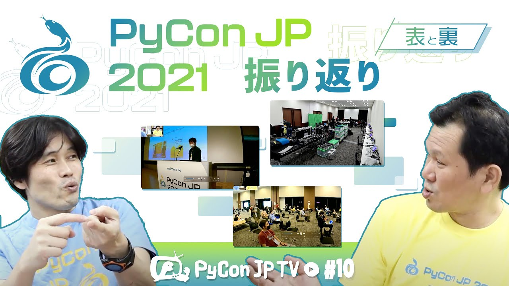

:og:image: https://tv.pycon.jp/_images/episode10.jpg
    

=========================================
 #10: PyCon JP 2021振り返り - 2021-11-05
=========================================

2021年10月15、16日に開催されたPyCon JP 2021の様子や裏側について語ります。

.. raw:: html

   <iframe width="560" height="315" src="https://www.youtube.com/embed/1e17S2qFQNo" title="YouTube video player" frameborder="0" allow="accelerometer; autoplay; clipboard-write; encrypted-media; gyroscope; picture-in-picture" allowfullscreen></iframe>

関連リンク
==========
* `PyCon JP TVお便りコーナー <https://docs.google.com/forms/d/e/1FAIpQLSfvL4cKteAaG_czTXjofR83owyjXekG9GNDGC6-jRZCb_2HRw/viewform>`_
* Twitter: `@pyconjptv <https://twitter.com/pyconjptv>`_
* `Python.jp Discordサーバ <https://www.python.jp/pages/pythonjp_discord.html>`_ の ``#pyconjp-tv`` チャンネル

パーソナリティ
--------------
* 寺田 学(`@terapyon <https://twitter.com>`_)
* 鈴木 たかのり(`@takanory <https://twitter.com/takanory>`_)

Pythonニュース
--------------
* `Python Release Python 3.10.0 | Python.org <https://www.python.org/downloads/release/python-3100/>`_
* `PyCon mini Shizuoka <https://shizuoka.pycon.jp/2021>`_

  * 2021年11月20日(土)開催
  * `プロポーザル採択速報 <https://shizuoka.pycon.jp/2021/article/2>`_
  * `PyCon mini Shizuoka 2021【オンライン&ライブビューイング開催】 - connpass <https://pycon-shizu.connpass.com/event/228219/>`_
* `PyCon APAC 2021 <https://th.pycon.org/>`_

  * 2021年11月20日(土)、21日(日)開催
  * 日本から4人のスピーカー
  * チケット: `PyCon APAC 2021 | Eventpop <https://www.eventpop.me/e/11673/https-th-pycon-org>`_
* `Python Boot Camp in 山口 - connpass <https://pyconjp.connpass.com/event/205993/>`_

  * 2021年12月4日(土)開催
* `PyCon Kyushu 2022 Kumamoto <https://kyushu.pycon.jp/2022/>`_

  * 2022年1月22日(土)開催
  * トーク募集: `PaperCall.io - PyCon Kyushu 2022 Kumamoto <https://www.papercall.io/pykyushu2022>`_
  
PyCon JP 2021振り返り
---------------------
* `PyCon JP 2021 <https://2021.pycon.jp/>`_

  * `タイムテーブル <https://2021.pycon.jp/time-table>`_
  * `スポンサー一覧 <https://2021.pycon.jp/sponsors>`_
* `Pythonで理解する統計解析の基礎 <https://gihyo.jp/book/2018/978-4-297-10049-0>`_ (谷合さんの著書)
* `PyCon JP Blog: PyCon JP Association Meeting 2021を開催しました <https://pyconjp.blogspot.com/2021/10/pycon-jp-association-meeting-2021.html>`_

飲みトーク
----------
* `VECTOR BREWING <https://craftbeercompany.co.jp/vector-brewing/>`_
* `ついにBluetooth対応となった「REALFORCE R3」 <https://pc.watch.impress.co.jp/docs/news/1360965.html>`_
* `PyCon JP Blog: PyCon JP 2021インタビュー動画公開 <https://pyconjp.blogspot.com/2021/11/pyconjp2021-interview-video.html>`_
* `GoPro <https://gopro.com/ja/jp/>`_
* `ネットワークオペレーションセンター（NOC）とは - IT用語辞典 e-Words <https://e-words.jp/w/%E3%83%8D%E3%83%83%E3%83%88%E3%83%AF%E3%83%BC%E3%82%AF%E3%82%AA%E3%83%9A%E3%83%AC%E3%83%BC%E3%82%B7%E3%83%A7%E3%83%B3%E3%82%BB%E3%83%B3%E3%82%BF%E3%83%BC.html>`_
* `DaVinci Resolve 17 | Blackmagic Design <https://www.blackmagicdesign.com/jp/products/davinciresolve/>`_
* `14インチMacBook Proと16インチMacBook Pro - Apple（日本） <https://www.apple.com/jp/macbook-pro-14-and-16/>`_
* `Uchu Brewing WAVE <https://uchubrew.shop-pro.jp/?pid=147328250>`_
* `Karabiner-Elements <https://karabiner-elements.pqrs.org/>`_
* `ヤマハ | AG03 - ウェブキャスティングミキサー <https://jp.yamaha.com/products/music_production/webcasting_mixer/ag03/index.html>`_
* `[Pycon JP 2021] Guido van Rossum さんからのオープニングビデオメッセージ - YouTube <https://www.youtube.com/watch?v=LSse32tu2Wk>`_
* `Heiwa Craft Sour Ale（平和クラフト サワーエール） <https://craftbeerhunt.net/beer/hwaiwa-craft-sour-ale>`_
* `Python Software Foundation News: The Python Software Foundation is searching for its next Executive Director <https://pyfound.blogspot.com/2021/11/the-python-software-foundation-is.html>`_
* `faster-cpython <https://github.com/faster-cpython>`_

目次
====
* `0:00:28 <https://www.youtube.com/watch?v=1e17S2qFQNo&t=28s>`_ 配信開始
* `0:01:05 <https://www.youtube.com/watch?v=1e17S2qFQNo&t=65s>`_ 呼びかけ「PyCon JP 2021参加しました?」
* `0:04:06 <https://www.youtube.com/watch?v=1e17S2qFQNo&t=246s>`_ 【Pythonニュース】Python 3.10.0が2021年10月4日にリリースされました
* `0:05:00 <https://www.youtube.com/watch?v=1e17S2qFQNo&t=300s>`_ 11月20日開催のPyCon mini Shizuoka、トークが決定
* `0:06:53 <https://www.youtube.com/watch?v=1e17S2qFQNo&t=413s>`_ PyCon APAC Thailand 2021が11月20、21日に開催。いろんな国からのスピーカーがいっぱい。日本から4名が発表します
* `0:10:27 <https://www.youtube.com/watch?v=1e17S2qFQNo&t=627s>`_ Python Boot Camp in 山口を12月4日に開催。久しぶりに復活します
* `0:11:45 <https://www.youtube.com/watch?v=1e17S2qFQNo&t=705s>`_ PyCon Kyushu in Kumamoto 2022、来年1月22日に開催。トーク募集中
* `0:12:40 <https://www.youtube.com/watch?v=1e17S2qFQNo&t=760s>`_ YouTubeコメントの紹介
* `0:13:20 <https://www.youtube.com/watch?v=1e17S2qFQNo&t=800s>`_ 【メイントーク】PyCon JP 2021振り返り。現地の写真を交えて紹介
* `0:14:30 <https://www.youtube.com/watch?v=1e17S2qFQNo&t=870s>`_ 会場(ベルサール神田)のビルの外観、受付
* `0:15:55 <https://www.youtube.com/watch?v=1e17S2qFQNo&t=955s>`_ ノベルティは「PyCon JP 2021マスク」と名札、今日の衣装はPyCon JP 2021 Tシャツ
* `0:17:45 <https://www.youtube.com/watch?v=1e17S2qFQNo&t=1065s>`_ ホールの様子、バナーとかあるとイベント感がある
* `0:20:10 <https://www.youtube.com/watch?v=1e17S2qFQNo&t=1210s>`_ スタッフルームの様子、配信はプロに依頼、リモート用司会者席がある、配信のテクノロジーがどうなっているのか謎
* `0:23:40 <https://www.youtube.com/watch?v=1e17S2qFQNo&t=1420s>`_ オープニングの打合せ
* `0:24:00 <https://www.youtube.com/watch?v=1e17S2qFQNo&t=1440s>`_ 受付裏にブースを作らせてもらい、PyCon JPのキラキラシールでの寄付活動が久しぶりにできた
* `0:25:30 <https://www.youtube.com/watch?v=1e17S2qFQNo&t=1530s>`_ オープニングに向けて人が入ってきた。キーノートはプロ棋士の谷合さん、いろいろ作っていてすごい
* `0:29:45 <https://www.youtube.com/watch?v=1e17S2qFQNo&t=1785s>`_ 自身の著書にサインをする谷合さん、サインはPythonエンジニアっぽかった。現地開催だとプレゼント大会がやりやすい。
* `0:32:10 <https://www.youtube.com/watch?v=1e17S2qFQNo&t=1930s>`_ PyCon JP Associationの公開ミーティングをハイブリッドで開催した。どういう設定なのかわからないがとてもスムーズだった。いろいろディスカッションできてよかった
* `0:35:20 <https://www.youtube.com/watch?v=1e17S2qFQNo&t=2120s>`_ 久しぶりに集合写真を撮った。マスクがあるので楽しそうな写真にするのが難しい
* `0:37:03 <https://www.youtube.com/watch?v=1e17S2qFQNo&t=2223s>`_ 1日目にたかのりがライトニングトークをしたが、その写真はないらしい...
* `0:38:10 <https://www.youtube.com/watch?v=1e17S2qFQNo&t=2290s>`_ 2日目はオンラインのみ。キーノートはBrandt BucherさんによるStructural Pattern Matchingの話し
* `0:43:10 <https://www.youtube.com/watch?v=1e17S2qFQNo&t=2590s>`_ ランチタイムセッションでプラチナスポンサーの人と寺田がMCでパネルディスカッションをした
* `0:45:17 <https://www.youtube.com/watch?v=1e17S2qFQNo&t=2717s>`_ スペシャルブース紹介とブースツアーの仕組みはすごい良く回ってた、各社もブースを工夫していて良かった
* `0:47:00 <https://www.youtube.com/watch?v=1e17S2qFQNo&t=2820s>`_ パーティーも良かった。Zoomは動画だけでdiscordでチャットする仕組みはスムーズだった。パーティーでピザハットが届くのが良かったしみんな楽しそうだった
* `0:49:30 <https://www.youtube.com/watch?v=1e17S2qFQNo&t=2970s>`_ オンライン2年目ということもあって色々すごいなと思った
* `0:50:20 <https://www.youtube.com/watch?v=1e17S2qFQNo&t=3020s>`_ 【お便りコーナー】鈴木なぎささんから「Pythonの学習で挫折しそうになったこと、キー日ボードのこだわり」
* `0:56:15 <https://www.youtube.com/watch?v=1e17S2qFQNo&t=3375s>`_ 【次回予告】12月3日(金)から。内容は「EuroPython 2019(仮)」の予定
* `0:59:21 <https://www.youtube.com/watch?v=1e17S2qFQNo&t=3561s>`_ 🍺 Vector Brewing 浅草橋の猫 (草)、ねこぱんち栓抜きで開栓RealforceのBluetoothが出ましたね
* `1:01:45 <https://www.youtube.com/watch?v=1e17S2qFQNo&t=3705s>`_ PyCon JP 2021キーノートのときの様子を撮影した動画を再生。ピザが到着。撮影はGoProだが、音がうまくとれない
* `1:05:40 <https://www.youtube.com/watch?v=1e17S2qFQNo&t=3940s>`_ PyCon JP 2021の現地インタビュー動画を再生。会場視察から座長nikkieさんにインタビュー、スタッフ(しののめさん)インタビュー。ミーティングの時の配信をどうやっているか機材が謎。一般家庭にはマイクが4本くらいあるらしい(ねーよ)
* `1:13:25 <https://www.youtube.com/watch?v=1e17S2qFQNo&t=4405s>`_ NOC(ノック)とはなにか。会場無線LANのパスが「match_case」でセンスがよかった
* `1:15:45 <https://www.youtube.com/watch?v=1e17S2qFQNo&t=4545s>`_ PyCon JP 2021の参加者インタビュー。マスクしているからリップシンク(唇と音声の同期)していないとかわからない
* `1:27:45 <https://www.youtube.com/watch?v=1e17S2qFQNo&t=5265s>`_ PyCon JP 2021の1日目の現地LTはaodagさんとたかのり。現地でLT応募したがkamechanさんとpuhitakuさんは2日目のリモート発表になっていた。LTのときにカメラマンがちゃんと自分を撮ってくれるのがよかった。たかのりのLTのテンションが高かったらしい。プロジェクターにつなげるのとか久しぶりでいろいろ忘れてた
* `1:36:40 <https://www.youtube.com/watch?v=1e17S2qFQNo&t=5800s>`_ キーノートスピーカーの谷合さんインタビュー動画。編集にかかった時間は3時間以上。プレゼン動画は一発撮りが効率よさそう
* `1:47:00 <https://www.youtube.com/watch?v=1e17S2qFQNo&t=6420s>`_ PythonEDのCMでの寺田パートは10~20テイク。動画編集はDaVinci Resolve。M1 Macなら楽勝。新しいMacBook Pro 14inchを自慢
* `1:52:05 <https://www.youtube.com/watch?v=1e17S2qFQNo&t=6725s>`_ 🍺 Vector Brewing 浅草橋の猫 (浅)、Uchu Brewing WAVE
* `1:52:40 <https://www.youtube.com/watch?v=1e17S2qFQNo&t=6760s>`_ MacBook Pro 14inchの内蔵カメラが明るくなった。昨日届いて今のMacと同期して使っている。マイクもよくなったらしい。ディスプレイにカメラのノッチがある。M1 MacはDockerがつらい
* `1:58:35 <https://www.youtube.com/watch?v=1e17S2qFQNo&t=7115s>`_ キーボードはまぁまぁ。HHKBは買おうかなと思ったがいろいろ周辺を買わないといけないのでやめた。左下に地球儀キーが増えたが設定でemojiにした。いろんなキー設定にKarabinarとかもいらなくなってきた
* `2:02:35 <https://www.youtube.com/watch?v=1e17S2qFQNo&t=7355s>`_ PyCon JP 2021でリスナーのHajime Hamadaさんに会えたのでうれしかった
* `2:04:00 <https://www.youtube.com/watch?v=1e17S2qFQNo&t=7440s>`_ 別カメラで撮影した画像を共有。検温と消毒液が出る機材も私物らしい。会場のレイアウトの説明。オンラインの発表は映像はプロジェクターで見て、音声は同通レシーバーで聞く仕組みはすごい
* `2:07:53 <https://www.youtube.com/watch?v=1e17S2qFQNo&t=7673s>`_ ロゴバナー。スタッフ朝会など。スタッフは業者さんも含めて30名くらい。司会ブースのPCとAG03はレンタル
* `2:11:35 <https://www.youtube.com/watch?v=1e17S2qFQNo&t=7895s>`_ PyCon JP 2021ステッカーは自分で注文するシステム。現地での受付方法をみんな忘れていた
* `2:16:10 <https://www.youtube.com/watch?v=1e17S2qFQNo&t=8170s>`_ 寺田インタビューの様子。オープニング。トークの写真はなさそう
* `2:17:50 <https://www.youtube.com/watch?v=1e17S2qFQNo&t=8270s>`_ 2日目の現地の写真。グリーンバックの前でオープニング司会。プロンプターのはなし。たかのりのLTの映像がない問題
* `2:22:09 <https://www.youtube.com/watch?v=1e17S2qFQNo&t=8529s>`_ 寺田は自分が発表するときには誰かにカメラを渡して撮ってもらう。discordは拍手でメッセージがすごい流れちゃう問題
* `2:23:35 <https://www.youtube.com/watch?v=1e17S2qFQNo&t=8615s>`_ Guidoさんからのメッセージはすごくよかった、Python高速化など。キーノートのBrandtさんもMicrosoft
* `2:26:10 <https://www.youtube.com/watch?v=1e17S2qFQNo&t=8770s>`_ 🍺 平和クラフト SOUR ALE。PSFのBoard Directorが募集中。Python高速化はいろいろアイデアがあるらしい
* `2:28:45 <https://www.youtube.com/watch?v=1e17S2qFQNo&t=8925s>`_ 🍺 平和クラフト SOUR ALE(ワイプで見えにくかったので)。広島の西本さんに「公開ミーティング」のことを聞いた。2日目のパネルディスカッションは機材がてんこ盛りだった。裏側どうやってたか発表してほしい
* `2:31:18 <https://www.youtube.com/watch?v=1e17S2qFQNo&t=9078s>`_ 配信映像の作り方。配信の進行管理について
* `2:38:20 <https://www.youtube.com/watch?v=1e17S2qFQNo&t=9500s>`_ そろそろ終了。次回のネタ募集中
