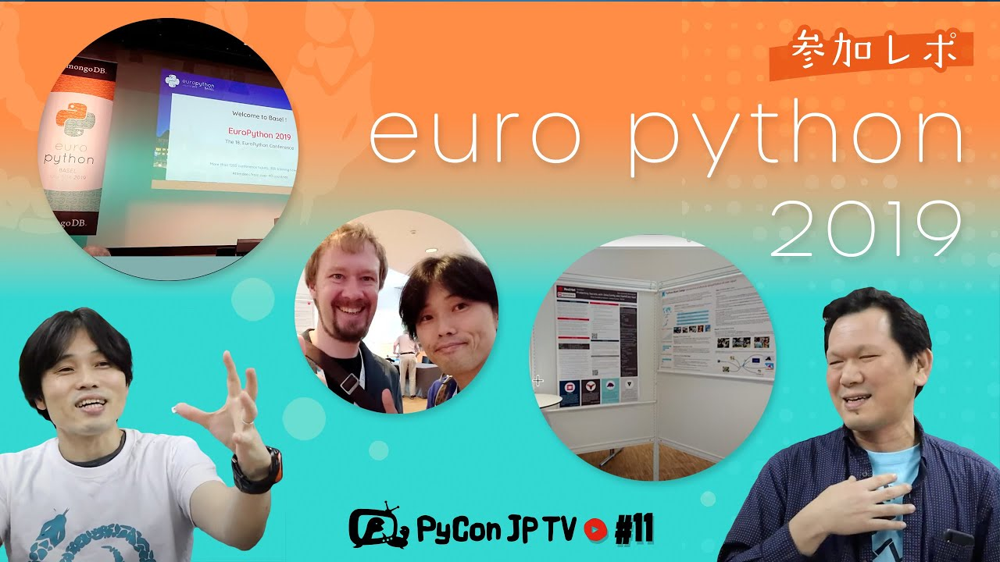

:og:image: https://tv.pycon.jp/_images/episode11.jpg
    

===================================
 #11: EuroPython 2019 - 2021-12-03
===================================

2019年7月8日-14日にスイスのバーゼルで開催されたEruoPython 2019について語ります。

.. raw:: html

   <iframe width="560" height="315" src="https://www.youtube.com/embed/lnklSqj7cPo" title="YouTube video player" frameborder="0" allow="accelerometer; autoplay; clipboard-write; encrypted-media; gyroscope; picture-in-picture" allowfullscreen></iframe>

関連リンク
==========
* `PyCon JP TVお便りコーナー <https://docs.google.com/forms/d/e/1FAIpQLSfvL4cKteAaG_czTXjofR83owyjXekG9GNDGC6-jRZCb_2HRw/viewform>`_
* Twitter: `@pyconjptv <https://twitter.com/pyconjptv>`_
* `Python.jp Discordサーバ <https://www.python.jp/pages/pythonjp_discord.html>`_ の ``#pyconjp-tv`` チャンネル

パーソナリティ
--------------
* 寺田 学(`@terapyon <https://twitter.com>`_)
* 鈴木 たかのり(`@takanory <https://twitter.com/takanory>`_)

Pythonニュース
--------------
* PyCon JP 2021の動画が公開: `PyCon JP 2021 - YouTube <https://www.youtube.com/playlist?list=PLMkWB0UjwFGkc0NVMnI5i0N8GkkU4x4k6>`_
* `Python Boot Camp in 山口 <https://pyconjp.connpass.com/event/205993/>`_
* `一般社団法人PyCon JP Association運営会議 #49 <https://pyconjp-staff.connpass.com/event/227273/>`_
* `PyCon Kyushu 2022 Kumamoto <https://pycon-kyushu.connpass.com/event/224167/>`_
* `PyCon US 2022 <https://us.pycon.org/2022/>`_ プロポーザル募集中

EuroPython 2019
---------------
* `EuroPython 2019 <https://ep2019.europython.eu/>`_
* 参加レポート記事: `ヨーロッパのPythonコミュニティと交流できる3日間「EuroPython 2019」 <https://gihyo.jp/news/report/01/europython2019>`_
* `EuroPython Conference <https://www.europython-society.org/europython/>`_
* `バーゼル - Wikipedia <https://ja.wikipedia.org/wiki/%E3%83%90%E3%83%BC%E3%82%BC%E3%83%AB>`_
* `EuroPython Society <https://www.europython-society.org/>`_

  * `EPS Members <https://www.europython-society.org/eps-members/>`_
  * `Marc-Andre Lemburg: All Things Python <https://www.malemburg.com/>`_
  * `Prof. Martin Christen | FHNW <https://www.fhnw.ch/de/personen/martin-christen>`_
* 1日目のトーク

  * `EuroPython 2019 - Opening Session <https://www.youtube.com/watch?v=avt77g27SbM>`_
  * `Lynn Cherny - Getting Your Data Joie De Vivre Back! - YouTube <https://www.youtube.com/watch?v=uF2GhMAaQOQ>`_
  * `Matthieu Amiguet - Python for realtime audio processing in a live music context - YouTube <https://www.youtube.com/watch>`_
  * `Cheuk Ho - Do we have a diversity problem in Python community? - YouTube <https://www.youtube.com/watch>`_
  * `Yenny Cheung - Why You Should Pursue Public Speaking and How to Get There - YouTube <https://www.youtube.com/watch?v=a5WIMg5sunw>`_
  * `EuroPython 2019 - Lightning talks on Wednesday, July 10 - YouTube <https://www.youtube.com/watch?v=xmr39hMI_9s>`_
* 2日目のトーク

  * `Paul Everitt - Python 1994 - YouTube <https://www.youtube.com/watch?v=vyz7zdGiPVY>`_
  * `Marc-Andre Lemburg - EPS General Assembly 2019 - YouTube <https://www.youtube.com/watch?v=jTy-tyFvou0>`_
  * `EuroPython 2019 - Lightning talks on Thursday, July 11 - YouTube <https://www.youtube.com/watch?v=YwJRS2Xe-Hc>`_
* パーティ会場の大学: `Muttenz | FHNW <https://www.fhnw.ch/en/about-fhnw/locations/muttenz>`_

飲みトーク
----------
* 🍺 `黄桜 LUCKY CHICKEN｜黄桜株式会社 <https://kizakura.co.jp/ja/prod_data/info.php?type=items3&id=IC000136>`_
* `ユーロエアポート・バーゼル＝ミュールーズ空港 - Wikipedia <https://ja.wikipedia.org/wiki/%E3%83%A6%E3%83%BC%E3%83%AD%E3%82%A8%E3%82%A2%E3%83%9D%E3%83%BC%E3%83%88%E3%83%BB%E3%83%90%E3%83%BC%E3%82%BC%E3%83%AB%EF%BC%9D%E3%83%9F%E3%83%A5%E3%83%BC%E3%83%AB%E3%83%BC%E3%82%BA%E7%A9%BA%E6%B8%AF>`_
* `バーゼル大聖堂 - Wikipedia <https://ja.wikipedia.org/wiki/%E3%83%90%E3%83%BC%E3%82%BC%E3%83%AB%E5%A4%A7%E8%81%96%E5%A0%82>`_
* 🍺 `Hazy IPA | クラフトビール・地ビールの通販 伊勢角屋麦酒 <https://www.biyagura.jp/c/all-items/414>`_
* 3日目のトーク

  * `Andrey Vlasovskikh - The Story of Features Coming in Python 3.8 and Beyond - YouTube <https://www.youtube.com/watch?v=xUXsIDtlv9s>`_
  * `Trapsilo Bumi - Enhancing Angklung Music Rehearsals with Python - YouTube <https://www.youtube.com/watch?v=HGcMHjzBzuw>`_
* `BIERREVIER <https://www.bierrevier.ch/>`_
* 🍺 `龍馬ブルームIPA | 日本ビール株式会社 <https://www.nipponbeer.jp/lineup/ryoma-bloom-ipa-350can/>`_
* `Hello @-バーゼルタトゥー <https://www.baseltattoo.ch/ja/>`_
* `Red Hot Chilli Pipers <https://rhcp.scot/>`_
* `Brewery & Brewpub in Basel | Volta Bräu <https://www.voltabraeu.ch/en/>`_
* `KLARA – nine kitchens, one bar <https://klarabasel.ch/en/>`_
* `シュパレン門 - トリップアドバイザー <https://www.tripadvisor.jp/Attraction_Review-g188049-d592903-Reviews-Spalen_Gate-Basel.html>`_
* `Basel Historical Museum – Musikmuseum - HMB <https://www.hmb.ch/en/museums/musikmuseum/>`_
* `Resonance Bowl <https://www.amazon.com/JoanLab-Fristaden-Lab-Resonance-Bowl/dp/B01G3P20DU>`_

目次
====
* `0:02:00 <https://www.youtube.com/watch?v=lnklSqj7cPo&t=120s>`_ 配信開始
* `0:02:57 <https://www.youtube.com/watch?v=lnklSqj7cPo&t=177s>`_ 呼びかけ「Python関連の今年の思い出」
* `0:04:40 <https://www.youtube.com/watch?v=lnklSqj7cPo&t=280s>`_ Twitter #pyconjptv 使ってね
* `0:06:41 <https://www.youtube.com/watch?v=lnklSqj7cPo&t=401s>`_ 【Pythonニュース】PyCon JP 2021の動画が公開された
* `0:08:23 <https://www.youtube.com/watch?v=lnklSqj7cPo&t=503s>`_ 12月4日(土)にPython Boot Camp in 山口が開催
* `0:10:45 <https://www.youtube.com/watch?v=lnklSqj7cPo&t=645s>`_ 12月16日(木)に一般社団法人PyCon JP Associationの運営ミーティングやります。参加者募集
* `0:13:18 <https://www.youtube.com/watch?v=lnklSqj7cPo&t=798s>`_ PyCon Kyushu 2022 Kumamotoのチケット発売が12月4日(土)から開始
* `0:15:50 <https://www.youtube.com/watch?v=lnklSqj7cPo&t=950s>`_ US PyConが2022年4月末にソルトレイクシティで開催
* `0:19:00 <https://www.youtube.com/watch?v=lnklSqj7cPo&t=1140s>`_ 【メイントーク】EuroPython 2019
* `0:20:13 <https://www.youtube.com/watch?v=lnklSqj7cPo&t=1213s>`_ EuroPythno 2019 TシャツとPyCon Thailand 2021パーカー
* `0:21:10 <https://www.youtube.com/watch?v=lnklSqj7cPo&t=1270s>`_ EuroPythonとは(なぜEuro PyConじゃないのか)
* `0:23:50 <https://www.youtube.com/watch?v=lnklSqj7cPo&t=1430s>`_ 【出発から】ポスターを持ってウィーン経由でスイスのバーゼルに到着
* `0:25:57 <https://www.youtube.com/watch?v=lnklSqj7cPo&t=1557s>`_ 【カンファレンス1日目】ホテルからカンファレンス会場へ移動
* `0:27:15 <https://www.youtube.com/watch?v=lnklSqj7cPo&t=1635s>`_ オープニングの司会はEPS(EuroPython Society) ChairのMark andreさんとバーゼルのMartinさん
* `0:29:15 <https://www.youtube.com/watch?v=lnklSqj7cPo&t=1755s>`_ EuroPython 2019グッズ、ポスターは6枠、Transifexステッカー、ジョブボード
* `0:30:40 <https://www.youtube.com/watch?v=lnklSqj7cPo&t=1840s>`_ トークの様子。音楽をリピートするマシーンを自作するトーク。水がビン。発表者の性別バランス。スピーカーの心構えのキーノートなど
* `0:35:40 <https://www.youtube.com/watch?v=lnklSqj7cPo&t=2140s>`_ LTの様子。Pewpewデバイスの紹介、Foxdotを伴奏にハーモニカで演奏、10カ国語のキーボード、自転車に会場に来た人。その後ビールを飲んで終了
* `0:39:59 <https://www.youtube.com/watch?v=lnklSqj7cPo&t=2399s>`_ 【カンファレンス2日目】ポスターの準備から。Python Boot Campステッカーを置いたらみんな持って行ってくれた
* `0:41:40 <https://www.youtube.com/watch?v=lnklSqj7cPo&t=2500s>`_ EuroPython Societyのミーティングに参加
* `0:42:00 <https://www.youtube.com/watch?v=lnklSqj7cPo&t=2520s>`_ komo_frさんがLTでNetworkXでのPEP解析を発表。Paul EverittさんによるPythonコミュニティの歴史トーク
* `0:45:16 <https://www.youtube.com/watch?v=lnklSqj7cPo&t=2716s>`_ この日はパーティー。ライブ演奏がループマシーンのトークの人。
* `0:47:17 <https://www.youtube.com/watch?v=lnklSqj7cPo&t=2837s>`_ スタッフのMartinさんの計らいで屋上に連れて行ってもらった。すごくいい景色だった
* `0:49:49 <https://www.youtube.com/watch?v=lnklSqj7cPo&t=2989s>`_ Python Boot Campポスターの様子。参加者と交流できてよかった
* `0:52:21 <https://www.youtube.com/watch?v=lnklSqj7cPo&t=3141s>`_ 【コメントをピックアップ】
* `0:53:05 <https://www.youtube.com/watch?v=lnklSqj7cPo&t=3185s>`_ 【お便りコーナー】鈴木なぎささんから「仕事でやりがいを感じるのはどんなとき?」。フードが到着
* `0:59:25 <https://www.youtube.com/watch?v=lnklSqj7cPo&t=3565s>`_ 【次回予告】2022年1月7日(金)の予定。内容は検討中
* `1:02:44 <https://www.youtube.com/watch?v=lnklSqj7cPo&t=3764s>`_ 🍺 カシャプシュ。黄桜 ラッキーチキン 旨味レッドIPA
* `1:06:25 <https://www.youtube.com/watch?v=lnklSqj7cPo&t=3985s>`_ 今日のフードは韓国系フライドチキン🐔など
* `1:09:30 <https://www.youtube.com/watch?v=lnklSqj7cPo&t=4170s>`_ いろいろ継続してやらないと忘れちゃうので時間がかかっちゃうよね
* `1:12:13 <https://www.youtube.com/watch?v=lnklSqj7cPo&t=4333s>`_ 4人目のスタッフが登場(リモートで作業していました)
* `1:15:40 <https://www.youtube.com/watch?v=lnklSqj7cPo&t=4540s>`_ 【日本出発から現地到着まで】写真を見ながら、ウィーンでは朝6時からやむを得ずビールを飲む
* `1:18:15 <https://www.youtube.com/watch?v=lnklSqj7cPo&t=4695s>`_ 最寄りの空港(ユーロエアポート・バーゼル＝ミュールーズ空港)はフランスとスイスの出口がそれぞれある。現金はどうしたの？
* `1:23:20 <https://www.youtube.com/watch?v=lnklSqj7cPo&t=5000s>`_ ホテルチェックインまでの散歩。家の入り口にある金属のこれはなに？バーゼル大聖堂を見学
* `1:24:55 <https://www.youtube.com/watch?v=lnklSqj7cPo&t=5095s>`_ ホテルで仮眠したら、20時少し前に起きて晩ご飯がピンチ
* `1:27:40 <https://www.youtube.com/watch?v=lnklSqj7cPo&t=5260s>`_ 🍺 伊勢角屋 HAZY IPA
* `1:29:19 <https://www.youtube.com/watch?v=lnklSqj7cPo&t=5359s>`_ 【カンファレンス3日目】朝食、LTリスト、EuroPythonグッズをお土産用に購入
* `1:32:30 <https://www.youtube.com/watch?v=lnklSqj7cPo&t=5550s>`_ HENNGEの人の発表。Andrey Vlasovskikh氏(PyCon JP 2016キーノート)と再会
* `1:38:10 <https://www.youtube.com/watch?v=lnklSqj7cPo&t=5890s>`_ 某企業(kiwi.com)主催のパーティーに参加。プールサイドでおしゃれ。はしゃぎすぎ注意。その後BIERREVIERに飲みに行った
* `1:45:10 <https://www.youtube.com/watch?v=lnklSqj7cPo&t=6310s>`_ 企業主催パーティーってどういう感じでやっているの？日本でもそういう文化が生まれたら面白そう
* `1:48:50 <https://www.youtube.com/watch?v=lnklSqj7cPo&t=6530s>`_ 🍺 龍馬 Bloom IPA。海外PyConだとブースに来て深くやりとりしたらいいグッズがもらえたりする
* `1:50:45 <https://www.youtube.com/watch?v=lnklSqj7cPo&t=6645s>`_ 【カンファレンスの次の日】この日は1日オフ。この日はBasel Tattooというイベントのパレードをやっていた。見たことがない楽器もたくさん
* `1:55:10 <https://www.youtube.com/watch?v=lnklSqj7cPo&t=6910s>`_ このあとアリーナでのコンサートがあり、チケットを購入して聞きに行った。パレードの人と違ってみんな上手。いろんな国の軍隊バンドとかが出ていた
* `1:58:33 <https://www.youtube.com/watch?v=lnklSqj7cPo&t=7113s>`_ Red Hot Cilli Pipersがかっこよかった。曲乗りとかもある。この日は実はスプリント
* `2:00:50 <https://www.youtube.com/watch?v=lnklSqj7cPo&t=7250s>`_ コンサート終了後はVOLTA BRAUにビールを飲みに行った。スプリントに行っているNoahさんから飲みに行く情報をキャッチしたので合流のために移動。スプリントを楽しむのはなかなか大変
* `2:03:34 <https://www.youtube.com/watch?v=lnklSqj7cPo&t=7414s>`_ KLARAに移動してスプリントチームと合流。EuroPython Societyメンバーもいて一緒に飲んだ
* `2:05:55 <https://www.youtube.com/watch?v=lnklSqj7cPo&t=7555s>`_ 【最終日】朝食はいつものパン。門を見学。スイスの牛柄のアヒル
* `2:09:10 <https://www.youtube.com/watch?v=lnklSqj7cPo&t=7750s>`_ MUSIK MUSEUM(小楽器の博物館)を見学
* `2:12:35 <https://www.youtube.com/watch?v=lnklSqj7cPo&t=7955s>`_ ピアノの機構の触れる模型があって楽しい。パイプオルガンの音色を切り替える機構の模型がすごい。自動演奏機械の演奏も1日何回か聴ける
* `2:15:30 <https://www.youtube.com/watch?v=lnklSqj7cPo&t=8130s>`_ サックスっぽい形のトランペットっぽい楽器。楽器には興味のない寺田パーソナリティ
* `2:16:35 <https://www.youtube.com/watch?v=lnklSqj7cPo&t=8195s>`_ この博物館はもともとは牢屋。ベルに顔がついていてかわいい。セルパン(幻想交響曲に出てくるやつ)
* `2:18:50 <https://www.youtube.com/watch?v=lnklSqj7cPo&t=8330s>`_ 卓上パイプオルガン(音程が悪かった)。見学を終えて駅の方へ移動
* `2:20:15 <https://www.youtube.com/watch?v=lnklSqj7cPo&t=8415s>`_ 空港に到着。あまった現金があるのでやむを得ずビール
* `2:21:10 <https://www.youtube.com/watch?v=lnklSqj7cPo&t=8470s>`_ 共振して水が跳ね上がる動画を再生(Resonance Bowlとか言うらしい)
* `2:22:10 <https://www.youtube.com/watch?v=lnklSqj7cPo&t=8530s>`_ 結構バーゼルを楽しんだ。そろそろdiscordに移るので準備を開始。
* `2:24:38 <https://www.youtube.com/watch?v=lnklSqj7cPo&t=8678s>`_ マーチングの様子の動画。配信終了

