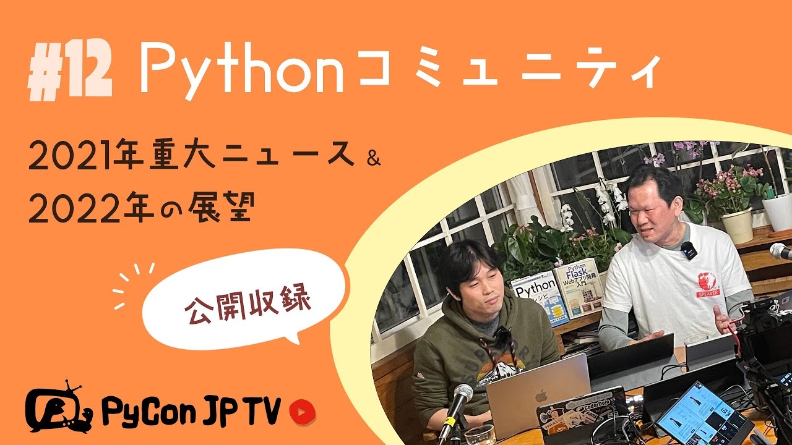

:og:image: https://tv.pycon.jp/_images/episode12.jpg
    

==================================================================
 #12: Pythonコミュニティ2021重大ニュースと2022の展望 - 2022-01-14
==================================================================

さまざまなPythonコミュニティの紹介を、2021年の重大ニュースと2022年の展望とともにお送りします。

.. raw:: html

   <iframe width="560" height="315" src="https://www.youtube.com/embed/i7S8dfok9wU" title="YouTube video player" frameborder="0" allow="accelerometer; autoplay; clipboard-write; encrypted-media; gyroscope; picture-in-picture" allowfullscreen></iframe>

関連リンク
==========
* `PyCon JP TVお便りコーナー <https://docs.google.com/forms/d/e/1FAIpQLSfvL4cKteAaG_czTXjofR83owyjXekG9GNDGC6-jRZCb_2HRw/viewform>`_
* Twitter: `@pyconjptv <https://twitter.com/pyconjptv>`_
* `Python.jp Discordサーバ <https://www.python.jp/pages/pythonjp_discord.html>`_ の ``#pyconjp-tv`` チャンネル

パーソナリティ
--------------
* 寺田 学(`@terapyon <https://twitter.com>`_)
* 鈴木 たかのり(`@takanory <https://twitter.com/takanory>`_)

Pythonニュース
--------------
* `PyCon JP Blog: 「Python Boot Camp in 山口」を開催しました！ <https://pyconjp.blogspot.com/2022/01/pycamp-in-yamaguchi-report.html>`_
* `PyCon JP 2021 カンファレンスレポート：レポート｜gihyo.jp <https://gihyo.jp/news/report/01/pyconjp2021>`_
* `PyCon JP Blog: PyCon JP 2022 座長決定 <https://pyconjp.blogspot.com/2022/01/pyconjp-2022-chair.html>`_
* `PyCon Kyushu 2022 Kumamoto <https://kyushu.pycon.jp/2022/>`_
* `PyCon JP Blog: 一般社団法人PyCon JP Associationの理事を募集します(2022年2月改選) <https://pyconjp.blogspot.com/2021/12/recruitment-of-board-mmbers.html>`_

Pythonコミュニティ2021重大ニュースと2022の展望
----------------------------------------------
* スライド: `Pythonコミュニティ 2021重大ニュースと2022の展望 <https://docs.google.com/presentation/d/1CXt4pvsxrOLzZL4kjWMMBtTf9BnlEn_DDksfS9JBP4Q/edit>`_
* Shonan.py https://shonan-py.connpass.com/

  * `自走プログラマー ～Pythonの先輩が教えるプロジェクト開発のベストプラクティス120：書籍案内｜技術評論社 <https://gihyo.jp/book/2020/978-4-297-11197-7>`_
* 飛騨高山Pythonの会 https://hida-python.connpass.com/

  * `Python Charity Talks in Japan 2021.09 - connpass <https://pyconjp.connpass.com/event/218154/>`_
* PyConKyushu https://www.pykyushu.jp/
* Unagi.py https://unagi-py.connpass.com/

  * `Unagi.py 勉強会48枚目 ～2021紅白LT合戦～ - connpass <https://unagi-py.connpass.com/event/233399/>`_
* PyLadies Tokyo https://tokyo.pyladies.com/

  * `PyLadies Tokyo 秋合宿 2021 - connpass <https://pyladies-tokyo.connpass.com/event/225583/>`_
* はんなりPython https://hannari-python.connpass.com/
* django-ja https://djangoproject.jp/

  * `DjangoCongress JP 2021 <https://djangocongress.jp/>`_

目次
====
* `0:00:32 <https://www.youtube.com/watch?v=i7S8dfok9wU&t=32s>`_ 配信開始
* `0:01:30 <https://www.youtube.com/watch?v=i7S8dfok9wU&t=90s>`_ 呼びかけ「2022の展望」
* `0:05:09 <https://www.youtube.com/watch?v=i7S8dfok9wU&t=309s>`_ 【Pythonニュース】Pytnon Boot Camp in 山口を開催した
* `0:07:18 <https://www.youtube.com/watch?v=i7S8dfok9wU&t=438s>`_ PyCon JP 2021のカンファレンスレポートがgihyo.jpで公開
* `0:08:09 <https://www.youtube.com/watch?v=i7S8dfok9wU&t=489s>`_ PyCon JP 2022の座長が決定
* `0:11:10 <https://www.youtube.com/watch?v=i7S8dfok9wU&t=670s>`_ PyCon Kyushu 2022 Kumamotoが来週(1月22日)開催
* `0:14:01 <https://www.youtube.com/watch?v=i7S8dfok9wU&t=841s>`_ PyCon JP Associationの理事募集中
* `0:14:45 <https://www.youtube.com/watch?v=i7S8dfok9wU&t=885s>`_ 【メイントーク】Pythonコミュニティ2021重大ニュースと2022の展望
* `0:16:15 <https://www.youtube.com/watch?v=i7S8dfok9wU&t=975s>`_ コミュニティってどういうイメージ?
* `0:18:02 <https://www.youtube.com/watch?v=i7S8dfok9wU&t=1082s>`_ Shonan.py https://shonan-py.connpass.com/
* `0:23:15 <https://www.youtube.com/watch?v=i7S8dfok9wU&t=1395s>`_ 飛騨高山Pythonの会 https://hida-python.connpass.com/
* `0:28:20 <https://www.youtube.com/watch?v=i7S8dfok9wU&t=1700s>`_ PyConKyushu https://www.pykyushu.jp/
* `0:30:35 <https://www.youtube.com/watch?v=i7S8dfok9wU&t=1835s>`_ Unagi.py https://unagi-py.connpass.com/
* `0:35:45 <https://www.youtube.com/watch?v=i7S8dfok9wU&t=2145s>`_ PyLadies Tokyo https://tokyo.pyladies.com/
* `0:39:54 <https://www.youtube.com/watch?v=i7S8dfok9wU&t=2394s>`_ はんなりPython https://hannari-python.connpass.com/
* `0:45:27 <https://www.youtube.com/watch?v=i7S8dfok9wU&t=2727s>`_ django-ja https://djangoproject.jp/
* `0:51:17 <https://www.youtube.com/watch?v=i7S8dfok9wU&t=3077s>`_ 【お便りコーナー】素数大好きさんから「PyCon JPに体調不良で参加できなかった」
* `0:53:30 <https://www.youtube.com/watch?v=i7S8dfok9wU&t=3210s>`_ PythonLove2022さんから「Python界隈でビッグニュースになりそうなこと」
* `0:56:40 <https://www.youtube.com/watch?v=i7S8dfok9wU&t=3400s>`_ 【Youtubeコメントをピックアップ】
* `0:58:46 <https://www.youtube.com/watch?v=i7S8dfok9wU&t=3526s>`_ 【次回予告】2022年2月4日(金) 19:30からPyConKyushu 2022
