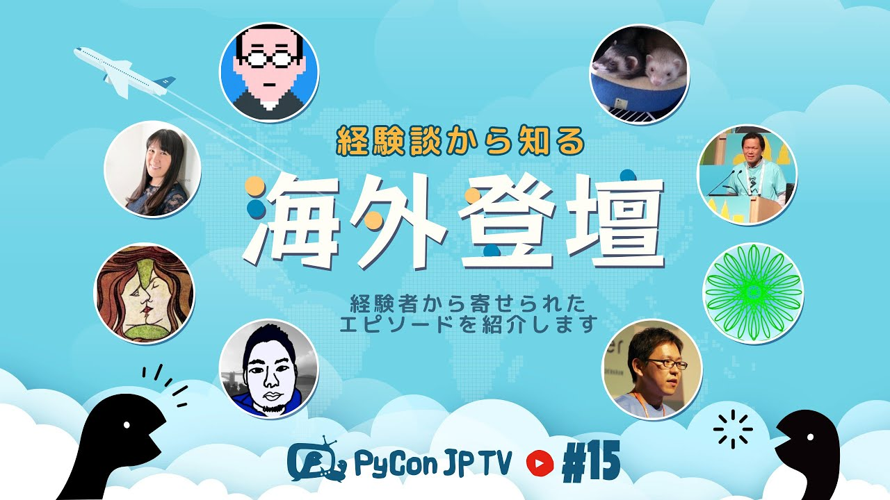

:og:image: https://tv.pycon.jp/_images/episode15.jpg
    

==========================================
 #15: 体験談から知る海外登壇 - 2022-04-01
==========================================

PyConなどの海外登壇経験者にアンケートに記入してもらった内容をもとに、海外登壇に至る裏側などを紹介します。

.. raw:: html

   <iframe width="560" height="315" src="https://www.youtube.com/embed/hXqAAW-t_HQ" title="YouTube video player" frameborder="0" allow="accelerometer; autoplay; clipboard-write; encrypted-media; gyroscope; picture-in-picture" allowfullscreen></iframe>

関連リンク
==========
* `PyCon JP TVお便りコーナー <https://docs.google.com/forms/d/e/1FAIpQLSfvL4cKteAaG_czTXjofR83owyjXekG9GNDGC6-jRZCb_2HRw/viewform>`_
* Twitter: `@pyconjptv <https://twitter.com/pyconjptv>`_
* `Python.jp Discordサーバ <https://www.python.jp/pages/pythonjp_discord.html>`_ の ``#pyconjp-tv`` チャンネル

パーソナリティ
--------------
* 寺田 学(`@terapyon <https://twitter.com>`_)
* 鈴木 たかのり(`@takanory <https://twitter.com/takanory>`_)

Pythonニュース
--------------
* `Python Insider: Python 3.10.3, 3.9.11, 3.8.13, and 3.7.13 are now available with security content <https://pythoninsider.blogspot.com/2022/03/python-3103-3911-3813-and-3713-are-now.html>`_
* `PyCon JP 2022 <https://2022.pycon.jp/>`_
* `EuroPython 2022 | July 11th-17th 2022 | Dublin Ireland & Remote <https://ep2022.europython.eu/>`_
* `PyCon APAC 2022 <https://tw.pycon.org/2022/en-us>`_
* `【オフライン】PyLadies Tokyo Meetup #69 Pythonライブラリー研究会 - connpass <https://pyladies-tokyo.connpass.com/event/243489/>`_
* `DjangoCongress JP 2022 4月作業日 - connpass <https://django.connpass.com/event/241535/>`_
* `peps.python.org <https://peps.python.org/>`_

  * `PEP 676 – PEP Infrastructure Process <https://peps.python.org/pep-0676/>`_
  * `PEP 680 – tomllib: Support for Parsing TOML in the Standard Library <https://peps.python.org/pep-0680/>`_
  * `PEP 594 – Removing dead batteries from the standard library <https://peps.python.org/pep-0594/>`_

体験談から知る海外登壇
----------------------
* スライド: `PyCon JP TV #15: 海外登壇の体験談 <https://docs.google.com/presentation/d/1w3mcGiNNPJsyJF6d6YFCL7c1sisbNzq1a2IIGEdwCSs/edit?usp=sharing>`_

飲みトーク
----------
* `SUNMAI ハニーラガー <http://www.sunmai.com/%E8%9C%82%E8%9C%9C%E7%B3%BB%E5%88%97/?lang=ja>`_
* `PyCon US 2022 <https://us.pycon.org/2022/>`_
* `KABREW KUMIHO I.P.A <http://kabrew.co.kr/en/kabrewbeer/can-beer?tpf=board/view&board_code=12&code=88>`_
* `Grapefruit and Hefeweizen | Schöfferhofer <https://www.schoefferhofer.com/schoefferhofer-grapefruit/>`_
* `Incase Hardshell Case for MacBook Pro 14インチ 2021 Dots - ピンク - Apple（日本） <https://www.apple.com/jp/shop/product/HPZY2ZM/A/incase-hardshell-case-for-macbook-pro-14%E3%82%A4%E3%83%B3%E3%83%81-2021-dots>`_

目次
====
* `0:01:08 <https://www.youtube.com/watch?v=hXqAAW-t_HQ&t=68s>`_ 配信開始
* `0:02:10 <https://www.youtube.com/watch?v=hXqAAW-t_HQ&t=130s>`_ コメント募集「Python以外で勉強したいこと」
* `0:06:48 <https://www.youtube.com/watch?v=hXqAAW-t_HQ&t=408s>`_ 【Pythonニュース】Pythonのセキュリティアップデートがリリース
* `0:08:44 <https://www.youtube.com/watch?v=hXqAAW-t_HQ&t=524s>`_ PyCon JP 2022のティザーサイトが公開
* `0:10:55 <https://www.youtube.com/watch?v=hXqAAW-t_HQ&t=655s>`_ EuroPython 2022、PyCon APAC 2022のCall for Proposalがまもなく締め切り
* `0:13:20 <https://www.youtube.com/watch?v=hXqAAW-t_HQ&t=800s>`_ PyLadies Tokyo Meetupが久しぶりにオフライン開催
* `0:15:00 <https://www.youtube.com/watch?v=hXqAAW-t_HQ&t=900s>`_ DjangoCongress JP 2022の準備が進んでいる
* `0:15:30 <https://www.youtube.com/watch?v=hXqAAW-t_HQ&t=930s>`_ PEPのページが新しくなった。PEP 676 – PEP Infrastructure Process、PEP 680 – tomllib、PEP 594 – Removing dead batteriesを紹介
* `0:19:50 <https://www.youtube.com/watch?v=hXqAAW-t_HQ&t=1190s>`_ 【メイントーク】体験談から知る海外登壇
* `0:21:42 <https://www.youtube.com/watch?v=hXqAAW-t_HQ&t=1302s>`_ どんな準備をしましたか?
* `0:26:50 <https://www.youtube.com/watch?v=hXqAAW-t_HQ&t=1610s>`_ 外国語の準備はしましたか?
* `0:32:12 <https://www.youtube.com/watch?v=hXqAAW-t_HQ&t=1932s>`_ 海外登壇で大変だったこと
* `0:37:18 <https://www.youtube.com/watch?v=hXqAAW-t_HQ&t=2238s>`_ 海外登壇で得られたこと、よかったこと
* `0:44:15 <https://www.youtube.com/watch?v=hXqAAW-t_HQ&t=2655s>`_ 海外登壇に関して伝えたいこと
* `0:51:03 <https://www.youtube.com/watch?v=hXqAAW-t_HQ&t=3063s>`_ その他エピソード
* `0:56:04 <https://www.youtube.com/watch?v=hXqAAW-t_HQ&t=3364s>`_ 【次回予告】PyCon US 2022の振り返り
* `0:59:00 <https://www.youtube.com/watch?v=hXqAAW-t_HQ&t=3540s>`_ コメントを確認
* `1:01:35 <https://www.youtube.com/watch?v=hXqAAW-t_HQ&t=3695s>`_ シュポッ!!トクトクトク、🍺 SUNMAI ハニーラガー。PyCon開催国のビール特集
* `1:02:55 <https://www.youtube.com/watch?v=hXqAAW-t_HQ&t=3775s>`_ YouTubeのチャットからピックアップ
* `1:19:30 <https://www.youtube.com/watch?v=hXqAAW-t_HQ&t=4770s>`_ 今日は4月1日ですが、嘘つきました?3月は終わりましたか?
* `1:23:00 <https://www.youtube.com/watch?v=hXqAAW-t_HQ&t=4980s>`_ PyCon USの発表準備の進捗どうですか
* `1:28:45 <https://www.youtube.com/watch?v=hXqAAW-t_HQ&t=5325s>`_ 【体験談を再度ピックアップ】どんな準備をしましたか?
* `1:29:07 <https://www.youtube.com/watch?v=hXqAAW-t_HQ&t=5347s>`_ 🍺 Kabrew Indea Pale Ale
* `1:34:26 <https://www.youtube.com/watch?v=hXqAAW-t_HQ&t=5666s>`_ 海外登壇で大変だったこと
* `1:39:50 <https://www.youtube.com/watch?v=hXqAAW-t_HQ&t=5990s>`_ PyCon US 2019のポスターの思い出、英語の質疑応答は大変
* `1:45:30 <https://www.youtube.com/watch?v=hXqAAW-t_HQ&t=6330s>`_ 海外登壇で得られたこと、よかったこと
* `1:49:45 <https://www.youtube.com/watch?v=hXqAAW-t_HQ&t=6585s>`_ 【業務連絡】PyCon JP TVのスタッフジャンパーを作ろう
* `1:54:13 <https://www.youtube.com/watch?v=hXqAAW-t_HQ&t=6853s>`_ 海外登壇に関して伝えたいこと
* `1:57:25 <https://www.youtube.com/watch?v=hXqAAW-t_HQ&t=7045s>`_ その他エピソード
* `2:05:15 <https://www.youtube.com/watch?v=hXqAAW-t_HQ&t=7515s>`_ 🍺 Schöfferhofer Grapefruit
* `2:05:55 <https://www.youtube.com/watch?v=hXqAAW-t_HQ&t=7555s>`_ 今日の内容で、参考になるとこありました?
* `2:10:35 <https://www.youtube.com/watch?v=hXqAAW-t_HQ&t=7835s>`_ 寺田パーソナリティーの新ネタを考える
* `2:15:30 <https://www.youtube.com/watch?v=hXqAAW-t_HQ&t=8130s>`_ トークが通ったらEuroPython 2022でダブリンに行こう
* `2:20:32 <https://www.youtube.com/watch?v=hXqAAW-t_HQ&t=8432s>`_ MacBook Pro 14インチのincaseのハードケースを買った
* `2:24:30 <https://www.youtube.com/watch?v=hXqAAW-t_HQ&t=8670s>`_ 「ジャンパー了解」、PyCon USに持っていく撮影機材と録画プラン、PyLadiesオークションは楽しい
* `2:32:50 <https://www.youtube.com/watch?v=hXqAAW-t_HQ&t=9170s>`_ 大長編PyCon US 2022
