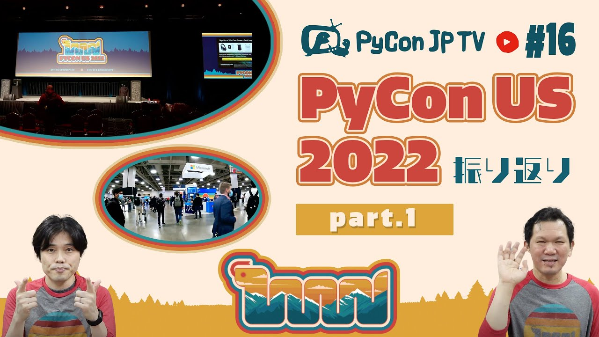

:og:image: https://tv.pycon.jp/_images/episode16.jpg
    

================================================
 #16: PyCon US 2022振り返り Part.1 - 2022-05-13
================================================

2022年4月27日から5月3日に開催された `PyCon US 2022 <https://us.pycon.org/2022/>`_ の様子を、参加者の目線で振り返ります。

.. raw:: html

   <iframe width="560" height="315" src="https://www.youtube.com/embed/Vi1D_xFEMNk" title="YouTube video player" frameborder="0" allow="accelerometer; autoplay; clipboard-write; encrypted-media; gyroscope; picture-in-picture" allowfullscreen></iframe>

関連リンク
==========
* `PyCon JP TVお便りコーナー <https://docs.google.com/forms/d/e/1FAIpQLSfvL4cKteAaG_czTXjofR83owyjXekG9GNDGC6-jRZCb_2HRw/viewform>`_
* Twitter: `@pyconjptv <https://twitter.com/pyconjptv>`_
* `Python.jp Discordサーバ <https://www.python.jp/pages/pythonjp_discord.html>`_ の ``#pyconjp-tv`` チャンネル

パーソナリティ
--------------
* 寺田 学(`@terapyon <https://twitter.com>`_)
* 鈴木 たかのり(`@takanory <https://twitter.com/takanory>`_)

Pythonニュース
--------------
* `Python Release Python 3.11.0b1 <https://www.python.org/downloads/release/python-3110b1/>`_

  * `PEP 664 – Python 3.11 Release Schedule <https://peps.python.org/pep-0664/>`_
* `PyCon JP Blog: PyCon JP 2022プロポーザル募集開始 <https://pyconjp.blogspot.com/2022/05/httpspyconjp.blogspot.com202205proposal.html>`_
* `PyCon JP 2022 :: pretalx <https://pretalx.com/pyconjp2022/cfp>`_
* 5月19日(木) `一般社団法人PyCon JP Association運営会議 #53 <https://pyconjp-staff.connpass.com/event/241801/>`_
* 5月22日(日) `【オフライン】PyLadies Tokyo Meetup #70 開発環境座談会 <https://pyladies-tokyo.connpass.com/event/247365/>`_
* 5月28日(土) `Python Boot Camp in 佐賀 <https://pyconjp.connpass.com/event/244411/>`_
* `PyScript | Run Python in your HTML <https://pyscript.net/>`_

  * `PyScript demo <https://pyscript.net/examples/>`_

PyCon US 2022振り返り Part.1
----------------------------
* `PyCon 2022 Welcome to PyCon US 2022 <https://us.pycon.org/2022/>`_
* `PyCon 2022 - Newcomer Orientation <https://us.pycon.org/2022/events/newcomer-orientation/>`_
* `The Pac-Man Rule <https://accu.org/conf-menu-overviews/pacman_rule/>`_

飲みトーク
----------
* `Bewilder Vitruvian Lager <https://bewilderbrewing.com/pages/vitruvian-lager>`_
* `Bewilder Deseret IPA <https://bewilderbrewing.com/pages/deseret-ipa>`_
* `Shades Brewing <https://www.shadesbrewing.beer/>`_
* `Masaki Kagesawa影澤正輝 (@Masakikage) / Twitter <https://twitter.com/Masakikage>`_
* `Tzu-ping Chung (@uranusjr) / Twitter <https://twitter.com/uranusjr>`_
* `Bewilder Tripel <https://bewilderbrewing.com/pages/tripel>`_
* `DuckDB - An in-process SQL OLAP database management system <https://duckdb.org/>`_
* `Paul Everitt (@paulweveritt) / Twitter <https://twitter.com/paulweveritt>`_
* `Jason Wirth (@Jason_Wirth) / Twitter <https://twitter.com/Jason_Wirth>`_
* `Hassan Sami Adnan (@hsami) / Twitter <https://twitter.com/hsami>`_
* `Ee Durbin (@EWDurbin) / Twitter <https://twitter.com/EWDurbin>`_

目次
====
* `0:00:28 <https://www.youtube.com/watch?v=Vi1D_xFEMNk&t=28s>`_ 配信開始
* `0:01:55 <https://www.youtube.com/watch?v=Vi1D_xFEMNk&t=115s>`_ コメント募集「ゴールデンウィークどう過ごしてました?」
* `0:04:35 <https://www.youtube.com/watch?v=Vi1D_xFEMNk&t=275s>`_ 【Pythonニュース】Python 3.11.0b1がリリース
* `0:06:03 <https://www.youtube.com/watch?v=Vi1D_xFEMNk&t=363s>`_ PyCon JP 2022のプロポーザルの募集開始
* `0:08:32 <https://www.youtube.com/watch?v=Vi1D_xFEMNk&t=512s>`_ 5月19日(木) にPyCon JP Association運営会議
* `0:09:12 <https://www.youtube.com/watch?v=Vi1D_xFEMNk&t=552s>`_ 5月22日(日) PyLadis Tokyo Meetupが葛西臨海公園でピクニックがてら開催
* `0:10:20 <https://www.youtube.com/watch?v=Vi1D_xFEMNk&t=620s>`_ 5月28日(土) Python Boot Camp in 佐賀が開催予定
* `0:11:37 <https://www.youtube.com/watch?v=Vi1D_xFEMNk&t=697s>`_ WebブラウザでPythonが動く「PyScript」がPyCon US 2022で発表された
* `0:13:48 <https://www.youtube.com/watch?v=Vi1D_xFEMNk&t=828s>`_ 【メイントーク】PyCon US 2022振り返り Part.1、イベント概要を紹介
* `0:18:00 <https://www.youtube.com/watch?v=Vi1D_xFEMNk&t=1080s>`_ PyCon USの参加人数と初参加者の比率
* `0:20:00 <https://www.youtube.com/watch?v=Vi1D_xFEMNk&t=1200s>`_ Day.0 会場の外観、受付、メイン会場
* `0:24:45 <https://www.youtube.com/watch?v=Vi1D_xFEMNk&t=1485s>`_ 会場入り、メイン会場でのNewcomer Orientation、スポンサーブースの動画
* `0:32:15 <https://www.youtube.com/watch?v=Vi1D_xFEMNk&t=1935s>`_ スポンサーブースは全体的にゆるい感じだった?
* `0:35:30 <https://www.youtube.com/watch?v=Vi1D_xFEMNk&t=2130s>`_ Day.1 オープニング、Łukasz Langa氏のキーノート
* `0:42:10 <https://www.youtube.com/watch?v=Vi1D_xFEMNk&t=2530s>`_ トーク会場、会場の外で質疑応答
* `0:45:23 <https://www.youtube.com/watch?v=Vi1D_xFEMNk&t=2723s>`_ ライトニングトークの紹介
* `0:52:40 <https://www.youtube.com/watch?v=Vi1D_xFEMNk&t=3160s>`_ カンファレンス1日目の終了後は企業のパーティーに参加
* `0:54:30 <https://www.youtube.com/watch?v=Vi1D_xFEMNk&t=3270s>`_ PyCon US 2022ステッカー、バッジ、Tシャツ
* `0:55:28 <https://www.youtube.com/watch?v=Vi1D_xFEMNk&t=3328s>`_ 【次回予告】PyCon US 2022の振り返り Part.2
* `0:57:21 <https://www.youtube.com/watch?v=Vi1D_xFEMNk&t=3441s>`_ パックマンルールとは
* `1:01:40 <https://www.youtube.com/watch?v=Vi1D_xFEMNk&t=3700s>`_ カシャプシュ 🍺 Bewilder Vitruvian Lager
* `1:06:30 <https://www.youtube.com/watch?v=Vi1D_xFEMNk&t=3990s>`_ 寺田の帰りの荷物が重たかった理由
* `1:09:30 <https://www.youtube.com/watch?v=Vi1D_xFEMNk&t=4170s>`_ アメリカに到着するまでが大変だという話、🍺 Bewilder Deseret IPA
* `1:14:40 <https://www.youtube.com/watch?v=Vi1D_xFEMNk&t=4480s>`_ PyCon US 2022に入るために3回予防接種が必須ルールだった。当日の受付動画
* `1:18:45 <https://www.youtube.com/watch?v=Vi1D_xFEMNk&t=4725s>`_ 行きのサンフランシスコの待ち時間にマウンテンビューを観光した
* `1:23:20 <https://www.youtube.com/watch?v=Vi1D_xFEMNk&t=5000s>`_ 🍺 Shades Brewing Kviek Pina Colada、カンファレンスの2日前にpeacockとご飯を食べに行った
* `1:26:34 <https://www.youtube.com/watch?v=Vi1D_xFEMNk&t=5194s>`_ カンファレンス前日はKagesawaさん、台湾のTzu-pingさんと飲みに行った。Tzu-pingさんの登場シーン。マスクをしているから見つけるの大変
* `1:32:30 <https://www.youtube.com/watch?v=Vi1D_xFEMNk&t=5550s>`_ ユタにいる日本の人と連絡をとって、その人とも一緒に飲みに行った
* `1:35:40 <https://www.youtube.com/watch?v=Vi1D_xFEMNk&t=5740s>`_ 動画: Tシャツ受け取り、朝食の様子
* `1:40:30 <https://www.youtube.com/watch?v=Vi1D_xFEMNk&t=6030s>`_ 動画: キーノート、トーク会場へ移動、オープンスペースの様子
* `1:43:10 <https://www.youtube.com/watch?v=Vi1D_xFEMNk&t=6190s>`_ 🍺 Bewilder Belgian Tripel (9.5%)。全然5%以上のビールあるじゃん
* `1:44:55 <https://www.youtube.com/watch?v=Vi1D_xFEMNk&t=6295s>`_ Peacockさんの空港でのトランジットで外に出ちゃう
* `1:46:54 <https://www.youtube.com/watch?v=Vi1D_xFEMNk&t=6414s>`_ DuckDBの話
* `1:53:30 <https://www.youtube.com/watch?v=Vi1D_xFEMNk&t=6810s>`_ YouTubeのコメントを振り返る、メイン会場の設備はどんな感じ?
* `2:00:00 <https://www.youtube.com/watch?v=Vi1D_xFEMNk&t=7200s>`_ 1日目にとったインタビュー動画: Paul Everittさん
* `2:04:58 <https://www.youtube.com/watch?v=Vi1D_xFEMNk&t=7498s>`_ インタビュー動画: Jason Wirthさん、Microsoftブース
* `2:08:25 <https://www.youtube.com/watch?v=Vi1D_xFEMNk&t=7705s>`_ インタビュー動画: バングラデシュ出身のグループ
* `2:12:50 <https://www.youtube.com/watch?v=Vi1D_xFEMNk&t=7970s>`_ インタビュー動画: Ernest W. Durbin IIIさん。3年間で音楽のジャンルが変わった
* `2:17:45 <https://www.youtube.com/watch?v=Vi1D_xFEMNk&t=8265s>`_ インタビューで日本からの寄付の話をしてくれた。現地開催はin-personって言うらしい
* `2:24:30 <https://www.youtube.com/watch?v=Vi1D_xFEMNk&t=8670s>`_ ソルトレイクシティの気候、ユタ在住の人の話
* `2:29:35 <https://www.youtube.com/watch?v=Vi1D_xFEMNk&t=8975s>`_ DirectorのEwaさんがいなくなった。新しいPSFスタッフにインタビューした
