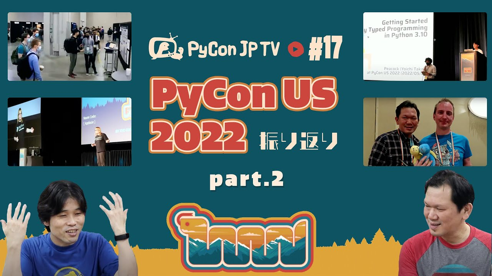

:og:image: https://tv.pycon.jp/_images/episode17.jpg
    

================================================
 #17: PyCon US 2022振り返り Part.2 - 2021-06-03
================================================

前回の続きで、2022年4月27日から5月3日に開催された `PyCon US 2022 <https://us.pycon.org/2022/>`_ の様子を、参加者の目線で振り返ります(カンファレンス2日目以降)。

.. raw:: html

   <iframe width="560" height="315" src="https://www.youtube.com/embed/xvVMXfHfRSg" title="YouTube video player" frameborder="0" allow="accelerometer; autoplay; clipboard-write; encrypted-media; gyroscope; picture-in-picture" allowfullscreen></iframe>

関連リンク
==========
* `PyCon JP TVお便りコーナー <https://docs.google.com/forms/d/e/1FAIpQLSfvL4cKteAaG_czTXjofR83owyjXekG9GNDGC6-jRZCb_2HRw/viewform>`_
* Twitter: `@pyconjptv <https://twitter.com/pyconjptv>`_
* `Python.jp Discordサーバ <https://www.python.jp/pages/pythonjp_discord.html>`_ の ``#pyconjp-tv`` チャンネル

パーソナリティ
--------------
* 寺田 学(`@terapyon <https://twitter.com>`_)
* 鈴木 たかのり(`@takanory <https://twitter.com/takanory>`_)

Pythonニュース
--------------
* PyCon JP 2022

  * `PyCon JP Blog: PyCon JP 2022 のロゴが決定しました！ <https://pyconjp.blogspot.com/2022/05/pyconjp2022-logo-ja.html>`_
  * `PyCon JP Blog: PyCon JP 2022 スポンサーシップパッケージ内容事前公開 <https://pyconjp.blogspot.com/2022/05/pyconjp2022-pre-sponsorship.html>`_
* 海外PyCon

  * `Ticket Info | PyCon APAC 2022 <https://tw.pycon.org/2022/en-us/registration/tickets>`_
  * `PyCon Korea 2022 <https://2022.pycon.kr/en>`_
* 国内イベント

  * `Python Boot Camp in 広島2nd - connpass <https://pyconjp.connpass.com/event/248048/>`_
  * `DjangoCongress JP 2022 <https://djangocongress.jp/>`_
* Community Service Awards

  * `PyCon JP Blog: PyCon US 2022でCommunity Service Awardsを受賞してきました <https://pyconjp.blogspot.com/2022/06/pyconjp-win-awards.html>`_
  * `Python Software Foundation News: PyCon JP Association Awarded the PSF Community Service Award for Q4 2021 <https://pyfound.blogspot.com/2022/05/pycon-jp-association-awarded-psf.html>`_

PyCon US 2022振り返り Part.2
----------------------------
* `Welcome to PyCon US 2022 <https://us.pycon.org/2022/>`_

  * `PyCon US 2022 Talks Schedule <https://us.pycon.org/2022/schedule/talks/>`_
* Day 2

  * `Lightning Talks - Day 2 AM - YouTube <https://www.youtube.com/watch?v=r-rpo4Xm_lM>`_ (寺田さんの発表は25:44から)
  * `Keynote - Sara Issaoun - YouTube <https://www.youtube.com/watch?v=x6SWPjdxvEI>`_
  * `Keynote - Peter Wang - YouTube <https://www.youtube.com/watch?v=qKfkCY7cmBQ>`_
* Day 3

  * `Lightning Talks - Day 3 - YouTube <https://www.youtube.com/watch?v=tF5SD-JlGo4>`_ (PyCon JP 2022は35:56から)
  * `Diversity & Inclusion Workgroup - YouTube <https://www.youtube.com/watch?v=WcbnJA2ah6U>`_
  * `Keynote - Steering Council Panel - YouTube <https://www.youtube.com/watch?v=m2R5shF1pLc>`_
  * `Talk - Peacock: Getting Started with Statically Typed Programming in Python 3.10 - YouTube <https://www.youtube.com/watch?v=ZUIK9hxyi7Y>`_
  * `Talk - Tetsuya Jesse Hirata: Productionize Research Oriented Code By Python - YouTube <https://www.youtube.com/watch?v=bJPov74qjb8>`_
  * `Keynote - Naomi Ceder - YouTube <https://www.youtube.com/watch?v=sFmwGQu0cQU>`_
  * `Keynote - Python Software Foundation Update - YouTube <https://www.youtube.com/watch?v=nQq8d24eWmk>`_ (表彰は11:37から)
  * `Keynote - Closing: Mariatta - YouTube <https://www.youtube.com/watch?v=iOUtQyKBzLo>`_

飲みトーク
----------
* `Bewilder Kolsch - Bewilder Brewing Co - Untappd <https://untappd.com/b/bewilder-brewing-co-bewilder-kolsch/3824016>`_
* `Belgian Wit - Bewilder Brewing Co - Untappd <https://untappd.com/b/bewilder-brewing-co-belgian-wit/4724695>`_
* `Pale Ale Beer - Our Craft Citrus Pale Ale - Sierra Nevada Brewing Co. <https://sierranevada.com/beer/pale-ale/>`_
* `PyCon 2022 Posters <https://us.pycon.org/2022/schedule/posters/list/>`_
* `「至福のキレ」ファミリーマート限定 | ビアサプライズ | サッポロビール <https://www.sapporobeer.jp/beersurprise/kire/>`_
* `11th Anniversary IPA 16oz 4-pack – Smog City Brewing <https://smogcitybrewing.com/products/11th-anniversary-ipa-16oz-4-pack>`_
* `LOVE Hazy IPA - Almanac Beer Company - Untappd <https://untappd.com/b/almanac-beer-company-love-hazy-ipa/2762971>`_
* `3年ぶりリアル開催の「PyCon US」現地リポート、Pythonの明日を知る | 日経クロステック（xTECH） <https://xtech.nikkei.com/atcl/nxt/column/18/00157/052300087/>`_
* `Software Design 2022年7月号｜技術評論社 <https://gihyo.jp/magazine/SD/archive/2022/202207>`_
* `#57 US PyCon 2022 に行ってきた速報ひとり語り 渡米と再入国の大変さを振り返り | terapyon channel podcast <https://podcast.terapyon.net/episodes/0066.html>`_

目次
====
* `0:00:33 <https://www.youtube.com/watch?v=xvVMXfHfRSg&t=33s>`_ 配信開始
* `0:01:16 <https://www.youtube.com/watch?v=xvVMXfHfRSg&t=76s>`_ コメント募集「アメリカ行ったことあるところ」
* `0:04:34 <https://www.youtube.com/watch?v=xvVMXfHfRSg&t=274s>`_ 【Pythonニュース】PyCon JP 2022のロゴデザインが決定
* `0:05:30 <https://www.youtube.com/watch?v=xvVMXfHfRSg&t=330s>`_ PyCon JP 2022のスポンサーパッケージが公開
* `0:07:01 <https://www.youtube.com/watch?v=xvVMXfHfRSg&t=421s>`_ PyCon APAC 2022のチケット発売中
* `0:08:43 <https://www.youtube.com/watch?v=xvVMXfHfRSg&t=523s>`_ PyCon Korea 2022が10月1日、2日に開催
* `0:09:42 <https://www.youtube.com/watch?v=xvVMXfHfRSg&t=582s>`_ Python Boot Camp in 広島 2ndが7月9日に開催
* `0:12:12 <https://www.youtube.com/watch?v=xvVMXfHfRSg&t=732s>`_ DjangoCongress JP 2022が11月12日に東京で開催
* `0:13:59 <https://www.youtube.com/watch?v=xvVMXfHfRSg&t=839s>`_ PyCon US 2022でCommunity Service Awardsを受賞してきた
* `0:16:15 <https://www.youtube.com/watch?v=xvVMXfHfRSg&t=975s>`_ 【メイントーク】PyCon JP 2022 振り返り Part.2
* `0:16:55 <https://www.youtube.com/watch?v=xvVMXfHfRSg&t=1015s>`_ Day.2 朝のLTで寺田さんがPyCon JP Associationの活動を紹介
* `0:20:36 <https://www.youtube.com/watch?v=xvVMXfHfRSg&t=1236s>`_ キーノート: Sara Issaoun
* `0:24:10 <https://www.youtube.com/watch?v=xvVMXfHfRSg&t=1450s>`_ キーノート: Peter Wang
* `0:30:27 <https://www.youtube.com/watch?v=xvVMXfHfRSg&t=1827s>`_ PSF Member Lunch
* `0:33:44 <https://www.youtube.com/watch?v=xvVMXfHfRSg&t=2024s>`_ オープンスペースのボードにPyCon  JP TVの枠を確保
* `0:35:13 <https://www.youtube.com/watch?v=xvVMXfHfRSg&t=2113s>`_ みんなで記念撮影
* `0:37:00 <https://www.youtube.com/watch?v=xvVMXfHfRSg&t=2220s>`_ PyLadiesオークション
* `0:44:15 <https://www.youtube.com/watch?v=xvVMXfHfRSg&t=2655s>`_ Day.3 朝のLTでPyCon JP 2022を紹介
* `0:46:20 <https://www.youtube.com/watch?v=xvVMXfHfRSg&t=2780s>`_ Diversity & Inclusion Workgroup パネル
* `0:48:25 <https://www.youtube.com/watch?v=xvVMXfHfRSg&t=2905s>`_ キーノート Steering Council Panel
* `0:50:30 <https://www.youtube.com/watch?v=xvVMXfHfRSg&t=3030s>`_ 日本人の発表: Peacockさん、Hirataさん
* `0:53:06 <https://www.youtube.com/watch?v=xvVMXfHfRSg&t=3186s>`_ キーノート: Naomi Ceder、クロージングでAwardを受賞、クロージング
* `0:59:20 <https://www.youtube.com/watch?v=xvVMXfHfRSg&t=3560s>`_ 【次回予告】内容未定
* `1:02:10 <https://www.youtube.com/watch?v=xvVMXfHfRSg&t=3730s>`_ カシャプシュ 🍺 Bewilder Kolsh Style
* `1:08:10 <https://www.youtube.com/watch?v=xvVMXfHfRSg&t=4090s>`_ 🍕到着
* `1:10:35 <https://www.youtube.com/watch?v=xvVMXfHfRSg&t=4235s>`_ 🍺 Bewilder Belgian Wit、PyCon USも2回目なので流れがわかる、いろいろやって忙しかった
* `1:15:40 <https://www.youtube.com/watch?v=xvVMXfHfRSg&t=4540s>`_ 今回、寺田が聞いたトーク、スポーツのトラッキング、Python環境の話など
* `1:21:58 <https://www.youtube.com/watch?v=xvVMXfHfRSg&t=4918s>`_ 面白かったキーノートはどれ?動画の字幕がすごい
* `1:27:25 <https://www.youtube.com/watch?v=xvVMXfHfRSg&t=5245s>`_ 🍺 Sierra Nevada Pale Ale(缶がデカい)、 🎥 ポスターセッションの様子
* `1:31:09 <https://www.youtube.com/watch?v=xvVMXfHfRSg&t=5469s>`_ 🎥 ジョブフェアの様子。アメリカでPythonの仕事探したいならPyCon USのジョブフェアに行くのがガチでおすすめ
* `1:35:35 <https://www.youtube.com/watch?v=xvVMXfHfRSg&t=5735s>`_ 🎥 インタビュー動画2本
* `1:43:30 <https://www.youtube.com/watch?v=xvVMXfHfRSg&t=6210s>`_ 🍺 サッポロ ビアサプライズ 至福のキレ、🍺 Smog City Brewing 11th Anniversary IPA
* `1:44:35 <https://www.youtube.com/watch?v=xvVMXfHfRSg&t=6275s>`_ カンファレンス2日目は元気なのでPyLadiesオークションでたくさん飲み、それから一人で飲みに行った
* `1:51:50 <https://www.youtube.com/watch?v=xvVMXfHfRSg&t=6710s>`_ 寺田のLT発表中のハプニング、Larry Hastingさんはいい人
* `1:57:24 <https://www.youtube.com/watch?v=xvVMXfHfRSg&t=7044s>`_ 帰り用のCOVID-19検査。結局、日本メンバーは全員同じ病院で検査
* `2:03:35 <https://www.youtube.com/watch?v=xvVMXfHfRSg&t=7415s>`_ PSFのインタビューをどうしようかな。Tzu-pingさんPythonスニーカーをゲットできず。カンファレンス3日目のあとにみんなで食事に
* `2:11:00 <https://www.youtube.com/watch?v=xvVMXfHfRSg&t=7860s>`_ 来年はPyCon APACブースを出したい!
* `2:17:56 <https://www.youtube.com/watch?v=xvVMXfHfRSg&t=8276s>`_ 🎥 インタビュー動画(Kojoさん、Jayさん、コアデベロッパーのPaul Ganssleさん)。コアデベロッパーの人が超面白い
* `2:28:13 <https://www.youtube.com/watch?v=xvVMXfHfRSg&t=8893s>`_ 🎥 インタビュー動画(Anthony Shawさん)。オープンスペースのインタビューはいい企画
* `2:33:13 <https://www.youtube.com/watch?v=xvVMXfHfRSg&t=9193s>`_ 🍺 Almanac Beer Company LOVE Hazy IPA。Youtubeでコラボしたいと言われた。動画撮影はいいツール
* `2:40:00 <https://www.youtube.com/watch?v=xvVMXfHfRSg&t=9600s>`_ カンファレンス動画を撮るのは楽しかった。写真撮影はちょっと大変
* `2:45:40 <https://www.youtube.com/watch?v=xvVMXfHfRSg&t=9940s>`_ 日本への入国は大変だった
* `2:59:12 <https://www.youtube.com/watch?v=xvVMXfHfRSg&t=10752s>`_ 宣伝: 日経クロステックに記事を書いた。Software Designに記事が掲載予定。 terapyon channelで語っている。雑誌の記事にまとめるのは大変
* `3:08:00 <https://www.youtube.com/watch?v=xvVMXfHfRSg&t=11280s>`_ たかのりが行けなくなってどうするか悩んだ。LTもやろうか悩んだ
* `3:12:30 <https://www.youtube.com/watch?v=xvVMXfHfRSg&t=11550s>`_ オープンスペースのインタビュー時はPeacockディレクターが撮影してくれてた。インタビューは話したい人が来るので面白い
* `3:19:35 <https://www.youtube.com/watch?v=xvVMXfHfRSg&t=11975s>`_ 動画系は提案時はピンと来ない、やってみないとイメージがつかない
