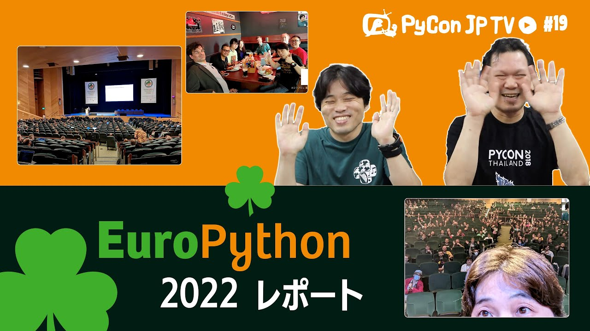

:og:image: https://tv.pycon.jp/_images/episode19.jpg
    

===========================================
 #19: EuroPython 2022振り返り - 2022-08-05
===========================================

2022年7月に開催されたEuroPython 2022の現地の様子をお伝えします。

.. raw:: html

  <iframe width="560" height="315" src="https://www.youtube.com/embed/MyoimjKNQVs" title="YouTube video player" frameborder="0" allow="accelerometer; autoplay; clipboard-write; encrypted-media; gyroscope; picture-in-picture" allowfullscreen></iframe>

関連リンク
==========
* `PyCon JP TVお便りコーナー <https://docs.google.com/forms/d/e/1FAIpQLSfvL4cKteAaG_czTXjofR83owyjXekG9GNDGC6-jRZCb_2HRw/viewform>`_
* Twitter: `@pyconjptv <https://twitter.com/pyconjptv>`_
* `Python.jp Discordサーバ <https://www.python.jp/pages/pythonjp_discord.html>`_ の ``#pyconjp-tv`` チャンネル

パーソナリティ
--------------
* 寺田 学(`@terapyon <https://twitter.com>`_)
* 鈴木 たかのり(`@takanory <https://twitter.com/takanory>`_)

Pythonニュース
--------------
* PyCon JP 2021/2022

  * `PyCon JP Blog: [#pyconjp 2021] 回答いただいた参加者アンケートの結果を共有します（全体編） <https://pyconjp.blogspot.com/2022/05/pyconjp2021-whole-feedback.html>`_
    * `PyCon JP Blog: PyCon JP 2022 トーク採択会議を行いました & トーク採択速報 <https://pyconjp.blogspot.com/2022/07/pyconjp2022-talk-adoption-bulletin-ja.html>`_
* 国内イベント

  * 8月6日(土) `[オフライン] PyLadies Caravan in 愛媛 リターンズ! - connpass <https://pyladies-tokyo.connpass.com/event/251328/>`_
  * 8月12日(金) `DjangoCongress JP 2022 <https://djangocongress.jp/>`_ トーク募集締め切り
  * 9月3日(土) `Python Boot Camp in 静岡県沼津市 - connpass <https://pyconjp.connpass.com/event/251468/>`_
* 海外イベント

  * `Kiwi PyCon XI <https://kiwipycon.nz/>`_ PyCon APACとのバンドルチケット発売中
  * PyCon APAC 2022 `Keynote <https://tw.pycon.org/2022/en-us/conference/keynotes>`_、`Talks <https://tw.pycon.org/2022/en-us/conference/talks>`_

EuroPython 2022振り返り
-----------------------
* `EuroPython 2022 <https://ep2022.europython.eu/>`_

  * `EP2022 - Live Stream - YouTube <https://www.youtube.com/playlist?list=PL8uoeex94UhFzv6hQ_V02xfMCcl8sUr4p>`_
  * `EuroPython 2022 | Flickr <https://www.flickr.com/groups/14792291@N24/>`_
  
* `Python Software Foundation News: Distinguished Service Award Granted to Naomi Ceder <https://pyfound.blogspot.com/2022/07/distinguished-service-award-granted-to.html>`_
* `James Webb Space Telescope | NASA <https://www.nasa.gov/mission_pages/webb/main/index.html>`_
* `Automate the Boring Stuff with Slackbot(ver.2) - Takanori Suzuki <https://ep2022.europython.eu/session/automate-the-boring-stuff-with-slackbot-ver-2>`_

  * スライド: `Automate the Boring Stuff with Slackbot (ver. 2) <https://slides.takanory.net/slides/20220713europython/#/>`_
* `BrewDog Outpost Dublin <https://www.brewdog.com/uk/bars/global/outpostdublin>`_
* スライド: `Spread the community after COVID-19 in Japan 🇯🇵 <https://slides.takanory.net/slides/20220715europython-lt/#/>`_

飲みトーク
----------
* `サッポロビール園サマーピルス <https://www.sapporobeer.jp/product/beer/summer_pils/>`_

目次
====
* `0:00:30 <https://www.youtube.com/watch?v=MyoimjKNQVs&t=30s>`_ 配信開始
* `0:01:27 <https://www.youtube.com/watch?v=MyoimjKNQVs&t=87s>`_ コメント募集「夏に飲みたい飲み物」
* `0:04:30 <https://www.youtube.com/watch?v=MyoimjKNQVs&t=270s>`_ 【Pythonニュース】PyCon JP 2021のアンケート結果が公開
* `0:06:50 <https://www.youtube.com/watch?v=MyoimjKNQVs&t=410s>`_ PyCon JP 2022のトーク採択会議と採択速報
* `0:10:06 <https://www.youtube.com/watch?v=MyoimjKNQVs&t=606s>`_ 8月6日(土) PyLadies Caravan in 愛媛リターンズ!開催予定
* `0:12:00 <https://www.youtube.com/watch?v=MyoimjKNQVs&t=720s>`_ Django Congress JP 2022のトーク募集中
* `0:13:40 <https://www.youtube.com/watch?v=MyoimjKNQVs&t=820s>`_ 9月3日(土) Python Boot Camp in 静岡県沼津市が開催予定
* `0:15:16 <https://www.youtube.com/watch?v=MyoimjKNQVs&t=916s>`_ kiwipyconとPyCon APACのバンドルチケットが発売中
* `0:17:41 <https://www.youtube.com/watch?v=MyoimjKNQVs&t=1061s>`_ PyCon APAC 2022のキーノートスピーカーとトークが決定
* `0:20:38 <https://www.youtube.com/watch?v=MyoimjKNQVs&t=1238s>`_ 【メイントーク】EuroPython 2022振り返り
* `0:21:40 <https://www.youtube.com/watch?v=MyoimjKNQVs&t=1300s>`_ イベントの概要を説明
* `0:23:15 <https://www.youtube.com/watch?v=MyoimjKNQVs&t=1395s>`_ 【カンファレンス1日目】写真を表示しながら説明: 会場、名札、受付、会場の様子
* `0:25:52 <https://www.youtube.com/watch?v=MyoimjKNQVs&t=1552s>`_ オープニング、接触についてのルール、NaomiさんがPSF Distinguished Service Awardを受賞
* `0:27:45 <https://www.youtube.com/watch?v=MyoimjKNQVs&t=1665s>`_ キーノートはJames Webb宇宙望遠鏡の話、企業ブースはがっつり、Pablo氏のトーク、リモート発表、Mark氏のトーク
* `0:31:44 <https://www.youtube.com/watch?v=MyoimjKNQVs&t=1904s>`_ ランチ、企業ブース、コアデベロッパーのパネル
* `0:33:38 <https://www.youtube.com/watch?v=MyoimjKNQVs&t=2018s>`_ takanoryのトークの裏話、LTの様子
* `0:39:25 <https://www.youtube.com/watch?v=MyoimjKNQVs&t=2365s>`_ 散歩、砂浜でピクミンを捕まえに、BREWDOGでビール
* `0:42:10 <https://www.youtube.com/watch?v=MyoimjKNQVs&t=2530s>`_ 【カンファレンス2日目】メイン会場、ドローンについてのキーノート、Sebastian氏のPythonを早く書くトーク
* `0:43:50 <https://www.youtube.com/watch?v=MyoimjKNQVs&t=2630s>`_ Mark Shannon氏のPython fasterの発表、ジョブフェア、コミュニティランチでの出会い
* `0:48:48 <https://www.youtube.com/watch?v=MyoimjKNQVs&t=2928s>`_ 日本からの参加者whitphxさんのトーク、ダイバシティー&インクルージョンパネル、LT
* `0:51:07 <https://www.youtube.com/watch?v=MyoimjKNQVs&t=3067s>`_ パーティ前のビール、パーティー
* `0:52:40 <https://www.youtube.com/watch?v=MyoimjKNQVs&t=3160s>`_ 【カンファレンス3日目】LT申し込み、キーノート、ランチ、takanoryのライトニングトーク、クロージング
* `0:57:10 <https://www.youtube.com/watch?v=MyoimjKNQVs&t=3430s>`_ 空港で夕食、飛行機で移動、デンマークに到着
* `0:59:00 <https://www.youtube.com/watch?v=MyoimjKNQVs&t=3540s>`_ 【次回予告】PyCon JP 2022の楽しみ方
* `1:02:24 <https://www.youtube.com/watch?v=MyoimjKNQVs&t=3744s>`_ カシャプシュ 🍺 サッポロビール園サマーピルス 。日本から3人参加できてよかった
* `1:09:25 <https://www.youtube.com/watch?v=MyoimjKNQVs&t=4165s>`_ 参加者数。ヨーロッパの都市ならどこでも変わらなそう。
* `1:13:11 <https://www.youtube.com/watch?v=MyoimjKNQVs&t=4391s>`_ 🍺 羊蹄山麓ビール Eglish Pale Ale、夏休みはとった?近場の旅行が増えてそう、SciPy 2022の話
* `1:20:05 <https://www.youtube.com/watch?v=MyoimjKNQVs&t=4805s>`_ takanoryのライトニングトーク裏話。サインアップのために早起き
* `1:26:04 <https://www.youtube.com/watch?v=MyoimjKNQVs&t=5164s>`_ ライトニングトークの時に寺田は飲みながら開発合宿の会場で見ていた。寺田のUSでのLTをオマージュ。日本で見ていた人はどんな感じだった?
* `1:34:10 <https://www.youtube.com/watch?v=MyoimjKNQVs&t=5650s>`_ 🍺 t0ki brewery CLEAN CODE、ライトニングトークで現地からも拍手がもらえて暖かかった。トークの反応はどうだった?
* `1:40:17 <https://www.youtube.com/watch?v=MyoimjKNQVs&t=6017s>`_ 写真で振り返るEuroPython 2022、出発からホテル到着まで。カンファレンスでどれくらい前に到着するか
* `1:49:40 <https://www.youtube.com/watch?v=MyoimjKNQVs&t=6580s>`_ カンファレンス前日の様子。ダブリンを散策、落ち着いてて治安がよさそう。BREW DOCKで飲んでいたらMarcさんと偶然遭遇
* `2:02:20 <https://www.youtube.com/watch?v=MyoimjKNQVs&t=7340s>`_ カンファレンスの次の日はデンマークのビルン、この日はLEGO House観光
* `2:09:49 <https://www.youtube.com/watch?v=MyoimjKNQVs&t=7789s>`_ LEGO Houseに到着、システムがすごい。6個のレゴの組み合わせカード。アトラクションの設計がすごい
* `2:14:30 <https://www.youtube.com/watch?v=MyoimjKNQVs&t=8070s>`_ ヒストリーミュージアム、カフェ、中央の巨大な樹、マスターピースギャラリー
* `2:23:50 <https://www.youtube.com/watch?v=MyoimjKNQVs&t=8630s>`_ LEGO Brick Builder、外で休憩、自分のminifigを作る、ランチ(Build your own meal)
* `2:28:59 <https://www.youtube.com/watch?v=MyoimjKNQVs&t=8939s>`_ 車を作る、街を作る、Modie Mixer、魚を作る、ヒストリーミュージアムの内側を見てなかった!!
* `2:33:18 <https://www.youtube.com/watch?v=MyoimjKNQVs&t=9198s>`_ LEGOストアに戻る。LEGO Houseの限定レゴが売っていた。このあとLEGOLANDに2日間行った
* `2:37:47 <https://www.youtube.com/watch?v=MyoimjKNQVs&t=9467s>`_ いろんなイベントが近づいてきた。リアルカンファレンス楽しいねー
