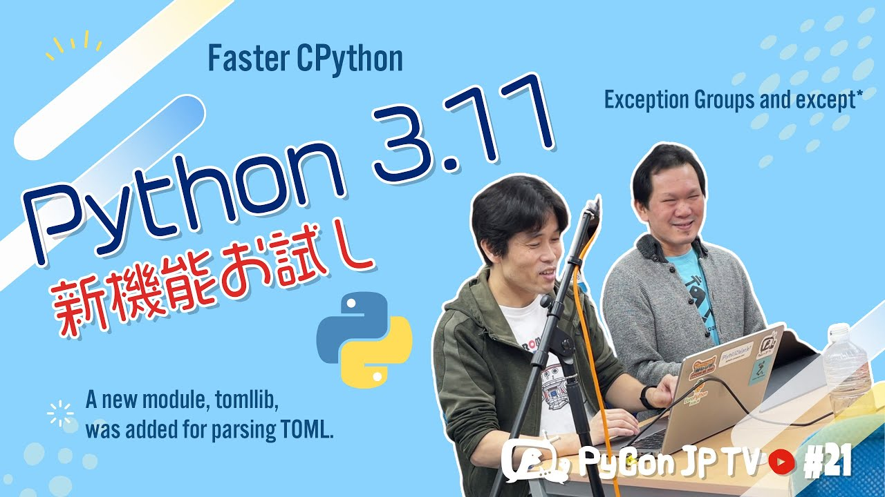

:og:image: https://tv.pycon.jp/_images/episode21.jpg
    

=============================================
 #21: Python 3.11の新機能を試す - 2022-10-07
=============================================

2022年10月24日にリリース予定の、Python 3.11の新機能を試しながら解説します。

.. raw:: html

   <iframe width="560" height="315" src="https://www.youtube.com/embed/gz5kcS9zdAc" title="YouTube video player" frameborder="0" allow="accelerometer; autoplay; clipboard-write; encrypted-media; gyroscope; picture-in-picture" allowfullscreen></iframe>

関連リンク
==========
* `PyCon JP TVお便りコーナー <https://docs.google.com/forms/d/e/1FAIpQLSfvL4cKteAaG_czTXjofR83owyjXekG9GNDGC6-jRZCb_2HRw/viewform>`_
* Twitter: `@pyconjptv <https://twitter.com/pyconjptv>`_
* `Python.jp Discordサーバ <https://www.python.jp/pages/pythonjp_discord.html>`_ の ``#pyconjp-tv`` チャンネル

パーソナリティ
--------------
* 寺田 学(`@terapyon <https://twitter.com>`_)
* 鈴木 たかのり(`@takanory <https://twitter.com/takanory>`_)

Pythonニュース
--------------
* PyCon JP 2022

  * `PyCon JP 2022 <https://2022.pycon.jp/>`_
  * 10月14日(金)、15日(日) `PyCon JP 2022 カンファレンス - connpass <https://pyconjp.connpass.com/event/255827/>`_
  * 10月16日(日) `PyCon JP 2022 Developer & Community Sprint - connpass <https://pyconjp.connpass.com/event/260219/>`_
  * 10月15日(土) `PyCon JP 2022 Official Party - connpass <https://pyconjp.connpass.com/event/261187/>`_
  * 10月14日(金) `PyLadies Caravan & Python Boot Campミートアップ 2022 - connpass <https://pyconjp.connpass.com/event/260381/>`_
  * `PyCon JP Blog: PyCon JP 2022当日スタッフ募集 <https://pyconjp.blogspot.com/2022/09/pyconjp2022-conf-day-of-staff.html>`_
  * `PyCon JP Blog: PyCon JP 2022 参加者Tシャツ発売! <https://pyconjp.blogspot.com/2022/09/PyConJP2022TshirtJ.html>`_
* 国内イベント

  * `PyCon JP Blog: 「Python Boot Camp in 静岡県沼津市」を開催しました <https://pyconjp.blogspot.com/2022/09/pycamp-in-shizuoka-numazu-report.html>`_
  * `PyCon JP Blog: 「Python Boot Camp in 新潟2nd」を開催しました！ <https://pyconjp.blogspot.com/2022/09/pycamp-in-niigata2nd.html>`_
  * 11月19日(土) `[オフライン] PyLadies Caravan in 愛知 リターンズ! - connpass <https://pyladies-tokyo.connpass.com/event/260718/>`_

Python 3.11の新機能を試す
-------------------------
* `PEP 664 – Python 3.11 Release Schedule <https://peps.python.org/pep-0664/>`_
* `Python Release Python 3.11.0rc2 <https://www.python.org/downloads/release/python-3110rc2/>`_
* `What’s New In Python 3.11 <https://docs.python.org/3.11/whatsnew/3.11.html>`_

  * `PEP 594 – Removing dead batteries from the standard library <https://peps.python.org/pep-0594/>`_
  * `PEP 657 – Include Fine Grained Error Locations in Tracebacks <https://peps.python.org/pep-0657/>`_
  * `PEP 654 – Exception Groups and except* <https://peps.python.org/pep-0654/>`_
  * `PEP 678 – Enriching Exceptions with Notes <https://peps.python.org/pep-0678/>`_
  * `tomllib — Parse TOML files <https://docs.python.org/3.11/library/tomllib.html#module-tomllib>`_
  * `The Python Performance Benchmark Suite <https://pyperformance.readthedocs.io/>`_
  * `pyperformanceの実行結果をまとめたスプレッドシート <https://docs.google.com/spreadsheets/d/1eCULBNnsB9FGhGd8Gm0TaDvGlZdwqc0qDzYT6zBFJu8/edit#gid=0>`_
* 参考:

  * `Python 3.11の新機能(その1） CPython高速化計画: Python3.11の新機能 - python.jp <https://www.python.jp/news/wnpython311/index.html>`_
  * `#02　Faster CPythonやGILの除去によるPythonの高速化 ―EuroPython Day 2、Day 3セッションレポート | gihyo.jp <https://gihyo.jp/article/2022/09/europython2022-02#gh3KtdEIBU>`_

飲みトーク
----------
* 🍺 `Hofbräu Oktoberfestbier <https://www.hofbraeu-muenchen.de/en/beer/hofbrau-oktoberfestbier>`_

目次
====
* `0:00:28 <https://www.youtube.com/watch?v=gz5kcS9zdAc&t=28s>`_ 配信開始
* `0:04:09 <https://www.youtube.com/watch?v=gz5kcS9zdAc&t=249s>`_ 【Pythonニュース】PyCon JP 2022チケット発売中
* `0:06:07 <https://www.youtube.com/watch?v=gz5kcS9zdAc&t=367s>`_ 10月16日(日) Developer & Community Sprint
* `0:08:01 <https://www.youtube.com/watch?v=gz5kcS9zdAc&t=481s>`_ 10月15日(土) PyCon JP 2022 Official Partyチケット
* `0:09:17 <https://www.youtube.com/watch?v=gz5kcS9zdAc&t=557s>`_ 10月14日(金) PyLadies Caravan & Python Boot Campミートアップ 2022
* `0:11:03 <https://www.youtube.com/watch?v=gz5kcS9zdAc&t=663s>`_ 当日スタッフ募集中
* `0:12:45 <https://www.youtube.com/watch?v=gz5kcS9zdAc&t=765s>`_ 参加者Tシャツ発売中
* `0:14:02 <https://www.youtube.com/watch?v=gz5kcS9zdAc&t=842s>`_ Python Boot Camp in 静岡県沼津市、新潟2ndを開催
* `0:15:37 <https://www.youtube.com/watch?v=gz5kcS9zdAc&t=937s>`_ 11月19日(土) PyLadies Caravan in 愛知 リターンズ!開催予定
* `0:18:32 <https://www.youtube.com/watch?v=gz5kcS9zdAc&t=1112s>`_ 【メイントーク】Python 3.11の新機能を試す
* `0:19:20 <https://www.youtube.com/watch?v=gz5kcS9zdAc&t=1160s>`_ PEP 664 – Python 3.11のリリーススケジュール
* `0:22:12 <https://www.youtube.com/watch?v=gz5kcS9zdAc&t=1332s>`_ What's New in Python 3.11のリリースハイライト
* `0:30:05 <https://www.youtube.com/watch?v=gz5kcS9zdAc&t=1805s>`_ dead batteriesはPython 3.11からDeprecationWariningが出るようになる
* `0:32:00 <https://www.youtube.com/watch?v=gz5kcS9zdAc&t=1920s>`_ PEP 657: Enhanced error locations in tracebacks: エラーの発生した箇所がわかりやすくなる
* `0:37:24 <https://www.youtube.com/watch?v=gz5kcS9zdAc&t=2244s>`_ PEP 654: Exception Groups and except*: 複数の例外をまとめて出して受け取れるようになった
* `0:41:48 <https://www.youtube.com/watch?v=gz5kcS9zdAc&t=2508s>`_ PEP 678: Exceptions can be enriched with notes: 例外に備考が追加できるようになる
* `0:46:20 <https://www.youtube.com/watch?v=gz5kcS9zdAc&t=2780s>`_ Windows py.exe launcher improvements: Windowsのpyコマンドで色んなPythonが呼び出せるようになる
* `0:47:50 <https://www.youtube.com/watch?v=gz5kcS9zdAc&t=2870s>`_ 標準ライブラリにtomllibが追加
* `0:48:55 <https://www.youtube.com/watch?v=gz5kcS9zdAc&t=2935s>`_ Faster CPython。平均でPython 3.10より25%高速化
* `0:51:10 <https://www.youtube.com/watch?v=gz5kcS9zdAc&t=3070s>`_ pyperformanceを手元で動作させた結果を共有
* `0:57:20 <https://www.youtube.com/watch?v=gz5kcS9zdAc&t=3440s>`_ Faster CPythonの中身としてどんなことをしたのか?
* `1:01:20 <https://www.youtube.com/watch?v=gz5kcS9zdAc&t=3680s>`_ 【お便りコーナー】PyCon JP久しぶりのオンサイト開催で緊張しているが、うまくのりきるコツは?
* `1:04:30 <https://www.youtube.com/watch?v=gz5kcS9zdAc&t=3870s>`_ 【次回予告】11月4日(金) 19:30から。テーマは「PyCon JP 2022振り返り」
* `1:08:11 <https://www.youtube.com/watch?v=gz5kcS9zdAc&t=4091s>`_ カシャプシュ 🍺 Hofbräu Oktoberfestbier
