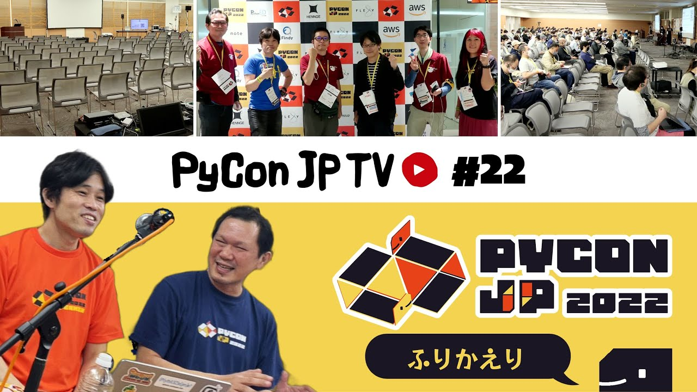

:og:image: https://tv.pycon.jp/_images/episode22.jpg

=========================================
 #22: PyCon JP 2022振り返り - 2022-11-04
=========================================

2022年10月14日〜16日に開催されたPyCon JP 2022の様子をお伝えします。

.. raw:: html

   <iframe width="560" height="315" src="https://www.youtube.com/embed/5tT4zNbKLHo" title="YouTube video player" frameborder="0" allow="accelerometer; autoplay; clipboard-write; encrypted-media; gyroscope; picture-in-picture" allowfullscreen></iframe>

   

関連リンク
==========
* `PyCon JP TVお便りコーナー <https://docs.google.com/forms/d/e/1FAIpQLSfvL4cKteAaG_czTXjofR83owyjXekG9GNDGC6-jRZCb_2HRw/viewform>`_
* Twitter: `@pyconjptv <https://twitter.com/pyconjptv>`_
* `Python.jp Discordサーバ <https://www.python.jp/pages/pythonjp_discord.html>`_ の ``#pyconjp-tv`` チャンネル

パーソナリティ
--------------
* 寺田 学(`@terapyon <https://twitter.com>`_)
* 鈴木 たかのり(`@takanory <https://twitter.com/takanory>`_)

Pythonニュース
--------------
* `Python Release Python 3.11.0 | Python.org <https://www.python.org/downloads/release/python-3110/>`_
* 11月12日(土) `DjangoCongress JP 2022 <https://djangocongress.jp/>`_
* 11月17日(木) `一般社団法人PyCon JP Association運営会議 #56 <https://pyconjp-staff.connpass.com/event/261842/>`_
* 11月19日(土) `Python Boot Camp in 香川2nd <https://pyconjp.connpass.com/event/261760/>`_
* 11月19日(土) `[オフライン] PyLadies Caravan in 愛知 リターンズ! <https://pyladies-tokyo.connpass.com/event/260718/>`_
* 11月19日(土) `PyLadies Tokyo - 8周年記念オンラインパーティ <https://pyladies-tokyo.connpass.com/event/263939/>`_
* `Proposal Guidelines - PyCon US 2023 <https://us.pycon.org/2023/speaking/guidelines/>`_
* `Python Developers Survey 2022 <https://surveys.jetbrains.com/s3/c2-python-developers-survey-2022>`_
* `Python Software Foundation News: Announcing Python Software Foundation Fellow Members for Q3 2022! 🎉 <https://pyfound.blogspot.com/2022/10/announcing-python-software-foundation.html>`_

PyCon JP 2022振り返り
---------------------
* `PyCon JP 2022 <https://2022.pycon.jp/>`_
* `PyLadies Caravan & Python Boot Campミートアップ 2022 <https://pyconjp.connpass.com/event/260381/>`_
* `Slido <https://www.slido.com/>`_
* `PyCon JP Blog: PyCon JP 2022 参加者Tシャツ発売! <https://pyconjp.blogspot.com/2022/09/PyConJP2022TshirtJ.html>`_

飲みトーク
----------
* 🍺 `Fresh Hop IPA <http://tamamura-honten.co.jp/?pid=163410035>`_

目次
====
* `0:00:47 <https://www.youtube.com/watch?v=5tT4zNbKLHo&t=47s>`_ 配信開始
* `0:04:30 <https://www.youtube.com/watch?v=5tT4zNbKLHo&t=270s>`_ 【Pythonニュース】Python 3.11.0がリリース
* `0:07:14 <https://www.youtube.com/watch?v=5tT4zNbKLHo&t=434s>`_ 11月12日(土) DjangoCongress JPが開催予定
* `0:08:18 <https://www.youtube.com/watch?v=5tT4zNbKLHo&t=498s>`_ 11月17日(木) PyCon JP Associationの運営会議
* `0:09:00 <https://www.youtube.com/watch?v=5tT4zNbKLHo&t=540s>`_ 11月19日(土) Python Boot Camp in 香川2nd
* `0:10:24 <https://www.youtube.com/watch?v=5tT4zNbKLHo&t=624s>`_ 11月19日(土) PyLadies Caravan in 愛知 リターンズ!
* `0:11:37 <https://www.youtube.com/watch?v=5tT4zNbKLHo&t=697s>`_ 11月19日(土) PyLadies Tokyo - 8周年記念オンラインパーティ
* `0:12:54 <https://www.youtube.com/watch?v=5tT4zNbKLHo&t=774s>`_ PyCon US 2023のProposal募集中
* `0:14:40 <https://www.youtube.com/watch?v=5tT4zNbKLHo&t=880s>`_ Python Developers Survey 2022の回答募集中
* `0:16:50 <https://www.youtube.com/watch?v=5tT4zNbKLHo&t=1010s>`_ Python Software Foundation Fellow Members for Q3 2022にアジアから3名が選ばれた
* `0:20:45 <https://www.youtube.com/watch?v=5tT4zNbKLHo&t=1245s>`_ 【メイントーク】PyCon JP 2022振り返り
* `0:23:19 <https://www.youtube.com/watch?v=5tT4zNbKLHo&t=1399s>`_ カンファレンス前日の様子。写真を見ながら、前日準備、Welcome Partyについて
* `0:29:42 <https://www.youtube.com/watch?v=5tT4zNbKLHo&t=1782s>`_ カンファレンス1日目の様子。会場の様子など
* `0:35:15 <https://www.youtube.com/watch?v=5tT4zNbKLHo&t=2115s>`_ カンファレンス1日目の夜。Python Boot Camp、PyLadiesパーティの様子。1日目どうでした?
* `0:39:14 <https://www.youtube.com/watch?v=5tT4zNbKLHo&t=2354s>`_ カンファレンス2日目。キーノート、歴代PyCon JP座長全員集合、クロージング、パーティーの様子
* `0:46:20 <https://www.youtube.com/watch?v=5tT4zNbKLHo&t=2780s>`_ 2日目どうでした?発表とsli.doでの質疑応答、機材トラブル
* `0:52:20 <https://www.youtube.com/watch?v=5tT4zNbKLHo&t=3140s>`_ PyCon JP 2022 Reportビデオの紹介。写真、ビデオはオフィシャルで今後公開予定
* `0:54:08 <https://www.youtube.com/watch?v=5tT4zNbKLHo&t=3248s>`_ PyCon JP 2022 TシャツとスピーカーTシャツ
* `0:56:47 <https://www.youtube.com/watch?v=5tT4zNbKLHo&t=3407s>`_ 【次回予告】12月2日(金) 19:30。テーマは「Python Boot Campのテキスト」を紹介
* `1:00:54 <https://www.youtube.com/watch?v=5tT4zNbKLHo&t=3654s>`_ カシャプシュ 🍺 志賀高原 Fresh Hop IPA 2022

