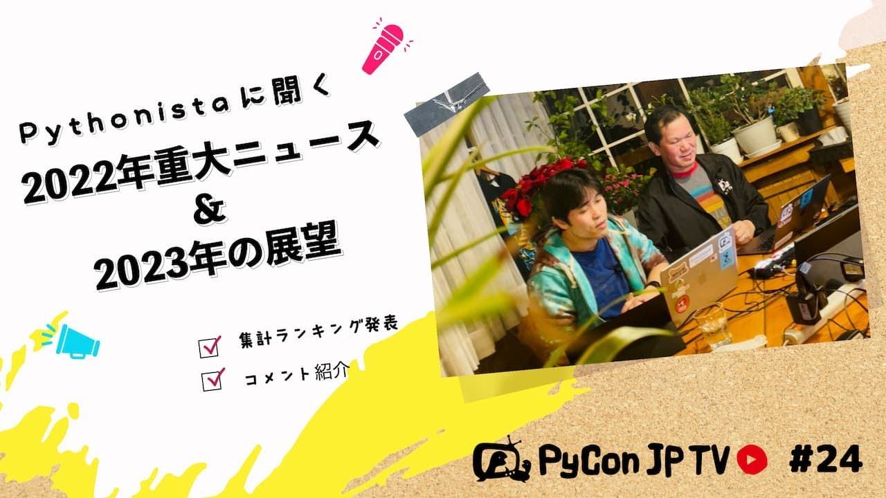

:og:image: https://tv.pycon.jp/_images/episode24.jpg

====================================================================
 #24: Pythonistaに聞く2022年重大ニュースと2023年の展望 - 2023-01-13
====================================================================

Pythonista(Pythonを使っている人)に事前アンケートを行い、その結果を元に2022年の重大ニュースと2023年の展望を見ていきたいと思います。

.. raw:: html

   <iframe width="560" height="315" src="https://www.youtube.com/embed/6gqyEktNU0Q" title="YouTube video player" frameborder="0" allow="accelerometer; autoplay; clipboard-write; encrypted-media; gyroscope; picture-in-picture" allowfullscreen></iframe>

関連リンク
==========
* `PyCon JP TVお便りコーナー <https://docs.google.com/forms/d/e/1FAIpQLSfvL4cKteAaG_czTXjofR83owyjXekG9GNDGC6-jRZCb_2HRw/viewform>`_
* Twitter: `@pyconjptv <https://twitter.com/pyconjptv>`_
* `Python.jp Discordサーバ <https://www.python.jp/pages/pythonjp_discord.html>`_ の ``#pyconjp-tv`` チャンネル

パーソナリティ
--------------
* 寺田 学(`@terapyon <https://twitter.com>`_)
* 鈴木 たかのり(`@takanory <https://twitter.com/takanory>`_)

Pythonニュース
--------------
* 海外イベント

  * `PyCon PH 2023 <https://pycon.python.ph/>`_
  * `Registration Information - PyCon US 2023 <https://us.pycon.org/2023/attend/information/>`_
  * `EuroPython 2023 <https://www.python.org/events/python-events/1398/>`_
* Pythonリリース情報

  * `Python Insider: Python 3.11.1, 3.10.9, 3.9.16, 3.8.16, 3.7.16, and 3.12.0 alpha 3 are now available <https://pythoninsider.blogspot.com/2022/12/python-3111-3109-3916-3816-3716-and.html>`_
  * `Python Insider: Python 3.12.0 alpha 4 released <https://blog.python.org/2023/01/python-3120-alpha-4-released.html>`_

Pythonistaに聞く2022年重大ニュースと2023年の展望
------------------------------------------------
* アンケートフォーム: `PyCon JP TV #24: Pythonistaに聞く2022年重大ニュースと2023年の展望 <https://docs.google.com/forms/d/e/1FAIpQLSdlRf-6TWKGEf3oSxVpNx0Crn-vj__Q8FhYaqrQzJ9tECluow/viewform>`_
* `スライド <https://docs.google.com/presentation/d/15xsu6nyVcupbIFk-UYzVuS-a1M-3STEcjIDYXdbFFb8/edit>`_
* 2022年重大ニュース

  * `DjangoCongress JP 2022 <https://djangocongress.jp/>`_
  * `PyCon JP Blog: PyCon JP AssociationがPSFのCommunity Service Awardに選ばれました🎉 <https://pyconjp.blogspot.com/2022/02/psf-community-service-award.html>`_
  * `PyCon JP 2022 <https://2022.pycon.jp/en/>`_
  * `PyCon Kyushu 2022 Kumamoto <https://kyushu.pycon.jp/2022/>`_
  * `Python Boot Camp(初心者向けPythonチュートリアル) <https://www.pycon.jp/support/bootcamp.html>`_
  * `Python Release Python 3.11.0 | Python.org <https://www.python.org/downloads/release/python-3110/>`_
  * `PyLadies Caravan | PyLadies Tokyo <https://tokyo.pyladies.com/caravan/index.html>`_
* その他重大ニュース

  * `Stable Diffusion Online <https://stablediffusionweb.com/>`_
  * `ChatGPT: Optimizing Language Models for Dialogue <https://openai.com/blog/chatgpt/>`_
  * `openai/whisper: Robust Speech Recognition via Large-Scale Weak Supervision <https://github.com/openai/whisper>`_
* 挑戦したいこと

  * `ESP8266 - Wikipedia <https://ja.wikipedia.org/wiki/ESP8266>`_
  * `MicroPython - Python for microcontrollers <https://micropython.org/>`_

目次
====
* `0:00:28 <https://www.youtube.com/watch?v=6gqyEktNU0Q&t=28s>`_ 配信開始
* `0:02:01 <https://www.youtube.com/watch?v=6gqyEktNU0Q&t=121s>`_ コメント募集「今年の年末年始お正月とかどんな風に過ごしてましたか」
* `0:05:02 <https://www.youtube.com/watch?v=6gqyEktNU0Q&t=302s>`_ 【Pythonニュース】PyCon PHのチケット発売中
* `0:06:32 <https://www.youtube.com/watch?v=6gqyEktNU0Q&t=392s>`_ PyCon US 2023チケット発売中
* `0:07:40 <https://www.youtube.com/watch?v=6gqyEktNU0Q&t=460s>`_ EuroPython 2023の日程が発表
* `0:08:44 <https://www.youtube.com/watch?v=6gqyEktNU0Q&t=524s>`_ Pythonのbugfixバージョンがリリース
* `0:09:27 <https://www.youtube.com/watch?v=6gqyEktNU0Q&t=567s>`_ Python 3.12 apha 4がリリース
* `0:10:56 <https://www.youtube.com/watch?v=6gqyEktNU0Q&t=656s>`_ 【メイントーク】Pythonistaに聞く2022年重大ニュースと2023年の展望
* `0:11:13 <https://www.youtube.com/watch?v=6gqyEktNU0Q&t=673s>`_ 事前アンケートの内容を紹介
* `0:13:40 <https://www.youtube.com/watch?v=6gqyEktNU0Q&t=820s>`_ アンケート結果のまとめスライドを表示
* `0:14:20 <https://www.youtube.com/watch?v=6gqyEktNU0Q&t=860s>`_ 「2022年重大ニュース」を発表
* `0:20:10 <https://www.youtube.com/watch?v=6gqyEktNU0Q&t=1210s>`_ 重大ニュースに関するコメントを紹介
* `0:24:59 <https://www.youtube.com/watch?v=6gqyEktNU0Q&t=1499s>`_ その他の重大ニュース
* `0:27:30 <https://www.youtube.com/watch?v=6gqyEktNU0Q&t=1650s>`_ パーソナリティ2人にとっての重大ニュース
* `0:31:00 <https://www.youtube.com/watch?v=6gqyEktNU0Q&t=1860s>`_ 「2023年の展望」を発表
* `0:39:51 <https://www.youtube.com/watch?v=6gqyEktNU0Q&t=2391s>`_ 2023年の展望に関するコメントを紹介
* `0:46:13 <https://www.youtube.com/watch?v=6gqyEktNU0Q&t=2773s>`_ 「他に挑戦したいこと」を紹介
* `0:53:40 <https://www.youtube.com/watch?v=6gqyEktNU0Q&t=3220s>`_ YouTubeのコメントをピックアップ
* `0:56:58 <https://www.youtube.com/watch?v=6gqyEktNU0Q&t=3418s>`_ パーソナリティ2人の2023年の展望
* `0:57:38 <https://www.youtube.com/watch?v=6gqyEktNU0Q&t=3458s>`_ 【次回予告】2月3日(金) 19:30から「Sphinxで静的Webサイト構築」をデモを交えながら
