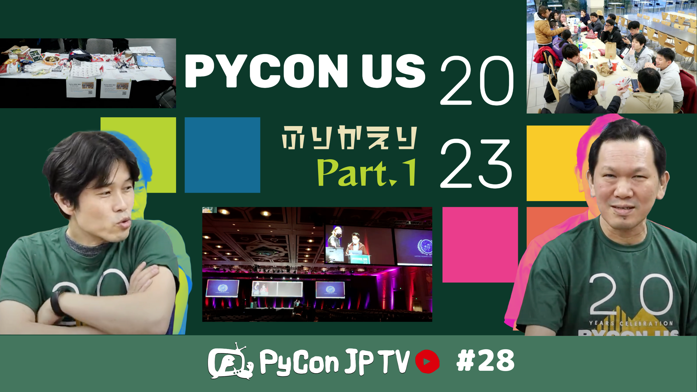

:og:image: https://tv.pycon.jp/_images/episode28.png

=========================================
 #28: PyCon US 2023振り返り - 2023-05-12
=========================================

2023年4月に開催されたPyCon US 2023のレポートを、(おそらく)日本語ではどこよりも早くお届けします

.. raw:: html

   <iframe width="560" height="315" src="https://www.youtube.com/embed/7-UjyXNriwk" title="YouTube video player" frameborder="0" allow="accelerometer; autoplay; clipboard-write; encrypted-media; gyroscope; picture-in-picture; web-share" allowfullscreen></iframe>

関連リンク
==========
* `PyCon JP - YouTubeチャンネル <https://www.youtube.com/user/PyConJP>`_
* Twitter: `@pyconjptv <https://twitter.com/pyconjptv>`_
* `PyCon JP TVお便りコーナー <https://docs.google.com/forms/d/e/1FAIpQLSfvL4cKteAaG_czTXjofR83owyjXekG9GNDGC6-jRZCb_2HRw/viewform>`_

パーソナリティ
--------------
* 寺田 学(`@terapyon <https://twitter.com>`_)
* 鈴木 たかのり(`@takanory <https://twitter.com/takanory>`_)

Pythonニュース
--------------
* 国内イベント

  * `PyCon APAC 2023 <https://2023-apac.pycon.jp/>`_
  * `PyCon JP Blog: PyCon APAC 2023 の CfP サイトを公開しました！ <https://pyconjp.blogspot.com/2023/04/pyconapac2023-cfp-ja.html>`_
  * `みんなのPython勉強会#93 - connpass <https://startpython.connpass.com/event/272158/>`_
  * `Python Boot Camp in 鹿児島2nd - connpass <https://pyconjp.connpass.com/event/278007/>`_
  * `PyCon JP Blog: 「Python Boot Camp in 愛知2nd」開催決定 <https://pyconjp.blogspot.com/2023/05/pycamp-in-aichi2nd.html.html>`_
  * `オープンソースカンファレンス2023 Nagoya <https://event.ospn.jp/osc2023-nagoya/>`_ に出展
* 海外イベント

  * `PyCon TW 2023 Registration: Individual / 個人票種 <https://pycontw.kktix.cc/events/2023-individual>`_
  * `EuroPython 2023 Ticket <https://tickets.europython.eu/>`_
  * `PyCon India 2023 <https://twitter.com/pyconindia/status/1655520378410926081>`_
  * `PyCon HK 2023 - Call For Proposal <https://pycon.hk/2023/pycon-hk-2023-cfp/>`_
* その他

  * `Introducing PyPI Organizations - The Python Package Index <https://blog.pypi.org/posts/2023-04-23-introducing-pypi-organizations/>`_
  * `Announcing the PyPI Safety & Security Engineer role - The Python Package Index <https://blog.pypi.org/posts/2023-05-09-announcing-pypi-safety-and-security-engr-role/>`_
  * `Python Software Foundation News: PSF Board Election Dates for 2023 <https://pyfound.blogspot.com/2023/05/psf-board-election-dates-for-2023.html>`_

PyCon US 2023振り返り
---------------------
* `Welcome to PyCon US 2023 - PyCon US 2023 <https://us.pycon.org/2023/#>`_

  * `Talk Schedule - PyCon US 2023 <https://us.pycon.org/2023/schedule/talks/>`_

飲みトーク
----------
* TBD

目次
====
* `0:01:00 <https://www.youtube.com/watch?v=7-UjyXNriwk&t=60s>`_ 配信開始。コメント募集「ゴールデンウィークどう過ごしていたか」
* `0:04:12 <https://www.youtube.com/watch?v=7-UjyXNriwk&t=252s>`_ 【Pythonニュース】PyCon APAC 2023のサイトが公開、プロポーザル募集中
* `0:06:41 <https://www.youtube.com/watch?v=7-UjyXNriwk&t=401s>`_ みんなのPython勉強会#93でパーソナリティの鈴木たかのりが発表
* `0:07:31 <https://www.youtube.com/watch?v=7-UjyXNriwk&t=451s>`_ Python Boot Camp in 鹿児島2nd、愛知2ndが開催予定
* `0:09:52 <https://www.youtube.com/watch?v=7-UjyXNriwk&t=592s>`_ オープンソースカンファレンス2023名古屋にPyCon JP Associationが出展
* `0:10:56 <https://www.youtube.com/watch?v=7-UjyXNriwk&t=656s>`_ PyCon Taiwan 2023の早割チケットが発売中
* `0:11:39 <https://www.youtube.com/watch?v=7-UjyXNriwk&t=699s>`_ EuroPython 2023のチケット発売中
* `0:12:11 <https://www.youtube.com/watch?v=7-UjyXNriwk&t=731s>`_ PyCon Indio 2023が開催予定
* `0:13:10 <https://www.youtube.com/watch?v=7-UjyXNriwk&t=790s>`_ PyCon HK 2023がプロポーザル募集中
* `0:14:08 <https://www.youtube.com/watch?v=7-UjyXNriwk&t=848s>`_ PyPIにOrganizations機能が追加
* `0:15:16 <https://www.youtube.com/watch?v=7-UjyXNriwk&t=916s>`_ PyPIでセキュリティエンジニアの募集
* `0:16:38 <https://www.youtube.com/watch?v=7-UjyXNriwk&t=998s>`_ PSF理事の立候補を受付中
* `0:18:07 <https://www.youtube.com/watch?v=7-UjyXNriwk&t=1087s>`_ 【メイントーク】PyCon US 2023振り返り、スケジュールを確認
* `0:20:23 <https://www.youtube.com/watch?v=7-UjyXNriwk&t=1223s>`_ 【カンファレンス前日】オープニングレセプションでPyCon APACコミュニティブースを開く。企業ブースの様子
* `0:24:41 <https://www.youtube.com/watch?v=7-UjyXNriwk&t=1481s>`_ 【カンファレンスDay 1】オープニング、キーノート、APACと他のブースの様子
* `0:30:06 <https://www.youtube.com/watch?v=7-UjyXNriwk&t=1806s>`_ APACブースでは日本から折り紙を持っていった、Python Crash Course著者のサイン会、オープンスペース、ライトニングトーク
* `0:36:27 <https://www.youtube.com/watch?v=7-UjyXNriwk&t=2187s>`_ APACメンバーで食事会、企業パーティー
* `0:40:05 <https://www.youtube.com/watch?v=7-UjyXNriwk&t=2405s>`_ 【カンファレンス Day 2】朝のライトニングトーク、Councilパネル、D&Iパネル
* `0:44:24 <https://www.youtube.com/watch?v=7-UjyXNriwk&t=2664s>`_ キーノート難しかった、PSFメンバーランチ
* `0:48:17 <https://www.youtube.com/watch?v=7-UjyXNriwk&t=2897s>`_ Pabloさんのmemrayのトーク、夕方のライトニングトーク、PyLadiesオークション
* `0:52:31 <https://www.youtube.com/watch?v=7-UjyXNriwk&t=3151s>`_ ウィスキーを飲む会に潜入
* `0:55:02 <https://www.youtube.com/watch?v=7-UjyXNriwk&t=3302s>`_ 【次回予告】6月2日(金) 19:30から「PyCon US 2023振り返り Part.2」
