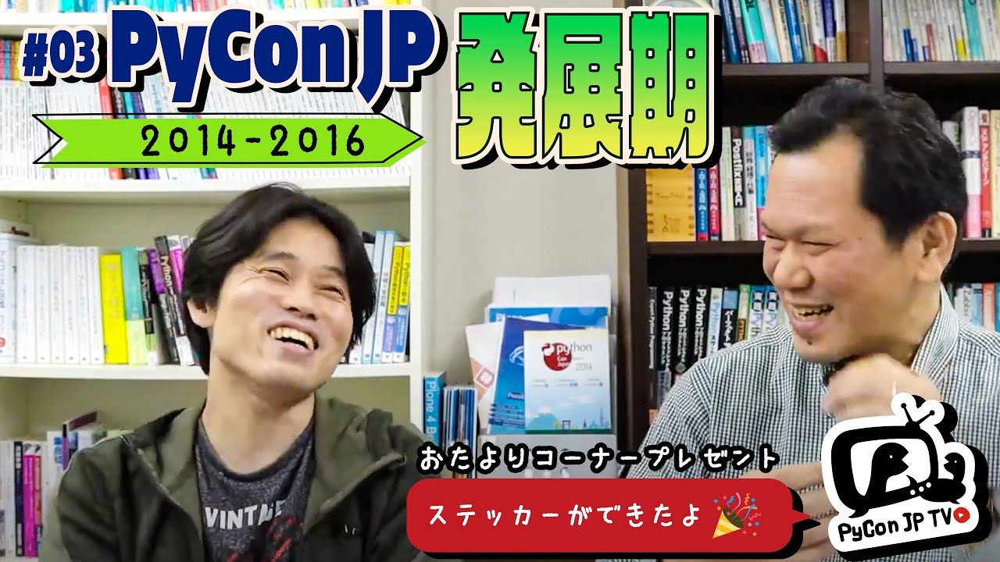

:og:image: https://tv.pycon.jp/_images/episode3.jpg

============================================
 #3: PyCon JP発展期: 2014-2016 - 2021-04-02
============================================

2014年から2016に開催されたPyCon JPを振り返り、PyCon JPが発展していく課程でどんなことがあったかを語ります。

.. raw:: html

   <iframe width="560" height="315" src="https://www.youtube.com/embed/FSdri26yNdo" frameborder="0" allow="accelerometer; autoplay; clipboard-write; encrypted-media; gyroscope; picture-in-picture" allowfullscreen></iframe>

関連リンク
==========
* `PyCon JP TVお便りコーナー <https://docs.google.com/forms/d/e/1FAIpQLSfvL4cKteAaG_czTXjofR83owyjXekG9GNDGC6-jRZCb_2HRw/viewform>`_
* Twitter: `@pyconjptv <https://twitter.com/pyconjptv>`_
* `Python.jp Discordサーバ <https://www.python.jp/pages/pythonjp_discord.html>`_ の ``#pyconjp-tv`` チャンネル

パーソナリティ
--------------
* 寺田 学(`@terapyon <https://twitter.com>`_)
* 鈴木 たかのり(`@takanory <https://twitter.com/takanory>`_)

Pythonニュース
--------------
* `pyconjapan (@pyconjapan) / Twitter <https://twitter.com/pyconjapan>`_
* `PyCon JP 2021 <https://2021.pycon.jp/>`_
* `PyCon 2021 Welcome To PyCon US 2021 <https://us.pycon.org/2021/>`_

PyCon JP 発展期: 2014-2016
--------------------------
* `PyCon JP 2014 <https://pycon.jp/2014/>`_

  * `PyCon JP Blog: 1分で読めるミーティングレポート（2013/11/05分） <https://pyconjp.blogspot.com/2013/11/meeting-20131105.html>`_
  * `Poster | PyCon JP 2014 in TOKYO <https://pycon.jp/2014/schedule/posters/list/>`_

* `PyCon JP 2015 <https://pycon.jp/2015/ja/>`_

  * `PyCon JP Blog: キーノートスピーカー(海外)変更のお知らせ <https://pyconjp.blogspot.com/2015/09/keynote-en.html>`_
* `PyCon JP 2016 <https://pycon.jp/2016/ja/>`_

  * `PyCon JP Blog: PyCon JP 2016 の方針決めミーティングを実施 <https://pyconjp.blogspot.com/2016/01/pyconjp2016-meeting-20160113.html>`_
  * `PyCon JP Blog: 第3回方針決めミーティングが実施されました <https://pyconjp.blogspot.com/2016/02/pyconjp2016-meeting-20160210.html>`_
  * `PyCon JP Blog: PyCon JP 2016 のテーマが決定しました <https://pyconjp.blogspot.com/2016/02/theme-of-pyconjp2016.html>`_
  * `PyCon JP 2016クロージングでの座長交代シーン <https://youtu.be/cyhFFm3yh14>`_

飲みトーク
----------
* `Stone Enjoy By 04.20.21 Hazy IPA <https://goodbeer.jp/shopdetail/000000001198/stone/page1/recommend/>`_
* `PyCon JP Blog: PyCon JPスタッフ合宿やってます！ 〜１日目〜 <https://pyconjp.blogspot.com/2016/04/pycon-jp.html>`_
* `HISTORY | ABOUT US | スプリングバレー <https://www.springvalleybrewery.jp/about/history.html>`_
* `Python Charity Talks in Japan 2021.02 - connpass <https://pyconjp.connpass.com/event/199787/>`_
* `Interop Tokyo 2021 <https://www.interop.jp/>`_
* `PyData.Tokyo - connpass <https://pydatatokyo.connpass.com/>`_
* `SNOW MONKEY IPA ~2021 LP ver.~ 330ｍl [商品番号 : 215] - 玉村本店 <http://www.tamamura-honten.co.jp/?pid=158130913>`_
* `Presentation: PyLadies東京支部立ち上げのお知らせ | PyCon JP 2014 in TOKYO <https://pycon.jp/2014/schedule/presentation/53/index.html>`_
* `Python Boot Camp(初心者向けPythonチュートリアル) — PyCon JP <https://www.pycon.jp/support/bootcamp.html>`_
* `pyconjp/jira-issue-report <https://github.com/pyconjp/jira-issue-report>`_
* `pyconjp/pyconjpbot: Slack bot for PyCon JP Slack <https://github.com/pyconjp/pyconjpbot>`_
* `PyCon JP Blog: PyCon JP 2016のロゴが完成しました！ <https://pyconjp.blogspot.com/2016/04/pycon-jp-2016-announcement-logo.html>`_

目次
====
* `0:00:25 <https://www.youtube.com/watch?v=FSdri26yNdo&t=25s>`_ PyCon JP TV 配信開始
* `0:01:23 <https://www.youtube.com/watch?v=FSdri26yNdo&t=83s>`_ メッセージ募集(PyCon JP 2014-2016の思い出)
* `0:03:27 <https://www.youtube.com/watch?v=FSdri26yNdo&t=207s>`_ PyCon JP TVステッカーのお披露目
* `0:04:13 <https://www.youtube.com/watch?v=FSdri26yNdo&t=253s>`_ 【Pythonニュース】
* `0:04:23 <https://www.youtube.com/watch?v=FSdri26yNdo&t=263s>`_ PyCon JPのTwitter https://twitter.com/pyconjapan ができました。フォローしてね
* `0:05:28 <https://www.youtube.com/watch?v=FSdri26yNdo&t=328s>`_ PyCon JPのティザーサイトができました https://2021.pycon.jp/
* `0:07:45 <https://www.youtube.com/watch?v=FSdri26yNdo&t=465s>`_ US PyCon 2021 https://us.pycon.org/2021/ のスケジュールが公開されました。今年はオンライン開催
* `0:11:25 <https://www.youtube.com/watch?v=FSdri26yNdo&t=685s>`_ 【PyCon JP 2014-2016: 発展期】
* `0:12:07 <https://www.youtube.com/watch?v=FSdri26yNdo&t=727s>`_ PyCon JP 2014-2016のパンフレット
* `0:12:44 <https://www.youtube.com/watch?v=FSdri26yNdo&t=764s>`_ PyCon APAC 2013の終わる前にたかのりが座長に立候補し、すぐに2014のチーム立ち上げ
* `0:14:57 <https://www.youtube.com/watch?v=FSdri26yNdo&t=897s>`_ どんな感じで2014のスタッフ活動ははじまったの?
* `0:16:11 <https://www.youtube.com/watch?v=FSdri26yNdo&t=971s>`_ PyCon JP 2014スタッフのチーム構成
* `0:17:22 <https://www.youtube.com/watch?v=FSdri26yNdo&t=1042s>`_ 寺田「リーダーをやってほしい人に声をかけろ」という助言はよかった
* `0:19:07 <https://www.youtube.com/watch?v=FSdri26yNdo&t=1147s>`_ 寺田は一旦スタッフミーティングには出ないようにしていたので、スタッフ活動を詳しくは知らない
* `0:20:06 <https://www.youtube.com/watch?v=FSdri26yNdo&t=1206s>`_ チーム運営: ミーティングをあまりしない、チームで決める、作業日で集まって作業をする
* `0:22:29 <https://www.youtube.com/watch?v=FSdri26yNdo&t=1349s>`_ 新しいスタッフを入れるための施策: connpassの賑やかし枠、報告ブログ、議事録公開
* `0:25:10 <https://www.youtube.com/watch?v=FSdri26yNdo&t=1510s>`_ SlackとJIRAを使い始めたのも2014年くらいから
* `0:26:21 <https://www.youtube.com/watch?v=FSdri26yNdo&t=1581s>`_ 【PyCon JP 2014】会場はプラザ平成
* `0:27:45 <https://www.youtube.com/watch?v=FSdri26yNdo&t=1665s>`_ パーティーを全員参加にしたかった
* `0:29:40 <https://www.youtube.com/watch?v=FSdri26yNdo&t=1780s>`_ ポスターセッションもこの年から、ジョブフェアもがっつり時間を使った
* `0:31:08 <https://www.youtube.com/watch?v=FSdri26yNdo&t=1868s>`_ 2014はスポンサー獲得が大変だった
* `0:33:46 <https://www.youtube.com/watch?v=FSdri26yNdo&t=2026s>`_ イベント当日はどうだった?
* `0:36:15 <https://www.youtube.com/watch?v=FSdri26yNdo&t=2175s>`_ 【PyCon JP 2015】
* `0:36:45 <https://www.youtube.com/watch?v=FSdri26yNdo&t=2205s>`_ キーノートスピーカーが直前でキャンセルになって大変だった
* `0:39:05 <https://www.youtube.com/watch?v=FSdri26yNdo&t=2345s>`_ 寺田は最初からスポンサー担当、2015はスポンサーの反応がよかった
* `0:44:15 <https://www.youtube.com/watch?v=FSdri26yNdo&t=2655s>`_ 【PyCon JP 2016】会場は早稲田大学
* `0:45:00 <https://www.youtube.com/watch?v=FSdri26yNdo&t=2700s>`_ PyCon JPの方針を匠メソッドでみんなで洗い出した→そこからテーマ「Everyone's different, all are wonderful.」が生まれた
* `0:47:10 <https://www.youtube.com/watch?v=FSdri26yNdo&t=2830s>`_ 寺田はこの年は「会場担当の副座長」だった
* `0:49:00 <https://www.youtube.com/watch?v=FSdri26yNdo&t=2940s>`_ ユースコーダーワークショップをはじめて開催した。台湾のNoahがはじめてスタッフ参加した
* `0:50:10 <https://www.youtube.com/watch?v=FSdri26yNdo&t=3010s>`_ 2016のクロージングで座長の花束を内緒で用意した
* `0:52:13 <https://www.youtube.com/watch?v=FSdri26yNdo&t=3133s>`_ 【お便りコーナー】
* `0:52:38 <https://www.youtube.com/watch?v=FSdri26yNdo&t=3158s>`_ ろくじょうひとまさんからのお便り「この10年どうでした?」
* `0:54:20 <https://www.youtube.com/watch?v=FSdri26yNdo&t=3260s>`_ なぎささんからのお便り「今後も配信楽しみにしています」
* `0:55:52 <https://www.youtube.com/watch?v=FSdri26yNdo&t=3352s>`_ 【次回の予告】5月7日(金)、テーマは「US PyCon 2019」
* `0:59:50 <https://www.youtube.com/watch?v=FSdri26yNdo&t=3590s>`_ 🍺の準備
* `1:01:20 <https://www.youtube.com/watch?v=FSdri26yNdo&t=3680s>`_ 乾杯🍻、Youtubeのチャットを拾う
* `1:04:17 <https://www.youtube.com/watch?v=FSdri26yNdo&t=3857s>`_ 🍺 ヱビス プレミアムホワイト
* `1:05:00 <https://www.youtube.com/watch?v=FSdri26yNdo&t=3900s>`_ PyCon JP 2014のスピーカーTシャツを披露
* `1:08:50 <https://www.youtube.com/watch?v=FSdri26yNdo&t=4130s>`_ スピーカー、スポンサー、スタッフを集めた打ち上げで
* `1:12:05 <https://www.youtube.com/watch?v=FSdri26yNdo&t=4325s>`_ 🍺 Stone Enjoy By 04.20.21
* `1:15:40 <https://www.youtube.com/watch?v=FSdri26yNdo&t=4540s>`_ 2014から運営について色々実験した
* `1:18:20 <https://www.youtube.com/watch?v=FSdri26yNdo&t=4700s>`_ スポンサーと一緒に考えてよりよいイベントにする。スポンサー同士のつながりもよかった
* `1:21:40 <https://www.youtube.com/watch?v=FSdri26yNdo&t=4900s>`_ 2016は会場チームをやってみて楽しかった。メンバーは自分以外みんな平成生まれ
* `1:29:40 <https://www.youtube.com/watch?v=FSdri26yNdo&t=5380s>`_ 2016の日光でのスタッフ合宿の思い出
* `1:31:58 <https://www.youtube.com/watch?v=FSdri26yNdo&t=5518s>`_ 人が増えてきて全体写真を撮るのが大変
* `1:32:30 <https://www.youtube.com/watch?v=FSdri26yNdo&t=5550s>`_ 🍺 SPRING VALLEY 豊潤＜496＞
* `1:34:56 <https://www.youtube.com/watch?v=FSdri26yNdo&t=5696s>`_ 参加者がみんないい人たちなので、うまく説明して協力してもらうと全体がうまく回る
* `1:38:38 <https://www.youtube.com/watch?v=FSdri26yNdo&t=5918s>`_ ビール談義「SPRING VALLEY 豊潤＜496＞」について
* `1:43:50 <https://www.youtube.com/watch?v=FSdri26yNdo&t=6230s>`_ 1回目のプラザ平成(2014)は大変。ネットワークが大変だった
* `1:46:38 <https://www.youtube.com/watch?v=FSdri26yNdo&t=6398s>`_ 2014事務局リーダーの神谷さんがチャットに登場
* `1:48:33 <https://www.youtube.com/watch?v=FSdri26yNdo&t=6513s>`_ Python Charity Talks in Japanの寄付金(890,000円)をPSFに振り込みました
* `1:59:18 <https://www.youtube.com/watch?v=FSdri26yNdo&t=7158s>`_ 2016はスプリントが2日
* `2:01:44 <https://www.youtube.com/watch?v=FSdri26yNdo&t=7304s>`_ 2021年のInteropはハイブリッド開催
* `2:04:20 <https://www.youtube.com/watch?v=FSdri26yNdo&t=7460s>`_ 2016の打ち上げでの出会いからPyData.Tokyoが生まれた
* `2:06:40 <https://www.youtube.com/watch?v=FSdri26yNdo&t=7600s>`_ 🍺 志賀高原 SNOW MONKEY IPA ~2021 LP ver.~
* `2:07:15 <https://www.youtube.com/watch?v=FSdri26yNdo&t=7635s>`_ PyLadies TokyoはPyCon JP 2014のポスターセッションで立ち上がった
* `2:09:02 <https://www.youtube.com/watch?v=FSdri26yNdo&t=7742s>`_ いりさわさん「PyCon JP行かなかったら出会わなかった人50人いるなー」
* `2:10:00 <https://www.youtube.com/watch?v=FSdri26yNdo&t=7800s>`_ SNOW MONEY IPAの紹介
* `2:13:47 <https://www.youtube.com/watch?v=FSdri26yNdo&t=8027s>`_ Python Boot Campの紹介、2020年2月の長崎から開催できていない、そこからコミュニティが生まれている
* `2:18:23 <https://www.youtube.com/watch?v=FSdri26yNdo&t=8303s>`_ 自分のスタッフ業を楽するためにプログラムを書いた。2014年はJIRAの状況の通知、2016年からpyconjpbot
* `2:20:59 <https://www.youtube.com/watch?v=FSdri26yNdo&t=8459s>`_ 座長を誘わず副座長だけで飲んだ
* `2:23:34 <https://www.youtube.com/watch?v=FSdri26yNdo&t=8614s>`_ いい人がいたら声をかけてスタッフにひっぱる
* `2:25:30 <https://www.youtube.com/watch?v=FSdri26yNdo&t=8730s>`_ スタッフで仲間が増えて、またなにかで会ったりするのがいいよね
* `2:30:05 <https://www.youtube.com/watch?v=FSdri26yNdo&t=9005s>`_ 2017年からいりさわさんがクラフトビールを大量に出すのすごいよかった
* `2:33:30 <https://www.youtube.com/watch?v=FSdri26yNdo&t=9210s>`_ ランチの大変だったこと、2014ランチが足りなくなった、2015キッチンカーですごい行列、ベジタリアン用が他の人が食べちゃう
* `2:41:20 <https://www.youtube.com/watch?v=FSdri26yNdo&t=9680s>`_ おやつ奪い合い問題
* `2:45:58 <https://www.youtube.com/watch?v=FSdri26yNdo&t=9958s>`_ 朝食をどうするか
* `2:46:20 <https://www.youtube.com/watch?v=FSdri26yNdo&t=9980s>`_ 🍺 Weird Beard Orenge & Black
* `2:49:05 <https://www.youtube.com/watch?v=FSdri26yNdo&t=10145s>`_ モノタロウさんがスポンサーになるとモノタロウ侍さんの楽屋が必要になる、スポンサーの宅配便問題
* `2:55:15 <https://www.youtube.com/watch?v=FSdri26yNdo&t=10515s>`_ PyCon JP 2016のロゴを作った人は誰でしょう?
* `3:01:00 <https://www.youtube.com/watch?v=FSdri26yNdo&t=10860s>`_ PeacockはいつからPyCon JPに参加してるの?
* `3:06:26 <https://www.youtube.com/watch?v=FSdri26yNdo&t=11186s>`_ 3時間超えたので、そろそろ...
* `3:09:44 <https://www.youtube.com/watch?v=FSdri26yNdo&t=11384s>`_ このあとはClubhouseで
