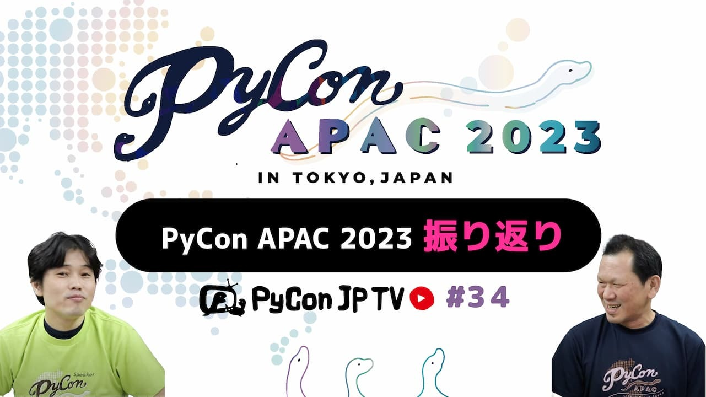

:og:image: https://tv.pycon.jp/_images/episode34.jpg

===========================================
 #34: PyCon APAC 2023振り返り - 2023-11-02
===========================================

2023年10月26日(木)〜29日(日)と東京で開催された
`PyCon APAC 2023 <https://2023-apac.pycon.jp/>`__
の様子を、写真を中心にお伝えします。

.. raw:: html

   <iframe width="560" height="315" src="https://www.youtube.com/embed/PfCmxzBd4v8?si=dU9jM0UpWUfNM-hN" title="YouTube video player" frameborder="0" allow="accelerometer; autoplay; clipboard-write; encrypted-media; gyroscope; picture-in-picture; web-share" allowfullscreen></iframe>

関連リンク
==========
* `PyCon JP - YouTubeチャンネル <https://www.youtube.com/user/PyConJP>`_
* Twitter: `@pyconjptv <https://twitter.com/pyconjptv>`_
* `PyCon JP TVお便りコーナー <https://docs.google.com/forms/d/e/1FAIpQLSfvL4cKteAaG_czTXjofR83owyjXekG9GNDGC6-jRZCb_2HRw/viewform>`_

パーソナリティ
--------------
* 寺田 学(`@terapyon <https://twitter.com>`_)
* 鈴木 たかのり(`@takanory <https://twitter.com/takanory>`_)

Pythonニュース
--------------
* 国内イベント

  * `関西オープンフォーラム2023に出展 11/10, 11開催 <https://www.k-of.jp/2023/>`__
  * https://www.k-of.jp/2023/booth/pycon-jp-association/
* 海外イベント

  * `PyCon Hong Kong <https://pycon.hk/>`__ (11月11日)チケット発売中
  * `PyCon ID 2023 <https://pycon.id/>`__ (11月18日、19日)チケット発売中 
  * `PyLadiesCon <http://conference.pyladies.com/>`__ (オンライン)12月1日〜3日
  * `PyCon Thailand 2023 <https://th.pycon.org/>`__ (12月15日、16日)チケット発売中
  * `PyCon Philippines 2024 <https://pycon-2024.python.ph/>`__ (2月23日、24日)
  * `PyCon APAC 2024 <https://pycon.asia/>`__ 10月25日-27日 インドネシアのジョグジャカルタ

* その他

  * `Python Insider: Python 3.13.0 alpha 1 is now available <https://pythoninsider.blogspot.com/2023/10/python-3130-alpha-1-is-now-available.html>`__
  * `Python Software Foundation News: Announcing our new Community Communications Manager! <https://pyfound.blogspot.com/2023/10/announcing-community-communications-mgr.html>`__

PyCon APAC 2023振り返り
-----------------------
* 公式サイト: https://2023-apac.pycon.jp/

飲みトーク
----------
* TBD

目次
====
* `0:00:22 <https://www.youtube.com/watch?v=PfCmxzBd4v8&t=22s>`_ 配信開始
* `0:02:06 <https://www.youtube.com/watch?v=PfCmxzBd4v8&t=126s>`_ コメント募集「PyCon APACなにが楽しかったか、よかったか」
* `0:05:24 <https://www.youtube.com/watch?v=PfCmxzBd4v8&t=324s>`_ 【Pythonニュース】関西オープンフォーラムに出展
* `0:06:28 <https://www.youtube.com/watch?v=PfCmxzBd4v8&t=388s>`_ PyCon Hong Kong 2023、PyCon Indonesia 2023が11月に開催予定
* `0:07:44 <https://www.youtube.com/watch?v=PfCmxzBd4v8&t=464s>`_ PyLadiesCon 2023がオンラインで12月に開催予定
* `0:09:04 <https://www.youtube.com/watch?v=PfCmxzBd4v8&t=544s>`_ PyCon Philippines 2024が2024年2月に開催予定
* `0:09:39 <https://www.youtube.com/watch?v=PfCmxzBd4v8&t=579s>`_ PyCon APAC 2024の開催が2024年10月にインドネシアのジョグジャカルタに決定
* `0:11:36 <https://www.youtube.com/watch?v=PfCmxzBd4v8&t=696s>`_ Python 3.11.0 alpha 1がリリース
* `0:12:27 <https://www.youtube.com/watch?v=PfCmxzBd4v8&t=747s>`_ Python Software Doundationの新しいCommunity Communication Managerの紹介
* `0:13:57 <https://www.youtube.com/watch?v=PfCmxzBd4v8&t=837s>`_ 【メイントーク】PyCon APAC 2023振り返り。イベント概要を紹介
* `0:15:51 <https://www.youtube.com/watch?v=PfCmxzBd4v8&t=951s>`_ 【Day 0】準備、チュートリアルの様子を写真を中心に紹介
* `0:19:32 <https://www.youtube.com/watch?v=PfCmxzBd4v8&t=1172s>`_ PyCon APACとPyCon JP Associationのブースを設置、他準備の様子
* `0:23:25 <https://www.youtube.com/watch?v=PfCmxzBd4v8&t=1405s>`_ 配信チェック用にビール仕込み動画が使われていたw
* `0:24:55 <https://www.youtube.com/watch?v=PfCmxzBd4v8&t=1495s>`_ 招待制のWelcome Party
* `0:26:45 <https://www.youtube.com/watch?v=PfCmxzBd4v8&t=1605s>`_ 今日の衣装はスピーカーTシャツとスタッフTシャツ
* `0:27:22 <https://www.youtube.com/watch?v=PfCmxzBd4v8&t=1642s>`_ 【Day 1】オープニング、キーノート
* `0:31:57 <https://www.youtube.com/watch?v=PfCmxzBd4v8&t=1917s>`_ キーノートスピーカー喜多先生への合同インタビュー
* `0:35:04 <https://www.youtube.com/watch?v=PfCmxzBd4v8&t=2104s>`_ PyCon JP Associationミーティング。台湾からの参加者。Python ASIAミーティング
* `0:45:14 <https://www.youtube.com/watch?v=PfCmxzBd4v8&t=2714s>`_ PyLadies Caravan & Python Boot Campミートアップ。名札はこんな感じ
* `0:49:29 <https://www.youtube.com/watch?v=PfCmxzBd4v8&t=2969s>`_ 【Day 2】ロストメモリー、キーノート、寺田の発表
* `0:53:12 <https://www.youtube.com/watch?v=PfCmxzBd4v8&t=3192s>`_ PyCon APACランチ、ポスターセッション、PyLadiesランチ
* `0:57:07 <https://www.youtube.com/watch?v=PfCmxzBd4v8&t=3427s>`_ バングラデシュの5人と再会、来年のPyCon APACの開催地発表
* `0:59:14 <https://www.youtube.com/watch?v=PfCmxzBd4v8&t=3554s>`_ 次回予告
