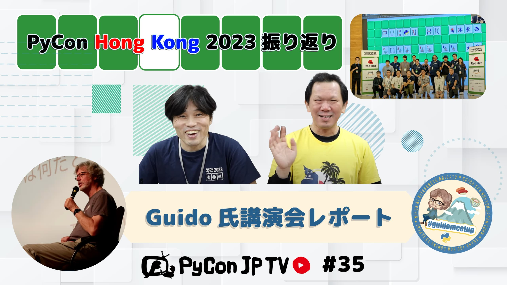

:og:image: https://tv.pycon.jp/_images/episode35.jpg

========================================================================
 #35: PyCon Hong Kong 2023振り返り & Guido氏講演会レポート - 2023-12-01
========================================================================

2023年11月11日(土)に香港で開催された「PyCon Hong Kong 2023」に、パーソナリティの鈴木たかのりがスピーカーとして参加してきました。
初めて参加するPyCon Hong Kong 2023の様子をお伝えします。

また、2023年11月30日(木)に開催された「Guido氏インタラクティブ記念講演会」のレポートもお伝えします。

.. raw:: html

   <iframe width="560" height="315" src="https://www.youtube.com/embed/8d9rg6ul2w8?si=JUAI4f_vMjNbkC8u" title="YouTube video player" frameborder="0" allow="accelerometer; autoplay; clipboard-write; encrypted-media; gyroscope; picture-in-picture; web-share" allowfullscreen></iframe>

関連リンク
==========
* `PyCon JP - YouTubeチャンネル <https://www.youtube.com/user/PyConJP>`_
* Twitter: `@pyconjptv <https://twitter.com/pyconjptv>`_
* `PyCon JP TVお便りコーナー <https://docs.google.com/forms/d/e/1FAIpQLSfvL4cKteAaG_czTXjofR83owyjXekG9GNDGC6-jRZCb_2HRw/viewform>`_

パーソナリティ
--------------
* 寺田 学(`@terapyon <https://twitter.com>`_)
* 鈴木 たかのり(`@takanory <https://twitter.com/takanory>`_)

Pythonニュース
--------------
* 国内イベント

  * `PyCon JP Blog: PyCon APAC 2023 オリジナルビール 振り返り <https://pyconjp.blogspot.com/2023/11/pycon-beer-info.html>`_
  * `PyCon JP Blog: 関西オープンフォーラム2023に出展しました <https://pyconjp.blogspot.com/2023/11/pycamp-caravan-kof-2023-report.html>`_
  * `PyCon JP Blog: Open Source Conference 2023 Tokyo/Fallに出展してきました <https://pyconjp.blogspot.com/2023/11/pycamp-caravan-osc-2023-tokyo-fall-report.html>`_
* 海外イベント

  * `PyLadiesCon 2023 <http://conference.pyladies.com/>`_ 2023年12月1日-3日、オンライン
  * `PyCon Thailand 2023 <https://th.pycon.org/>`_ 2023年12月14日-16日、タイ、バンコク
  * `PyCon Philippines 2024 <https://pycon-2024.python.ph/>`_ 2024年2月25-26日、フィリピン、マカティ
  * `PyCon APAC 2024 <https://pycon.asia/>`_ 2024年10月25-27日、インドネシア、ジョグジャカルタ
* その他

  * `Python Software Foundation News: Join the Python Developers Survey 2023: Share and learn about the community! <https://pyfound.blogspot.com/2023/11/join-python-developers-survey-2023.html>`_
  * `Python Software Foundation News: It's time for our annual year-end PSF fundraiser and membership drive 🎉 <https://pyfound.blogspot.com/2023/11/support-python-q4-2023.html>`_
  * `Python Insider: Python 3.13.0 alpha 2 is now available <https://pythoninsider.blogspot.com/2023/11/python-3130-alpha-2-is-now-available.html>`_

PyCon HK 2023振り返り
---------------------
* `2023 - PyCon Hong Kong <https://pycon.hk/2023/>`_
* `Guido氏インタラクティブ記念講演会 PyCon JP枠 - connpass <https://pyconjp.connpass.com/event/301716/>`_

飲みトーク
----------
* TBD

目次
====
* `0:00:30 <https://www.youtube.com/watch?v=8d9rg6ul2w8&t=30s>`_ 配信開始
* `0:06:09 <https://www.youtube.com/watch?v=8d9rg6ul2w8&t=369s>`_ 【Pythonニュース】PyCon APACオリジナルビール振り返り
* `0:07:17 <https://www.youtube.com/watch?v=8d9rg6ul2w8&t=437s>`_ 関西オープンフォーラム2023、オープンソースカンファレンス東京に出展
* `0:09:11 <https://www.youtube.com/watch?v=8d9rg6ul2w8&t=551s>`_ PyLadiesCon 2023が開催予定
* `0:09:51 <https://www.youtube.com/watch?v=8d9rg6ul2w8&t=591s>`_ PyCon Thailand 2023、PyCon Philippines 2024が開催予定
* `0:11:33 <https://www.youtube.com/watch?v=8d9rg6ul2w8&t=693s>`_ PyCon APAC 2024はインドネシアのジョグジャカルタで開催
* `0:12:25 <https://www.youtube.com/watch?v=8d9rg6ul2w8&t=745s>`_ Python Developer Survey 2023、PSFの募金活動とメンバー募集キャンペーン
* `0:14:38 <https://www.youtube.com/watch?v=8d9rg6ul2w8&t=878s>`_ Python 3.13.0 alpha 2がリリース
* `0:15:19 <https://www.youtube.com/watch?v=8d9rg6ul2w8&t=919s>`_ 【メイントークその1】PyCon Hong Kong 2023振り返り。Webサイトでイベント概要を確認、グッズを紹介
* `0:21:00 <https://www.youtube.com/watch?v=8d9rg6ul2w8&t=1260s>`_ カンファレンス前日の食事会。PyCon APACでビールをつくった話をした
* `0:26:18 <https://www.youtube.com/watch?v=8d9rg6ul2w8&t=1578s>`_ カンファレンス朝、PyCon APACブース、オープニング、maayaさんのキーノート、takanoryの発表
* `0:31:56 <https://www.youtube.com/watch?v=8d9rg6ul2w8&t=1916s>`_ ブースのグッズがなくなってた、他のブース、PyScriptのトーク、ランチは各自で
* `0:37:26 <https://www.youtube.com/watch?v=8d9rg6ul2w8&t=2246s>`_ 午後のトーク、JonさんのマモノスイーパーをPythonで解く発表、クロージング
* `0:41:48 <https://www.youtube.com/watch?v=8d9rg6ul2w8&t=2508s>`_ パーティーの前に少し香港観光、パーティー、Cheukさんmaayaさんと2次会
* `0:46:28 <https://www.youtube.com/watch?v=8d9rg6ul2w8&t=2788s>`_ 【メイントークその2】Guido氏講演会レポート、イベントの背景説明
* `0:50:03 <https://www.youtube.com/watch?v=8d9rg6ul2w8&t=3003s>`_ 事前準備、ステッカー、オープニング、「GuidoさんにQ&A」コーナー
* `0:56:35 <https://www.youtube.com/watch?v=8d9rg6ul2w8&t=3395s>`_ 「Guidoさんに活動を見てもらう」コーナー、「GuidoさんにLive Q&A」コーナー
* `1:02:05 <https://www.youtube.com/watch?v=8d9rg6ul2w8&t=3725s>`_ 【次回予告】2024年1月12日(金) 19:30から「Pythonistaに聞く2023重大ニュースと2024の展望」

