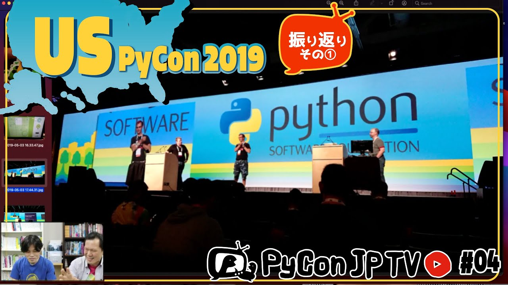

:og:image: https://tv.pycon.jp/_images/episode4.jpg

========================================
 #4: US PyCon 2019振り返り - 2021-05-07
========================================

2019年に開催されたUS PyConに初参加したパーソナリティーの2人の目線から、US PyConの特色、記憶に残ったことなどを話します。

.. raw:: html

   <iframe width="560" height="315" src="https://www.youtube.com/embed/fUGoPzfBv7E" title="YouTube video player" frameborder="0" allow="accelerometer; autoplay; clipboard-write; encrypted-media; gyroscope; picture-in-picture" allowfullscreen></iframe>

関連リンク
==========
* `PyCon JP TVお便りコーナー <https://docs.google.com/forms/d/e/1FAIpQLSfvL4cKteAaG_czTXjofR83owyjXekG9GNDGC6-jRZCb_2HRw/viewform>`_
* Twitter: `@pyconjptv <https://twitter.com/pyconjptv>`_
* `Python.jp Discordサーバ <https://www.python.jp/pages/pythonjp_discord.html>`_ の ``#pyconjp-tv`` チャンネル

パーソナリティ
--------------
* 寺田 学(`@terapyon <https://twitter.com>`_)
* 鈴木 たかのり(`@takanory <https://twitter.com/takanory>`_)

Pythonニュース
--------------
* `DjangoCongress JP 2021 <https://djangocongress.jp/>`_ トーク募集中
* `Django 3.2 released <https://www.djangoproject.com/weblog/2021/apr/06/django-32-released/>`_
* `Download Python <https://www.python.org/downloads/>`_ Python 3.8.10、3.9.5がリリース
* `Python Release Python 3.10.0b1 <https://www.python.org/downloads/release/python-3100b1/>`_

US PyCon 2019振り返り
---------------------
* `PyCon 2019 in Cleveland, Ohio | May 1-9 <https://us.pycon.org/2019/>`_
* `PyCon 2021 Welcome To PyCon US 2021 <https://us.pycon.org/2021/>`_
* カンファレンス2日前

  * `Volunteering On-Site <https://pycon-archive.python.org/2019/about/volunteers/>`_
  * `Masthead Brewing Company <https://mastheadbrewingco.com/>`_
* カンファレンス前日

  * `Thirsty Dog Brewing Company <https://thirstydog.com/>`_
  * `Newcomer Orientation <https://pycon-archive.python.org/2019/events/newcomer_orientation/>`_
  * `Opening Reception <https://us.pycon.org/2019/events/opening-reception/>`_
  * `Southern Tier Brewing Company <https://stbcbeer.com/>`_
* メインカンファレンス1日目

  * `Python Crash Course, 2nd Edition <https://nostarch.com/pythoncrashcourse2e/>`_
* メインカンファレンス2日目

  * キーノートの再演動画: `"From Prison to Python" - Shadeed Wallace-Stepter (North Bay Python 2019) - YouTube <https://www.youtube.com/watch?v=jNBsrLzHVgM>`_
  * キーノートの再演動画: `Mass Decarceration: If We Don’t Hire People With Felony Convictions, Who Will? - YouTube <https://www.youtube.com/watch?v=hyd6MiWXSP4>`_

飲みトーク
----------
* `Anchor Liberty Ale <https://www.anchorbrewing.com/beer/liberty_ale>`_
* `Salty Crew - Coronado Brewing Company <https://coronadobrewing.com/beer/salty-crew/>`_
* `Python 2 EOL Party in Tokyo - connpass <https://python2.connpass.com/event/161403/>`_
* 1日目キーノートの動画: `Russell Keith-Magee - Keynote - PyCon 2019 - YouTube <https://www.youtube.com/watch?v=ftP5BQh1-YM>`_
* 1日目キーノートについてのBlog: `Ceci n'est pas un blog <https://cecinestpasun.com/entries/where-do-you-see-python-in-10-years/>`_
* 印象的なトーク: `Victor Stinner - How to engage Python contributors in the long term? Tech is easy, people are hard. - YouTube <https://www.youtube.com/watch?v=O3UmUj9h_Eo>`_
* `SCULPIN | Ballast Point Brewing <https://ballastpoint.com/beer/sculpin/>`_

目次
====
* `0:00:09 <https://www.youtube.com/watch?v=fUGoPzfBv7E&t=9s>`_ 配信開始
* `0:01:13 <https://www.youtube.com/watch?v=fUGoPzfBv7E&t=73s>`_ メッセージ募集【GWなにしてました?】
* `0:06:04 <https://www.youtube.com/watch?v=fUGoPzfBv7E&t=364s>`_ 【Pythonニュース】
* `0:06:18 <https://www.youtube.com/watch?v=fUGoPzfBv7E&t=378s>`_ DjangoCongress JP 2021のトーク募集中
* `0:08:40 <https://www.youtube.com/watch?v=fUGoPzfBv7E&t=520s>`_ Django 3.2リリース
* `0:09:41 <https://www.youtube.com/watch?v=fUGoPzfBv7E&t=581s>`_ Python 3.8.10、3.9.5リリース
* `0:09:56 <https://www.youtube.com/watch?v=fUGoPzfBv7E&t=596s>`_ Python 3.10 beta 1 がリリース
* `0:10:50 <https://www.youtube.com/watch?v=fUGoPzfBv7E&t=650s>`_ 【メイントーク】US PyCon 2019振り返り
* `0:11:21 <https://www.youtube.com/watch?v=fUGoPzfBv7E&t=681s>`_ US PyCon 2021はオンラインでがっつり計画している
* `0:12:54 <https://www.youtube.com/watch?v=fUGoPzfBv7E&t=774s>`_ 2019年にはじめてUS PyConに参加して、また行きたいと思っている
* `0:13:28 <https://www.youtube.com/watch?v=fUGoPzfBv7E&t=808s>`_ 2019年5月1日に日本を出発してクリーブランド到着まで
* `0:15:09 <https://www.youtube.com/watch?v=fUGoPzfBv7E&t=909s>`_ US PyCon 会場となりのホテルに到着
* `0:16:26 <https://www.youtube.com/watch?v=fUGoPzfBv7E&t=986s>`_ US PyConのメインホール(スポンサーブース等)
* `0:18:11 <https://www.youtube.com/watch?v=fUGoPzfBv7E&t=1091s>`_ ノベルティの袋詰め作業のボランティアに参加。Larry Hastingさんに再会
* `0:21:25 <https://www.youtube.com/watch?v=fUGoPzfBv7E&t=1285s>`_ 5月1日の夜🍺は Masthead Brewing でJason、Younggunとビール
* `0:21:55 <https://www.youtube.com/watch?v=fUGoPzfBv7E&t=1315s>`_ 【メインカンファレンス前日】5月2日の朝
* `0:22:35 <https://www.youtube.com/watch?v=fUGoPzfBv7E&t=1355s>`_ 全体パンフレットとUS PyConの名札
* `0:23:45 <https://www.youtube.com/watch?v=fUGoPzfBv7E&t=1425s>`_ 昼にThirsty Dog Brewingで🍺と大量のプーティーン
* `0:24:20 <https://www.youtube.com/watch?v=fUGoPzfBv7E&t=1460s>`_ 全日夕方にキーノート会場でNewcomer Orientation
* `0:25:43 <https://www.youtube.com/watch?v=fUGoPzfBv7E&t=1543s>`_ ビール片手にOpening Receptionでスポンサーブース巡り
* `0:27:19 <https://www.youtube.com/watch?v=fUGoPzfBv7E&t=1639s>`_ 会場にいるGuidoさんを遠くから盗撮
* `0:27:40 <https://www.youtube.com/watch?v=fUGoPzfBv7E&t=1660s>`_ 5月2日の夜🍺は Southern Tier Brewingでビール
* `0:28:26 <https://www.youtube.com/watch?v=fUGoPzfBv7E&t=1706s>`_ 【メインカンファレンス1日目】5月3日。カンファレンスの朝食
* `0:29:23 <https://www.youtube.com/watch?v=fUGoPzfBv7E&t=1763s>`_ PyConCleveland 2019 Tシャツはペラッペラ
* `0:30:15 <https://www.youtube.com/watch?v=fUGoPzfBv7E&t=1815s>`_ ノベルティはそんなにバッグには入っていない
* `0:30:35 <https://www.youtube.com/watch?v=fUGoPzfBv7E&t=1835s>`_ Lightning Talksの申し込みボード
* `0:31:09 <https://www.youtube.com/watch?v=fUGoPzfBv7E&t=1869s>`_ US PyConのランチはヤバい
* `0:32:25 <https://www.youtube.com/watch?v=fUGoPzfBv7E&t=1945s>`_ Python Crash Courseの著者(Eric Matthes)と記念撮影
* `0:33:35 <https://www.youtube.com/watch?v=fUGoPzfBv7E&t=2015s>`_ Fluent Pythonの著者サイン会
* `0:34:07 <https://www.youtube.com/watch?v=fUGoPzfBv7E&t=2047s>`_ メイン会場の全体像
* `0:34:57 <https://www.youtube.com/watch?v=fUGoPzfBv7E&t=2097s>`_ 信号機のOpen Spaceに参加
* `0:35:37 <https://www.youtube.com/watch?v=fUGoPzfBv7E&t=2137s>`_ 1日目のLightning Talks、日本から参加したHirataさんがLTで登壇
* `0:37:49 <https://www.youtube.com/watch?v=fUGoPzfBv7E&t=2269s>`_ スポンサー(Square)主催のパーティーに参加
* `0:41:00 <https://www.youtube.com/watch?v=fUGoPzfBv7E&t=2460s>`_ 寺田さんはメジャーリーグを見に行った
* `0:41:36 <https://www.youtube.com/watch?v=fUGoPzfBv7E&t=2496s>`_ 【メインカンファレンス2日目】5月4日
* `0:41:46 <https://www.youtube.com/watch?v=fUGoPzfBv7E&t=2506s>`_ Shadeed “Sha” Wallace-StepterさんとJessica McKellarさんのキーノート
* `0:45:31 <https://www.youtube.com/watch?v=fUGoPzfBv7E&t=2731s>`_ キーノートでの印象的な写真
* `0:45:47 <https://www.youtube.com/watch?v=fUGoPzfBv7E&t=2747s>`_ Ewaさん(PSFのBoard Director)へのインタビュー
* `0:47:17 <https://www.youtube.com/watch?v=fUGoPzfBv7E&t=2837s>`_ PyCharmブースでPaul Everittさん、Andrey Vlasovskikhさんと再会
* `0:48:43 <https://www.youtube.com/watch?v=fUGoPzfBv7E&t=2923s>`_ カンファレンス2日目の途中で時間切れ
* `0:49:45 <https://www.youtube.com/watch?v=fUGoPzfBv7E&t=2985s>`_ 【おたよりコーナー】
* `0:50:18 <https://www.youtube.com/watch?v=fUGoPzfBv7E&t=3018s>`_ 佐賀県のPython職人さんから「Zopeの時代からPythonをやっている2人からの最近のPythonへの感想」
* `0:52:41 <https://www.youtube.com/watch?v=fUGoPzfBv7E&t=3161s>`_ 埼玉県の鈴木なぎささん「概要欄のもくじがとても便利」
* `0:53:35 <https://www.youtube.com/watch?v=fUGoPzfBv7E&t=3215s>`_ 【次回予告】次回は6月4日(金)19:30からUS PyCon 2019の続きと、PyCon 2021の話
* `0:55:22 <https://www.youtube.com/watch?v=fUGoPzfBv7E&t=3322s>`_ PyCon JPは10月開催に向けて絶賛準備中
* `0:59:48 <https://www.youtube.com/watch?v=fUGoPzfBv7E&t=3588s>`_ 🍺 の準備、Anchor Liberty Ale
* `1:00:15 <https://www.youtube.com/watch?v=fUGoPzfBv7E&t=3615s>`_ 🍻 乾杯、前半のコメントを拾う。発表を聞きながらTwitterとか書くの難しい
* `1:05:40 <https://www.youtube.com/watch?v=fUGoPzfBv7E&t=3940s>`_ 🍺 Prairie Artisan Ales 'Merica、クリーブランドはビール醸造所併設のパブがたくさん
* `1:10:57 <https://www.youtube.com/watch?v=fUGoPzfBv7E&t=4257s>`_ 🍺 Coronado Salty Crew
* `1:14:20 <https://www.youtube.com/watch?v=fUGoPzfBv7E&t=4460s>`_ PyCharmはPyConに積極的
* `1:17:35 <https://www.youtube.com/watch?v=fUGoPzfBv7E&t=4655s>`_ 写真とともに再度振り返り。日本出発から、乗り換えの空港にTAP ROOMあったけど入れなかった、国内線(United)で出たプレッツェルの配り方でアメリカを感じた
* `1:24:03 <https://www.youtube.com/watch?v=fUGoPzfBv7E&t=5043s>`_ ポスターがちゃんと届いた!!クリーブランドの電車で空港からドキドキしながら移動した
* `1:27:29 <https://www.youtube.com/watch?v=fUGoPzfBv7E&t=5249s>`_ ホテルに到着。部屋が広いけど高い
* `1:28:55 <https://www.youtube.com/watch?v=fUGoPzfBv7E&t=5335s>`_ 🍺 Cascade Lakes Hazy Kush
* `1:32:29 <https://www.youtube.com/watch?v=fUGoPzfBv7E&t=5549s>`_ メイン会場の準備中の様子
* `1:34:40 <https://www.youtube.com/watch?v=fUGoPzfBv7E&t=5680s>`_ Masthead Brewing
* `1:36:29 <https://www.youtube.com/watch?v=fUGoPzfBv7E&t=5789s>`_ 【カンファレンス前日】この日だけホテルで朝食。オムレツの頼み方が難しい
* `1:40:40 <https://www.youtube.com/watch?v=fUGoPzfBv7E&t=6040s>`_ 会場を見に行って、受付をした
* `1:41:43 <https://www.youtube.com/watch?v=fUGoPzfBv7E&t=6103s>`_ 散歩。スマートフォンのSIMフリー化が間に合わず、人権のない状態ためSwarmでチェックインできなかった
* `1:45:30 <https://www.youtube.com/watch?v=fUGoPzfBv7E&t=6330s>`_ 昼 🍺、Thirsty Dog Brewing、川沿いでいい所
* `1:49:10 <https://www.youtube.com/watch?v=fUGoPzfBv7E&t=6550s>`_ キーノート会場に戻ってNewcomer Orientationに参加、その後ビールを飲みながらOpening Reception
* `1:51:47 <https://www.youtube.com/watch?v=fUGoPzfBv7E&t=6707s>`_ 「RIP Python 2」ステッカー、KiteのTシャツかわいいからもらった
* `1:55:20 <https://www.youtube.com/watch?v=fUGoPzfBv7E&t=6920s>`_ 「RIP Python 2」ステッカーの実物、Six Feet Upバージョン、日本のPython 2 EOLパーティーバージョン
* `1:59:18 <https://www.youtube.com/watch?v=fUGoPzfBv7E&t=7158s>`_ Souther Tier Brewing で 🍺。日本から行ったメンバーで集合
* `2:04:30 <https://www.youtube.com/watch?v=fUGoPzfBv7E&t=7470s>`_ 寺田写真に切り替え
* `2:05:50 <https://www.youtube.com/watch?v=fUGoPzfBv7E&t=7550s>`_ カンファレンス前日の散歩、スタジアム、科学館(しょぼかった)、野球のスタジアム
* `2:09:20 <https://www.youtube.com/watch?v=fUGoPzfBv7E&t=7760s>`_ メイン会場の入り口と受付、受付システムがすごい、袋詰めのボランティア作業
* `2:13:28 <https://www.youtube.com/watch?v=fUGoPzfBv7E&t=8008s>`_ Newcomer Orinetation
* `2:15:07 <https://www.youtube.com/watch?v=fUGoPzfBv7E&t=8107s>`_ コミュニティブースを訪問
* `2:16:25 <https://www.youtube.com/watch?v=fUGoPzfBv7E&t=8185s>`_ Souther Tier Brewing で🍺
* `2:16:44 <https://www.youtube.com/watch?v=fUGoPzfBv7E&t=8204s>`_ 【カンファレンス1日目】オープニング、Pac-Manルール
* `2:18:28 <https://www.youtube.com/watch?v=fUGoPzfBv7E&t=8308s>`_ キーノート: Russell Keith-Magee
* `2:20:40 <https://www.youtube.com/watch?v=fUGoPzfBv7E&t=8440s>`_ トーク会場の様子
* `2:23:17 <https://www.youtube.com/watch?v=fUGoPzfBv7E&t=8597s>`_ Ploneのコミュニティブース
* `2:24:19 <https://www.youtube.com/watch?v=fUGoPzfBv7E&t=8659s>`_ Guidoさんと記念撮影
* `2:25:35 <https://www.youtube.com/watch?v=fUGoPzfBv7E&t=8735s>`_ Dustinさん主催のいろんな地域からの参加者サミットにちょっと参加
* `2:27:35 <https://www.youtube.com/watch?v=fUGoPzfBv7E&t=8855s>`_ 寺田さんの印象的なトーク(Victor Stinnerさん)。OSS開発での燃え尽き
* `2:30:30 <https://www.youtube.com/watch?v=fUGoPzfBv7E&t=9030s>`_ 廊下でヨガをやっていた
* `2:31:20 <https://www.youtube.com/watch?v=fUGoPzfBv7E&t=9080s>`_ ライトニングトーク、司会者が上手だった、Hirataさんの写真がたくさん
* `2:35:45 <https://www.youtube.com/watch?v=fUGoPzfBv7E&t=9345s>`_ コメントを拾う(Pac-Manルール)、US PyConから学んだことを日本に取り込む
* `2:38:03 <https://www.youtube.com/watch?v=fUGoPzfBv7E&t=9483s>`_ Ballast Point Sculpin IPA
* `2:38:55 <https://www.youtube.com/watch?v=fUGoPzfBv7E&t=9535s>`_ 【カンファレンス2日目】キーノート(Shaさん、Jessicaさん)の話、受刑者にPythonを教えて自分の会社で雇っていてすごい
* `2:49:50 <https://www.youtube.com/watch?v=fUGoPzfBv7E&t=10190s>`_ US PyConに参加している人はほとんど白人
* `2:52:36 <https://www.youtube.com/watch?v=fUGoPzfBv7E&t=10356s>`_ US PyCon 2019でこのキーノートが聞けてとてもよかった
* `2:54:48 <https://www.youtube.com/watch?v=fUGoPzfBv7E&t=10488s>`_ このあとdiscordに移動
