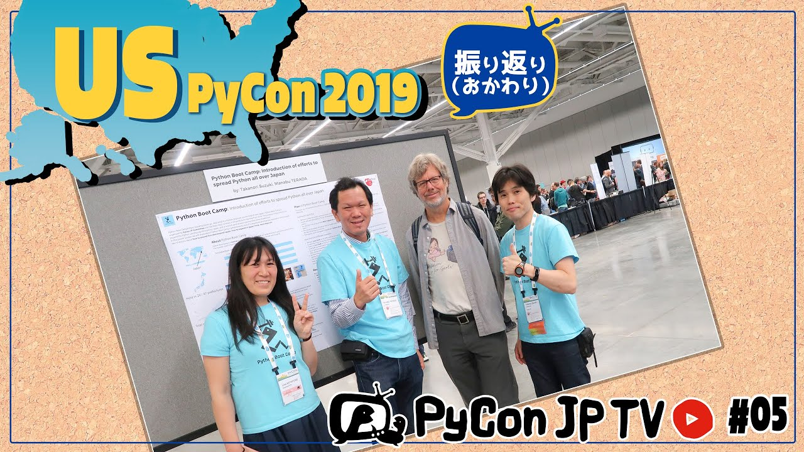

:og:image: https://tv.pycon.jp/_images/episode5.jpg

==================================================
 #5: US PyCon 2019振り返り(おかわり) - 2021-06-24
==================================================

* 6月4日(金)から6月24日(木)に変更になりました

2019年に開催されたUS PyConに初参加したパーソナリティーの2人の目線から、US PyConの特色、記憶に残ったことなどを話します。(#4の続きです)

.. raw:: html

   <iframe width="560" height="315" src="https://www.youtube.com/embed/swD2gU5rMxc" title="YouTube video player" frameborder="0" allow="accelerometer; autoplay; clipboard-write; encrypted-media; gyroscope; picture-in-picture" allowfullscreen></iframe>

関連リンク
==========
* `PyCon JP TVお便りコーナー <https://docs.google.com/forms/d/e/1FAIpQLSfvL4cKteAaG_czTXjofR83owyjXekG9GNDGC6-jRZCb_2HRw/viewform>`_
* Twitter: `@pyconjptv <https://twitter.com/pyconjptv>`_
* `Python.jp Discordサーバ <https://www.python.jp/pages/pythonjp_discord.html>`_ の ``#pyconjp-tv`` チャンネル

パーソナリティ
--------------
* 寺田 学(`@terapyon <https://twitter.com>`_)
* 鈴木 たかのり(`@takanory <https://twitter.com/takanory>`_)

Pythonニュース
--------------
* `PyCon US 2021 <https://us.pycon.org/2021/>`_
* `DjangoCongress JP 2021 <https://djangocongress.jp/>`_

  * チケット: `DjangoCongress JP 2021 - connpass <https://django.connpass.com/event/214451/>`_
* `PyCon JP Blog: PyCon JP 2021 プロポーザルの募集開始 <https://pyconjp.blogspot.com/2021/05/start-proposal.html>`_

  * `PyCon JP Blog: PyCon JP 2021 プロポーザルレビュアー募集のお知らせ <https://pyconjp.blogspot.com/2021/06/pyconjp2021-reviewers-apply.html>`_

US PyCon 2019振り返り(お替わり)
-------------------------------
* `PyCon 2019 in Cleveland, Ohio <https://us.pycon.org/2019/>`_
* `Open Spaces <https://us.pycon.org/2019/events/open-spaces/>`_
* `Read the Docs <https://readthedocs.org/>`_

  * `ericholscher (Eric Holscher) <https://github.com/ericholscher>`_
* Betsyさん `History of PSF Officers & Directors <https://www.python.org/psf/records/board/history/>`_
* `Yoshi Yamaguchi (@ymotongpoo) <https://twitter.com/ymotongpoo>`_
* `PyLadies Auction <https://us.pycon.org/2019/events/auction/>`_
* `Posters <https://us.pycon.org/2019/schedule/posters/list/#!>`_

  * `Presentation: Python Boot Camp: Introduction of efforts to spread Python all over Japan <https://us.pycon.org/2019/schedule/presentation/130/>`_
* `PyCon Jobs Fair <https://us.pycon.org/2019/sponsors/jobs/>`_
* `PyCon JP Blog: PyCon night Tokyo/Osaka 2016.06 を開催しました <https://pyconjp.blogspot.com/2016/06/pycon-night-tokyoosaka-201606.html>`_
* `Development Sprints <https://us.pycon.org/2019/community/sprints/>`_

飲みトーク
----------
* `Star Cloud | Modern Times Beer <http://www.moderntimesbeer.com/beer/star-cloud>`_
* `PyCon US 2021 T-shirts and Stickers <https://us.pycon.org/2021/registration/pycon-store/>`_
* `Stone Buenaveza Salt & Lime Lager | Stone Brewing <https://www.stonebrewing.com/beer/year-round-releases/stone-buenaveza-salt-lime-lager#ageGatePassed>`_
* `Advanced asyncio: Solving Real-world Production Problems <https://us.pycon.org/2019/schedule/presentation/161/>`_

  * 動画: `Lynn Root - Advanced asyncio: Solving Real-world Production Problems <https://www.youtube.com/watch?v=bckD_GK80oY>`_
* `Migrating Pinterest from Python2 to Python3 <https://us.pycon.org/2019/schedule/presentation/147/>`_

  * 動画: `Jordan Adler, Joe Gordon - Migrating Pinterest from Python2 to Python3 <https://www.youtube.com/watch?v=e1vqfBEAkNA>`_
* `Talks Schedule | PyCon 2019 <https://us.pycon.org/2019/schedule/talks/>`_
* `PSF Community Service Awards <https://www.python.org/community/awards/psf-awards/>`_
* `Yellow Sky Pale Ale | Y.MARKET BREWING <https://craftbeer.nagoya/our-beer/beer_fruit/yellow-sky-pale-ale/>`_
* `基調講演 | PyCon JP 2016 in TOKYO <https://pycon.jp/2016/ja/keynote/index.html>`_
* `Plone Conference 2018 Tokyo <https://2018.ploneconf.org/>`_
* `第4回　思わぬ出会いのあった3日目ポスターセッション ―Pythonコミュニティのこれから：世界最大のPythonカンファレンス「US PyCon 2019」レポート <https://gihyo.jp/news/report/01/us-pycon2019/0004?page=1>`_
* 動画: `KEYNOTE / Python Steering Council / C. Willing, T. Wouters, B. Cannon, P. Galindo Salgado, B. Warsaw <https://www.youtube.com/watch?v=xEkuOtCQ6vA&t=505s>`_
* `Python生みの親が明かした「引退騒動」、PyCon 2019インサイド報告（2ページ目） <https://xtech.nikkei.com/atcl/nxt/column/18/00818/062100007/?P=2>`_
* `Python Software Foundation News: The 2021 Python Language Summit: Making CPython Faster <https://pyfound.blogspot.com/2021/05/the-2021-python-language-summit-making.html>`_

  * スライド `ideas/FasterCPythonDark.pdf <https://github.com/faster-cpython/ideas/blob/main/FasterCPythonDark.pdf>`_
* `Announcing the Location for PyCon US 2022/2023 <https://pycon.blogspot.com/2020/12/announcing-pycon-us-20222023.html>`_
* `Salt Lake City craft beerでGoogleマップを検索 <https://www.google.co.jp/maps/search/Salt+Lake+City+craft+beer/@40.7765443,-111.9910397,12z/data=!3m1!4b1>`_

目次
====
* `0:00:35 <https://www.youtube.com/watch?v=swD2gU5rMxc&t=35s>`_ 配信開始
* `0:02:14 <https://www.youtube.com/watch?v=swD2gU5rMxc&t=134s>`_ メッセージ募集【最近参加した、これから参加したいイベント】
* `0:02:45 <https://www.youtube.com/watch?v=swD2gU5rMxc&t=165s>`_ Twitterで拡散希望！ハッシュタグは #pyconjptv
* `0:05:55 <https://www.youtube.com/watch?v=swD2gU5rMxc&t=355s>`_ 【Pythonニュース】
* `0:06:05 <https://www.youtube.com/watch?v=swD2gU5rMxc&t=365s>`_ PyCon US 2021が開催された
* `0:07:04 <https://www.youtube.com/watch?v=swD2gU5rMxc&t=424s>`_ DjangoCongress JP 2021のチケット発売中。7月3日(土)開催
* `0:08:50 <https://www.youtube.com/watch?v=swD2gU5rMxc&t=530s>`_ PyCon JP 2021のプロポーザル募集中。7月10日(土)が締め切り
* `0:11:50 <https://www.youtube.com/watch?v=swD2gU5rMxc&t=710s>`_ プロポーザルのレビュアーも募集中
* `0:13:49 <https://www.youtube.com/watch?v=swD2gU5rMxc&t=829s>`_ 【メイントーク】US PyCon 2019振り返り(おわかり)
* `0:14:40 <https://www.youtube.com/watch?v=swD2gU5rMxc&t=880s>`_ 今日はカンファレンス2日目(5月4日)の午後から
* `0:15:11 <https://www.youtube.com/watch?v=swD2gU5rMxc&t=911s>`_ オープンスペースのボード。めちゃくちゃ埋まってる
* `0:17:30 <https://www.youtube.com/watch?v=swD2gU5rMxc&t=1050s>`_ ランチはパッサパサ
* `0:17:58 <https://www.youtube.com/watch?v=swD2gU5rMxc&t=1078s>`_ PSFブースにいたRead The Docsのericさんにご挨拶
* `0:18:35 <https://www.youtube.com/watch?v=swD2gU5rMxc&t=1115s>`_ PSFブースにしたBetsyさんにご挨拶。Pythonステッカーを送ってくれた人
* `0:19:10 <https://www.youtube.com/watch?v=swD2gU5rMxc&t=1150s>`_ Googleブースで発表をしていたymotongpooさんを激写
* `0:19:35 <https://www.youtube.com/watch?v=swD2gU5rMxc&t=1175s>`_ ちょっと外出
* `0:20:00 <https://www.youtube.com/watch?v=swD2gU5rMxc&t=1200s>`_ 【PyLadiesオークション】PyLadies オークションとは
* `0:22:00 <https://www.youtube.com/watch?v=swD2gU5rMxc&t=1320s>`_ オークション会場の様子
* `0:24:02 <https://www.youtube.com/watch?v=swD2gU5rMxc&t=1442s>`_ 自分の絵のジグソーパズルを持ってアピールするGuidoさん
* `0:25:18 <https://www.youtube.com/watch?v=swD2gU5rMxc&t=1518s>`_ スポンサーはcitusdataとMicrosoft
* `0:25:23 <https://www.youtube.com/watch?v=swD2gU5rMxc&t=1523s>`_ この日の目玉商品。衝撃の値段で落札
* `0:28:20 <https://www.youtube.com/watch?v=swD2gU5rMxc&t=1700s>`_ 【メインカンファレンス3日目】5月5日
* `0:28:34 <https://www.youtube.com/watch?v=swD2gU5rMxc&t=1714s>`_ カンファレンス3日目はポスターセッションとジョブフェアがメイン
* `0:29:23 <https://www.youtube.com/watch?v=swD2gU5rMxc&t=1763s>`_ takanoryが朝一でPython Boot Campのポスターを貼りに行った
* `0:29:55 <https://www.youtube.com/watch?v=swD2gU5rMxc&t=1795s>`_ 朝のライトニングトーク、いろんなPythonイベントの紹介があった
* `0:30:35 <https://www.youtube.com/watch?v=swD2gU5rMxc&t=1835s>`_ PyCon JPの紹介をteradaがした
* `0:31:11 <https://www.youtube.com/watch?v=swD2gU5rMxc&t=1871s>`_ この日のキーノートは「Python Steering Council」のディスカッション
* `0:32:30 <https://www.youtube.com/watch?v=swD2gU5rMxc&t=1950s>`_ ポスターセッションは全部で30ポスターぐらいの発表があった
* `0:33:05 <https://www.youtube.com/watch?v=swD2gU5rMxc&t=1985s>`_ Python Boot Campのポスターをteradaさん、selinaさんに手伝ってもらった
* `0:34:20 <https://www.youtube.com/watch?v=swD2gU5rMxc&t=2060s>`_ 以前PyCon night Tokyoで発表してくれたPaulさんが来てくれた
* `0:35:00 <https://www.youtube.com/watch?v=swD2gU5rMxc&t=2100s>`_ シカゴのJason一家と記念撮影
* `0:35:55 <https://www.youtube.com/watch?v=swD2gU5rMxc&t=2155s>`_ 日本語ができる人、日本に興味がある人とかがポスターに来てくれた
* `0:37:10 <https://www.youtube.com/watch?v=swD2gU5rMxc&t=2230s>`_ ジョブフェアの様子
* `0:38:00 <https://www.youtube.com/watch?v=swD2gU5rMxc&t=2280s>`_ 日本から参加したメンバーで記念撮影
* `0:38:28 <https://www.youtube.com/watch?v=swD2gU5rMxc&t=2308s>`_ Guidoさんが私のポスターを見に来てくれた!!
* `0:39:40 <https://www.youtube.com/watch?v=swD2gU5rMxc&t=2380s>`_ Guidoさんから「写真撮る?」と言ってくれた
* `0:40:40 <https://www.youtube.com/watch?v=swD2gU5rMxc&t=2440s>`_ PSFチームメンバーの紹介、PyLadiesオークションのすごい金額
* `0:41:20 <https://www.youtube.com/watch?v=swD2gU5rMxc&t=2480s>`_ この日の夜はPyConディナーに参加してビールを飲んで、ビールを飲んだ
* `0:42:15 <https://www.youtube.com/watch?v=swD2gU5rMxc&t=2535s>`_ 【スプリント】5月6日
* `0:43:08 <https://www.youtube.com/watch?v=swD2gU5rMxc&t=2588s>`_ どの部屋でなにをやっているかのボード
* `0:43:25 <https://www.youtube.com/watch?v=swD2gU5rMxc&t=2605s>`_ パッケージングサミット
* `0:44:04 <https://www.youtube.com/watch?v=swD2gU5rMxc&t=2644s>`_ ちょっと外出して買い物
* `0:44:33 <https://www.youtube.com/watch?v=swD2gU5rMxc&t=2673s>`_ パッケージサミットふたたび
* `0:44:55 <https://www.youtube.com/watch?v=swD2gU5rMxc&t=2695s>`_ スプリント会場の様子
* `0:48:13 <https://www.youtube.com/watch?v=swD2gU5rMxc&t=2893s>`_ 【おたよりコーナー】
* `0:48:55 <https://www.youtube.com/watch?v=swD2gU5rMxc&t=2935s>`_ Python Love 2021さんから「海外PyCon参加の時間と費用の工面はどうしてるの?」
* `0:52:30 <https://www.youtube.com/watch?v=swD2gU5rMxc&t=3150s>`_ 鈴木渚紗さんから「配信機材のこだわりがすごい」
* `0:54:15 <https://www.youtube.com/watch?v=swD2gU5rMxc&t=3255s>`_ 【次回予告】7月9日(金)一般社団法人PyCon JP Associationについて。ピザが少し早く到着
* `0:56:59 <https://www.youtube.com/watch?v=swD2gU5rMxc&t=3419s>`_ 🍺 準備
* `0:57:40 <https://www.youtube.com/watch?v=swD2gU5rMxc&t=3460s>`_ 🍺 Modern Times Beer: Star Cloud
* `0:58:25 <https://www.youtube.com/watch?v=swD2gU5rMxc&t=3505s>`_ 🍻 乾杯、PyCon US 2021のTシャツ。海外カンファレンス見ながらチャットでやりとりすると便利
* `0:58:55 <https://www.youtube.com/watch?v=swD2gU5rMxc&t=3535s>`_ おそろいのTシャツいいですね、PyCon US 2021を一緒に見ていた話、タイ語でタイのLTの発表を見てた話
* `1:02:19 <https://www.youtube.com/watch?v=swD2gU5rMxc&t=3739s>`_ 視聴者からのコメントを拾うタイム、PyLadiesオークションは寄付で税金が減る、PyLadies Tシャツ着てる人が多い、腕時計は常に見えて便利
* `1:07:43 <https://www.youtube.com/watch?v=swD2gU5rMxc&t=4063s>`_ 🍺 Stone Buenaveza Salt & Lime Lager、確かに塩味、写真を見ると2年前の記憶が蘇る
* `1:11:50 <https://www.youtube.com/watch?v=swD2gU5rMxc&t=4310s>`_ 寺田撮影の写真を見ながらトーク、asyncioのトークは難しかった、MSブースでVS Code
* `1:15:35 <https://www.youtube.com/watch?v=swD2gU5rMxc&t=4535s>`_ 寺田カメラマンがymotongpooさんをたくさん撮影
* `1:18:50 <https://www.youtube.com/watch?v=swD2gU5rMxc&t=4730s>`_ どんなトークが印象に残った?redhatの人のburn outから戻ってきた話、Pinterestの2to3の話、PyCon USは5トラックあるのでマニアックなトークもある
* `1:22:13 <https://www.youtube.com/watch?v=swD2gU5rMxc&t=4933s>`_ LT司会者は面白い人、ビールの缶で吹き出さない裏技、今日はアメリカビール特集、今日のピザは切れが悪い
* `1:26:54 <https://www.youtube.com/watch?v=swD2gU5rMxc&t=5214s>`_ PyLadiesオークションのディナーはおいしかった、サラダの準備、PyLadiesオークションは見てるだけでめちゃめちゃ面白かった
* `1:29:01 <https://www.youtube.com/watch?v=swD2gU5rMxc&t=5341s>`_ ポスター会場、ジョブフェア全体の様子を撮影した動画、カメラの横移動が速くてちょっと目が疲れる、Blackのポスターでなんの話をしてるんだろう
* `1:35:50 <https://www.youtube.com/watch?v=swD2gU5rMxc&t=5750s>`_ PSFからの報告タイム、PSF Community Service Awards
* `1:39:50 <https://www.youtube.com/watch?v=swD2gU5rMxc&t=5990s>`_ 🍺 Y.MARKET BREWING Yellow Sky Pale Ale
* `1:42:42 <https://www.youtube.com/watch?v=swD2gU5rMxc&t=6162s>`_ たかのりの写真を振り返り。オープンスペースに何があるんだろうコーナー、微妙なランチ
* `1:46:30 <https://www.youtube.com/watch?v=swD2gU5rMxc&t=6390s>`_ PyCon US 2020にPyCon APACとしてコミュニティブースを出そうと計画していた、アメリカの🍣
* `1:48:30 <https://www.youtube.com/watch?v=swD2gU5rMxc&t=6510s>`_ スポンサーブースの動画(会場の音しか聞こえない)
* `1:50:20 <https://www.youtube.com/watch?v=swD2gU5rMxc&t=6620s>`_ スポンサーブースの動画(ここからトークが聞こえます)
* `1:53:21 <https://www.youtube.com/watch?v=swD2gU5rMxc&t=6801s>`_ アメリカの🍣再び、PyLadiesオークションの商品の下見タイム、オークション会場の様子
* `1:59:18 <https://www.youtube.com/watch?v=swD2gU5rMxc&t=7158s>`_ PyCon JPトートバッグを使っているAndrey氏、食べてないけどアメリカの🍣は微妙そう
* `2:02:13 <https://www.youtube.com/watch?v=swD2gU5rMxc&t=7333s>`_ 3日目に写真を振り返り、会場全体の転換、ジョブフェアに来てた日本の人の話
* `2:06:50 <https://www.youtube.com/watch?v=swD2gU5rMxc&t=7610s>`_ PyCon US 2022参加したらどう楽しみたいか、朝のLTの話、PyCon JP紹介スライドの英語の間違いと発表のこと
* `2:20:40 <https://www.youtube.com/watch?v=swD2gU5rMxc&t=8440s>`_ 英語での質疑応答がうまくできなくて日本語で質問してもらった失敗談
* `2:22:00 <https://www.youtube.com/watch?v=swD2gU5rMxc&t=8520s>`_ Plone Conference 2018 Tokyoは全部英語なので大変だった
* `2:27:54 <https://www.youtube.com/watch?v=swD2gU5rMxc&t=8874s>`_ ポスターの内容とA0ポスター制作の裏話、ポスター発表であったこと
* `2:33:50 <https://www.youtube.com/watch?v=swD2gU5rMxc&t=9230s>`_ プログラミングを学ぶ方法はいろいろあるよね
* `2:36:40 <https://www.youtube.com/watch?v=swD2gU5rMxc&t=9400s>`_ Python Steering Councilの話、2021でもPythonの今後についてCouncilが話していた、GuidoさんがBDFLやめたけどSteering Councilに復帰した話
* `2:44:00 <https://www.youtube.com/watch?v=swD2gU5rMxc&t=9840s>`_ PyCon US 2021でGuidoさんがPython開発に復帰したきっかけはコロナ、PyCon US 2021がオンラインで眠いけど参加できて良かった
* `2:49:10 <https://www.youtube.com/watch?v=swD2gU5rMxc&t=10150s>`_ 来年ソルトレイクシティでお会いしましょう、クラフトビールがあることは確認済み
* `2:52:00 <https://www.youtube.com/watch?v=swD2gU5rMxc&t=10320s>`_ ここからdiscordでの三次会に移動
