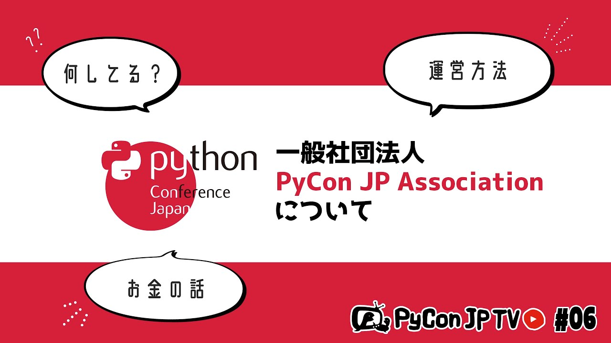

:og:image: https://tv.pycon.jp/_images/episode6.jpg

===============================================================
 #6: 「一般社団法人PyCon JP Association」について - 2021-07-09
===============================================================

PyCon JP TVを運営している一般社団法人PyCon JP Associationについて紹介します。

.. raw:: html

   <iframe width="560" height="315" src="https://www.youtube.com/embed/R7sO0gVX89M" title="YouTube video player" frameborder="0" allow="accelerometer; autoplay; clipboard-write; encrypted-media; gyroscope; picture-in-picture" allowfullscreen></iframe>

関連リンク
==========
* `PyCon JP TVお便りコーナー <https://docs.google.com/forms/d/e/1FAIpQLSfvL4cKteAaG_czTXjofR83owyjXekG9GNDGC6-jRZCb_2HRw/viewform>`_
* Twitter: `@pyconjptv <https://twitter.com/pyconjptv>`_
* `Python.jp Discordサーバ <https://www.python.jp/pages/pythonjp_discord.html>`__ の ``#pyconjp-tv`` チャンネル

パーソナリティ
--------------
* 寺田 学(`@terapyon <https://twitter.com>`_)
* 鈴木 たかのり(`@takanory <https://twitter.com/takanory>`_)

Pythonニュース
--------------
* `DjangoCongress JP 2021 <https://django.connpass.com/event/214451/>`_

  * `DjangoCongress JP 2021オンライン会場 - YouTube <https://www.youtube.com/watch?v=BLfO79jJO2c>`_
* `Python Insider: Python 3.9.6, 3.8.11, 3.7.11, and 3.6.14 are now available <https://blog.python.org/2021/06/python-396-3811-3711-and-3614-are-now.html>`_
* `PyCon JP Blog: About the PyCon JP 2021 (as of the end of June) / PyCon JP 2021の座長です。6月末時点の全てをお話しします <https://pyconjp.blogspot.com/2021/07/hybrid-pyconjp-2021-plan-june.html>`_

  * `PyCon JP Blog: PyCon JP 2021 Call for proposals is now open | PyCon JP 2021 プロポーザルの募集開始 <https://pyconjp.blogspot.com/2021/05/start-proposal.html>`_
* `PyCon JP Blog: Python Charity Talks in Japan 2021.09 第1回作業日報告 <https://pyconjp.blogspot.com/2021/07/python-charity-talks-in-japan-202109-1.html>`_

「一般社団法人PyCon JP Association」について
--------------------------------------------
* `PyCon JP 運営 <https://www.pycon.jp/>`_
* `PyCon JP イベント主催事業 <https://www.pycon.jp/organizer/index.html>`_
* `Python Boot Camp(初心者向けPythonチュートリアル) <https://www.pycon.jp/support/bootcamp.html>`_
* `決算報告 <https://www.pycon.jp/annualreport/index.html>`_

  * `2020年度決算報告書 <https://drive.google.com/file/d/15tQn0nnc5OrBDnp2jaTlG2dm-39113sR/view>`_
* `PyCon JP スタッフ - connpass <https://pyconjp-staff.connpass.com/>`_

  * 8月6日(金) `一般社団法人PyCon JP Association運営会議 #47 <https://pyconjp-staff.connpass.com/event/213396/>`_
* `PyCon JP Blog: PyCon APAC 2018 in シンガポール のツアー参加者募集 <https://pyconjp.blogspot.com/2018/03/pycon-apac-2018-in.html>`_    

飲みトーク
----------
* `プレミアムクラフトビール『75BEER』 <https://www.orionbeer.co.jp/brand/75beer/>`_
* `TOKYO CRAFT <https://www.suntory.co.jp/beer/tokyocraft/>`_
* `openpyxl <https://openpyxl.readthedocs.io/>`_
* `Java - Wikipedia <https://ja.wikipedia.org/wiki/Java>`_
* `PEP 594 -- Removing dead batteries from the standard library <https://www.python.org/dev/peps/pep-0594/>`_
* `python-doc-ja/python-doc-ja: Python ドキュメント日本語訳プロジェクト <https://github.com/python-doc-ja/python-doc-ja>`_
* `Python.jp Discordサーバ <https://www.python.jp/discord/index.html>`_
* `Better error messages <https://docs.python.org/3.10/whatsnew/3.10.html#better-error-messages>`_ 
* `常陸野ネストビール <https://hitachino.cc/beer/index.html>`_

目次
====
* `0:00:22 <https://www.youtube.com/watch?v=R7sO0gVX89M&t=22s>`_ 配信開始
* `0:01:05 <https://www.youtube.com/watch?v=R7sO0gVX89M&t=65s>`_ コメント募集「よく使うサードパーティ製パッケージ」
* `0:04:03 <https://www.youtube.com/watch?v=R7sO0gVX89M&t=243s>`_ コメント、Twitterなどでメッセージ書いてくれるとうれしいです
* `0:05:53 <https://www.youtube.com/watch?v=R7sO0gVX89M&t=353s>`_ 【Pythonニュース】
* `0:06:15 <https://www.youtube.com/watch?v=R7sO0gVX89M&t=375s>`_ DjangoCongress Jp 2021が無事開催されました
* `0:07:15 <https://www.youtube.com/watch?v=R7sO0gVX89M&t=435s>`_ Python 3.9.6などがリリースされました
* `0:09:30 <https://www.youtube.com/watch?v=R7sO0gVX89M&t=570s>`_ PyCon JP 2021の6月末時点の全てをお知らせ
* `0:12:10 <https://www.youtube.com/watch?v=R7sO0gVX89M&t=730s>`_ PyCon JP 2021のProposalは7月10時 23時59分(JST)が締め切りです
* `0:13:18 <https://www.youtube.com/watch?v=R7sO0gVX89M&t=798s>`_ Python Charity Talks in Japan 2021.09 の準備を進めてます
* `0:14:09 <https://www.youtube.com/watch?v=R7sO0gVX89M&t=849s>`_ 【メイントーク】一般社団法人PyCon JP Associationについて
* `0:14:36 <https://www.youtube.com/watch?v=R7sO0gVX89M&t=876s>`_ パーソナリティーの2人はPyCon JP 2021のスタッフじゃないのでイベントの中身は詳しくない
* `0:15:53 <https://www.youtube.com/watch?v=R7sO0gVX89M&t=953s>`_ PyCon JP Associationについて何が聞きたいですか?
* `0:17:40 <https://www.youtube.com/watch?v=R7sO0gVX89M&t=1060s>`_ そもそも「法人」「一般社団法人」ってなに?契約とか考えると法人が必要になった
* `0:20:20 <https://www.youtube.com/watch?v=R7sO0gVX89M&t=1220s>`_ 一般社団法人ってどういうものなの?
* `0:22:49 <https://www.youtube.com/watch?v=R7sO0gVX89M&t=1369s>`_ 【PyCon JP Associationはなにやってるの?】PyCon JPイベント
* `0:27:19 <https://www.youtube.com/watch?v=R7sO0gVX89M&t=1639s>`_ Python Boot Campの紹介
* `0:31:22 <https://www.youtube.com/watch?v=R7sO0gVX89M&t=1882s>`_ PyLadies Caravanの支援もしてます
* `0:32:35 <https://www.youtube.com/watch?v=R7sO0gVX89M&t=1955s>`_ 以前は海外PyCon参加の旅費支援をしていた、PyCon APACツアーの話
* `0:36:25 <https://www.youtube.com/watch?v=R7sO0gVX89M&t=2185s>`_ チャット欄のコメントを拾う
* `0:37:10 <https://www.youtube.com/watch?v=R7sO0gVX89M&t=2230s>`_ 【PyCon JP Associationのお金の話】私たちは非営利の団体です
* `0:40:29 <https://www.youtube.com/watch?v=R7sO0gVX89M&t=2429s>`_ 消費税の話
* `0:41:55 <https://www.youtube.com/watch?v=R7sO0gVX89M&t=2515s>`_ 決算報告を見てみる
* `0:43:08 <https://www.youtube.com/watch?v=R7sO0gVX89M&t=2588s>`_ ピーンポーンピーンポーン
* `0:43:30 <https://www.youtube.com/watch?v=R7sO0gVX89M&t=2610s>`_ PyCon JPイベントで予算が少し残る。そのお金からPythonを広める活動をしている
* `0:45:14 <https://www.youtube.com/watch?v=R7sO0gVX89M&t=2714s>`_ 決算書。現在の資産は2000万円弱
* `0:46:10 <https://www.youtube.com/watch?v=R7sO0gVX89M&t=2770s>`_ どういう風にお金を使って活動するとよいか、アイデアがほしい
* `0:48:25 <https://www.youtube.com/watch?v=R7sO0gVX89M&t=2905s>`_ 運営はオープンにしてます。運営会議にも気軽に参加してください!!
* `0:50:57 <https://www.youtube.com/watch?v=R7sO0gVX89M&t=3057s>`_ 【おたよりコーナー】鈴木渚紗さんから「プログラミングをはじめたきっかけは?」
* `0:54:35 <https://www.youtube.com/watch?v=R7sO0gVX89M&t=3275s>`_ 【次回予告】8月4日(水) PyCon APAC 2019(フィリピン)を紹介
* `0:58:10 <https://www.youtube.com/watch?v=R7sO0gVX89M&t=3490s>`_ PyCon JPのときにAssociationのオープンなミーティングやるので参加してね
* `0:59:25 <https://www.youtube.com/watch?v=R7sO0gVX89M&t=3565s>`_ 🍺準備
* `1:00:28 <https://www.youtube.com/watch?v=R7sO0gVX89M&t=3628s>`_ カシャプシュからの乾杯 🍻 ORION 75BEER IPA
* `1:01:40 <https://www.youtube.com/watch?v=R7sO0gVX89M&t=3700s>`_ 今日の寺田さんの衣装は PyCon JP ポロシャツ、PyCon JP 2021イベントTシャツあるのかなー
* `1:04:20 <https://www.youtube.com/watch?v=R7sO0gVX89M&t=3860s>`_ DroidKaigi 2020 や PyCon US 2020 のイベントキャンセルの話
* `1:06:10 <https://www.youtube.com/watch?v=R7sO0gVX89M&t=3970s>`_ YouTubeチャットを振り返る。pip install engawa、タイムゾーンはAOE
* `1:10:35 <https://www.youtube.com/watch?v=R7sO0gVX89M&t=4235s>`_ 🍺 ORION 75BEER、東京でPython Boot Campはやらないの?、今日は🍕じゃなくて🍣
* `1:14:55 <https://www.youtube.com/watch?v=R7sO0gVX89M&t=4495s>`_ 好きな回転ずしは?寺田さんの32の夜にはなにがあったの?プログラミングの素養はその前からあった
* `1:24:45 <https://www.youtube.com/watch?v=R7sO0gVX89M&t=5085s>`_ georgeTrue、アサヒの生ジョッキ缶は売れてるらしい、たかのりの高専時代のプログラミング授業
* `1:28:30 <https://www.youtube.com/watch?v=R7sO0gVX89M&t=5310s>`_ Webとの出会いはいつ?perlでCGI、これからはJavaですよ!メモリ確保し直すとか神じゃん!
* `1:32:19 <https://www.youtube.com/watch?v=R7sO0gVX89M&t=5539s>`_ openpyxlは罫線引いたりフォーマットに凝り出すと大変、中ではこう動いているって理解できて面白い、昔のExcelの罫線の問題
* `1:37:30 <https://www.youtube.com/watch?v=R7sO0gVX89M&t=5850s>`_ 🍺 SUNTORY Tokyo Craft ブラックペッパー仕立てのスパイシーエール(限定醸造)、胡椒の香りがすごいする
* `1:42:05 <https://www.youtube.com/watch?v=R7sO0gVX89M&t=6125s>`_ 今のJavaバージョンって15なの!?Java 8がLTS、今JDKってどこなの?LTSってどの段階で決めるの?
* `1:45:00 <https://www.youtube.com/watch?v=R7sO0gVX89M&t=6300s>`_ PythonはLTSがないけど2.7が実質LTS、3→4は2→3みたいにはしない予定とのこと、old batteriesの話、標準ライブラリどれが使われているかわからない問題、docs.python.orgでどこが見られているかでわかりそう(天才では)
* `1:51:18 <https://www.youtube.com/watch?v=R7sO0gVX89M&t=6678s>`_ 標準ライブラリを消すの大変、PyCon JPでもサービスを減らすの大変、3年間洗濯機のない生活、長期旅行したときの洗濯どうしてる?
* `1:54:55 <https://www.youtube.com/watch?v=R7sO0gVX89M&t=6895s>`_ 寺田さんのスーツケースはデカい、重たいスーツケースを筋肉で解決、nanaさんの筋トレ
* `2:00:01 <https://www.youtube.com/watch?v=R7sO0gVX89M&t=7201s>`_ スーツケースを持って歩くことが多い、海外のホテルは洗濯できる?ホテルのお高い洗濯サービスの恥ずかしい思い出
* `2:03:50 <https://www.youtube.com/watch?v=R7sO0gVX89M&t=7430s>`_ Python公式ドキュメントの翻訳ちょっとずつやっていく、翻訳は少しずつできる貢献なのでおすすめ、一カ所だけ翻訳されていないところとかがある
* `2:10:06 <https://www.youtube.com/watch?v=R7sO0gVX89M&t=7806s>`_ 🍺 常陸野ネスト HAZY IPA、翻訳discordでやりとりするとよさそう
* `2:13:15 <https://www.youtube.com/watch?v=R7sO0gVX89M&t=7995s>`_ Python 3.10のエラーメッセージがわかりやすくなっているのいい、最初はstack traceどこから見たらいいかわからない、新機能使いながら話すのやってもいいかも
* `2:17:17 <https://www.youtube.com/watch?v=R7sO0gVX89M&t=8237s>`_ そろそろdiscordに移動、今日は🍣があまりがちだった
