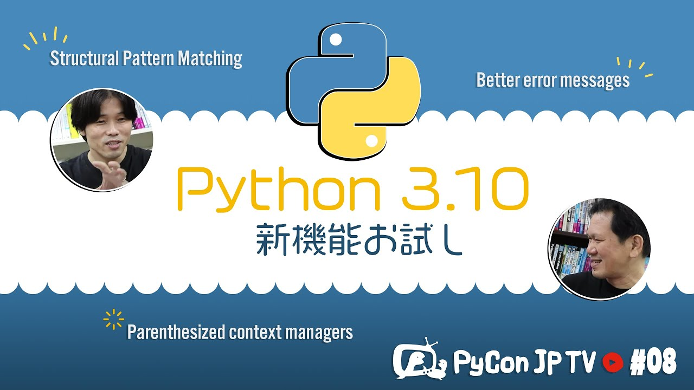

:og:image: https://tv.pycon.jp/_images/episode8.jpg

============================================
 #8: Python 3.10の新機能を試す - 2021-09-03
============================================

その場でPython 3.10のWhat's Newを見ながら新機能を試してみます。

.. raw:: html

   <iframe width="560" height="315" src="https://www.youtube.com/embed/ymo7H5WqzqI" title="YouTube video player" frameborder="0" allow="accelerometer; autoplay; clipboard-write; encrypted-media; gyroscope; picture-in-picture" allowfullscreen></iframe>

関連リンク
==========
* `PyCon JP TVお便りコーナー <https://docs.google.com/forms/d/e/1FAIpQLSfvL4cKteAaG_czTXjofR83owyjXekG9GNDGC6-jRZCb_2HRw/viewform>`_
* Twitter: `@pyconjptv <https://twitter.com/pyconjptv>`_
* `Python.jp Discordサーバ <https://www.python.jp/pages/pythonjp_discord.html>`_ の ``#pyconjp-tv`` チャンネル

パーソナリティ
--------------
* 寺田 学(`@terapyon <https://twitter.com>`_)
* 鈴木 たかのり(`@takanory <https://twitter.com/takanory>`_)

Pythonニュース
--------------
* `Python Charity Talks in Japan 2021.09 <https://pyconjp.connpass.com/event/218154/>`_
* `PyCon JP 2021 <https://2021.pycon.jp/>`_

  * チケット: `PyCon JP 2021 カンファレンス <https://pyconjp.connpass.com/event/221241/>`_
* `PyCon mini Shizuoka <https://shizuoka.pycon.jp/2021>`_    

Python 3.10の新機能を試す
-------------------------
* `PEP 619 -- Python 3.10 Release Schedule <https://www.python.org/dev/peps/pep-0619/>`_
* `What’s New In Python 3.10 <https://docs.python.org/3.10/whatsnew/3.10.html#pep-626-precise-line-numbers-for-debugging-and-other-tools>`_

  * `Summary – Release highlights <https://docs.python.org/3.10/whatsnew/3.10.html#summary-release-highlights>`_
  * `Parenthesized context managers <https://docs.python.org/3.10/whatsnew/3.10.html#parenthesized-context-managers>`_
  * `Better error messages <https://docs.python.org/3.10/whatsnew/3.10.html#better-error-messages>`_
  * `PEP 634: Structural Pattern Matching <https://docs.python.org/3.10/whatsnew/3.10.html#pep-634-structural-pattern-matching>`_

    * `Simple pattern: match to a literal <https://docs.python.org/3.10/whatsnew/3.10.html#simple-pattern-match-to-a-literal>`_
    * `Patterns with a literal and variable <https://docs.python.org/3.10/whatsnew/3.10.html#patterns-with-a-literal-and-variable>`_
    * `Patterns and classes <https://docs.python.org/3.10/whatsnew/3.10.html#patterns-and-classes>`_

飲みトーク
----------
* 🍺 `知床ドラフト｜北海道 網走地ビール の網走ビール株式会社 <https://www.takahasi.co.jp/beer/list/detail/shiretoko_draft.php>`_
* `PEP 8102 -- 2021 Term steering council election | Python.org <https://www.python.org/dev/peps/pep-8102/#id15>`_
* `Python Conference Indonesia 2021 <https://pycon.id/>`_
* `人生を変えたPythonとの出会い ―「PyCon Indonesia 2019」レポート：レポート｜gihyo.jp … 技術評論社 <https://gihyo.jp/news/report/2019/12/1701>`_
* 🍺 `4 x Goose Midway Session IPA | Hoppy. Tropical. Refreshing. – Goose Island <https://www.gooseislandshop.com/products/midway-session-ipa>`_
* `What's New In Python 3.8 <https://docs.python.org/ja/3.9/whatsnew/3.8.html>`_
* `What's New In Python 3.7 <https://docs.python.org/ja/3.9/whatsnew/3.7.html>`_
* `What's New In Python 3.6 <https://docs.python.org/ja/3.9/whatsnew/3.6.html>`_
* 🍺 `ALOHA SCULPIN HAZY IPA - Ballast Point Brewing <https://ballastpoint.com/beer/aloha-sculpin/>`_
* `Python 2 EOL Party in Tokyo - connpass <https://python2.connpass.com/event/161403/>`_
* `<OSS X Users Meeting> #31 ～オープンソースプロジェクトを支える言語たち～ - connpass <https://oss-x-users-meeting.connpass.com/event/218793/>`_
* `PyCon JP Blog: PyCon JP 2021 プロポーザル採択速報 / Proposal adoption bulletin <https://pyconjp.blogspot.com/2021/08/pyconjp-2021-proposal-selection.html>`_
* 🍺 `大塚店 NAMACHAん Brewing　店鋪情報 | スモークビアファクトリー <https://smokebeerfactory.com/otsuka/>`_
  
目次
====
* `0:00:29 <https://www.youtube.com/watch?v=ymo7H5WqzqI&t=29s>`_ 配信開始
* `0:01:30 <https://www.youtube.com/watch?v=ymo7H5WqzqI&t=90s>`_ コメント募集「使っているPythonバージョン」3.9が多め
* `0:02:50 <https://www.youtube.com/watch?v=ymo7H5WqzqI&t=170s>`_ 今日は助っ人ディレクター
* `0:05:25 <https://www.youtube.com/watch?v=ymo7H5WqzqI&t=325s>`_ 【Pythonニュース】Python Charity Talks in Japan 2021.09 やりますよ
* `0:08:17 <https://www.youtube.com/watch?v=ymo7H5WqzqI&t=497s>`_ PyCon JP 2021のチケット絶賛発売中
* `0:11:20 <https://www.youtube.com/watch?v=ymo7H5WqzqI&t=680s>`_ PyCon mini Shizuoka 2021 開催決定。発表者を募集中
* `0:13:47 <https://www.youtube.com/watch?v=ymo7H5WqzqI&t=827s>`_ 【メイントーク】Python 3.10の新機能を試す
* `0:14:20 <https://www.youtube.com/watch?v=ymo7H5WqzqI&t=860s>`_ Python 3.10の情報はどこにあるのか。PEPでリリーススケジュールを確認
* `0:19:35 <https://www.youtube.com/watch?v=ymo7H5WqzqI&t=1175s>`_ 新機能の詳細はPython 3.10の公式ドキュメントでWhat's Newで見る
* `0:21:55 <https://www.youtube.com/watch?v=ymo7H5WqzqI&t=1315s>`_ Python 3.10のリリースハイライト
* `0:24:09 <https://www.youtube.com/watch?v=ymo7H5WqzqI&t=1449s>`_ 新しい機能って積極的に試す方?最近は大きい変更がなかった
* `0:25:50 <https://www.youtube.com/watch?v=ymo7H5WqzqI&t=1550s>`_ Parenthesized context managers。複数のコンテキストマネージャーのときに()でまとめられる
* `0:27:50 <https://www.youtube.com/watch?v=ymo7H5WqzqI&t=1670s>`_ Better error messages。エラーメッセージがわかりやすくなる
* `0:32:34 <https://www.youtube.com/watch?v=ymo7H5WqzqI&t=1954s>`_ 優しいエラーメッセージを出すためのPabloさんの信念を感じる
* `0:34:04 <https://www.youtube.com/watch?v=ymo7H5WqzqI&t=2044s>`_ エラーメッセージの多言語対応も考えているらしい
* `0:34:40 <https://www.youtube.com/watch?v=ymo7H5WqzqI&t=2080s>`_ IntendationErrorsもメッセージが丁寧に
* `0:35:30 <https://www.youtube.com/watch?v=ymo7H5WqzqI&t=2130s>`_ PEP 634 Structural Pattern Matching。PyCon JP 2021のキーノートはこの機能を中心に作った人
* `0:36:30 <https://www.youtube.com/watch?v=ymo7H5WqzqI&t=2190s>`_ 基本的な構文の説明
* `0:38:19 <https://www.youtube.com/watch?v=ymo7H5WqzqI&t=2299s>`_ Simple pattern: match to a literal
* `0:40:25 <https://www.youtube.com/watch?v=ymo7H5WqzqI&t=2425s>`_ Patterns with a literal and variable。便利そう
* `0:43:20 <https://www.youtube.com/watch?v=ymo7H5WqzqI&t=2600s>`_ Patterns and classes。だんだんすごさがわかってきた
* `0:49:40 <https://www.youtube.com/watch?v=ymo7H5WqzqI&t=2980s>`_ match, caseはキーワードではなくソフトキーワードになった。reでmatchという変数名を使っている人が多いから?
* `0:50:50 <https://www.youtube.com/watch?v=ymo7H5WqzqI&t=3050s>`_ PEP 604: New Type Union Operator。Unionの縦棒(|)が便利
* `0:52:40 <https://www.youtube.com/watch?v=ymo7H5WqzqI&t=3160s>`_ 「新機能のやつやってみてどうでした?」「勉強になりました」
* `0:54:00 <https://www.youtube.com/watch?v=ymo7H5WqzqI&t=3240s>`_ 【お便りコーナー】鈴木渚紗さんから「PCとデバイスの組み合わせで困った話」
* `0:57:20 <https://www.youtube.com/watch?v=ymo7H5WqzqI&t=3440s>`_ 【次回予告】次回は10月1日(金) PyCon Thailand 2019の話。PyCon APAC 2021がタイで開催されるので
* `1:00:28 <https://www.youtube.com/watch?v=ymo7H5WqzqI&t=3628s>`_ 🍺 準備
* `1:01:35 <https://www.youtube.com/watch?v=ymo7H5WqzqI&t=3695s>`_ カシャプシュ。 🍺 網走ビール 知床ドラフト
* `1:02:40 <https://www.youtube.com/watch?v=ymo7H5WqzqI&t=3760s>`_ 臨時Dをねぎらい
* `1:03:10 <https://www.youtube.com/watch?v=ymo7H5WqzqI&t=3790s>`_ コメント「パターンマッチング使えそうだな」ドキュメント見ながら動かしてみたら便利そうだった。いい提案だと提案のPEPを書くためにレビュー、助言してくれる
* `1:05:35 <https://www.youtube.com/watch?v=ymo7H5WqzqI&t=3935s>`_ 最近がんがんデータクラス使うようになった。データクラスは型ヒント、パターンマッチングと相性がよさそう
* `1:08:15 <https://www.youtube.com/watch?v=ymo7H5WqzqI&t=4095s>`_ 🍕到着
* `1:09:50 <https://www.youtube.com/watch?v=ymo7H5WqzqI&t=4190s>`_ Python 3.9を使っている人が多い。2.7使ってるとか言えない?
* `1:11:45 <https://www.youtube.com/watch?v=ymo7H5WqzqI&t=4305s>`_ 寺田「better error messagesに期待している」。丁寧ねエラーメッセージを出すためにPabloさんが丁寧に解析しているんだろうなぁ。Pabloさんは今のSteering Councilメンバー
* `1:14:25 <https://www.youtube.com/watch?v=ymo7H5WqzqI&t=4465s>`_ Pythonを教えるときに「エラーメッセージ見ようね」って言う。下から見るのが大事
* `1:18:00 <https://www.youtube.com/watch?v=ymo7H5WqzqI&t=4680s>`_ PCの音の話。Bluetoothのコーデックがいろいろあってよくわからない。空間オーディオのはなし
* `1:26:50 <https://www.youtube.com/watch?v=ymo7H5WqzqI&t=5210s>`_ ノイズが乗ってるかも。音声問題は機器の切り分けしないといけないので難しい
* `1:29:45 <https://www.youtube.com/watch?v=ymo7H5WqzqI&t=5385s>`_ インドネシアのFarahさんがチャットに参加(びっくり)。たどたどしい英語でしゃべるパーソナリティ。今年のPyCon Indonesiaはオンラインとのこと
* `1:32:35 <https://www.youtube.com/watch?v=ymo7H5WqzqI&t=5555s>`_ 最初にどこのPyConに行きたい?助っ人D「US」寺田「タイ、シンガポール、マレーシア」たかのり「現地でやってくれるならどこでも行きたい」。インドネシアが最後のリアルPyConだった
* `1:36:30 <https://www.youtube.com/watch?v=ymo7H5WqzqI&t=5790s>`_ 寺田はインドネシアに行ったことがない。2019はスラバヤで開催。インドネシア出身のイスカンダルさんも一緒だった。現地の人がいると助かるよね
* `1:39:10 <https://www.youtube.com/watch?v=ymo7H5WqzqI&t=5950s>`_ Farahさんはどこから見つけてきたんだろう?アジアは時差があまりないので見やすそう
* `1:39:40 <https://www.youtube.com/watch?v=ymo7H5WqzqI&t=5980s>`_ 🍺 Goose Island Midway Session IPA。Goose Islandはシカゴ。でもこのビールはベルギー。今日のビールはナチュラルローソンで買ってきた
* `1:43:20 <https://www.youtube.com/watch?v=ymo7H5WqzqI&t=6200s>`_ 3.8の大きい新機能はセイウチ演算子。3.7のデータクラス、3.6のf-stringは手放せない。type hintはどのタイミングで何が入ったかわからない
* `1:45:55 <https://www.youtube.com/watch?v=ymo7H5WqzqI&t=6355s>`_ プロジェクトのバージョンは3.9。いつ3.10にするか、パターンマッチングは使いたい
* `1:47:40 <https://www.youtube.com/watch?v=ymo7H5WqzqI&t=6460s>`_ 🍺 Ballast Point Brewing ALOHA SCULPIN HAZY IPA
* `1:48:15 <https://www.youtube.com/watch?v=ymo7H5WqzqI&t=6495s>`_ Python2 EOLパーティーのクイズ大会の話。pycharityのクイズで出てくるかも。pycharityのクイズは司会がうまい
* `1:50:00 <https://www.youtube.com/watch?v=ymo7H5WqzqI&t=6600s>`_ 他の言語やっていて「どの機能がいつ入った」とかわからない。誰かに「これ便利だよ、これ使うべき」とか教えてほしい。セイウチ演算子はまだ使いどころがわからない
* `1:52:50 <https://www.youtube.com/watch?v=ymo7H5WqzqI&t=6770s>`_ SCSK主催のイベントでPythonの変更の話をした。他の発表見ていたらJavaにf-stringっぽいのが入っていた。お互いに他言語のいい機能を取り込んでいる
* `1:58:30 <https://www.youtube.com/watch?v=ymo7H5WqzqI&t=7110s>`_ PyCon JPが来月開催。現地に行きたい。Patronはもう売り切れていた。オンサイト参加券は90枚を予定
* `2:03:00 <https://www.youtube.com/watch?v=ymo7H5WqzqI&t=7380s>`_ 2021のプロポーザル採択本数は34。楽しみなトークはどれ?Pythonによるイラスト解析は面白そう。zoneinfoはニッチな発表。オンライン、オフライン発表はどういう風に運営するんだろう?
* `2:11:10 <https://www.youtube.com/watch?v=ymo7H5WqzqI&t=7870s>`_ Pythonは4年で5倍速くなるらしい。Python 3.8の新機能。3.10でzip()関数にstrict引数が増えた。strict=Trueで長さがあっていないとValueErrorが出る
* `2:16:55 <https://www.youtube.com/watch?v=ymo7H5WqzqI&t=8215s>`_ Python 3.10でintにbit_count()メソッドが増えた
* `2:19:15 <https://www.youtube.com/watch?v=ymo7H5WqzqI&t=8355s>`_ 事故発生!!
* `2:22:30 <https://www.youtube.com/watch?v=ymo7H5WqzqI&t=8550s>`_ 早く新機種を発表してほしい
* `2:25:11 <https://www.youtube.com/watch?v=ymo7H5WqzqI&t=8711s>`_ ビールは悪くない、人間が悪い
* `2:27:35 <https://www.youtube.com/watch?v=ymo7H5WqzqI&t=8855s>`_ M1Xが乗っているMacBook Proがほしい。Type Cが4ポートほしい。M1 MacBook Airはバッテリーが持つし熱持たないしとても良い。バッテリーが持つから2ポートでも行けるらしい
* `2:32:30 <https://www.youtube.com/watch?v=ymo7H5WqzqI&t=9150s>`_ 🍺 NAMACHAん Brewing なまちゃんの大人なラオホ。DのMacBookも内蔵ディスプレイが写らないので買い換えたい
* `2:38:35 <https://www.youtube.com/watch?v=ymo7H5WqzqI&t=9515s>`_ 家にあるMac miniは2012年モデルをSSDに乗せ替えて元気に使っている。miniは載せ替えできる。SSDは宙に浮いているらしい
* `2:42:40 <https://www.youtube.com/watch?v=ymo7H5WqzqI&t=9760s>`_ 次のMacBook ProでMagSafe来るかも知れない。MagSafeよかった。AfterShokz OPENCOMMはマグネットの専用ケーブルでだるい。fitbitも専用ケーブル
* `2:45:50 <https://www.youtube.com/watch?v=ymo7H5WqzqI&t=9950s>`_ 最近のスマートフォンはType Cの電源アダプター付けなくなって、いいと思う
* `2:47:50 <https://www.youtube.com/watch?v=ymo7H5WqzqI&t=10070s>`_ 腕時計はボタン電池。2個セットで売ってるのと種類が多すぎて型番が覚えられない
* `2:52:55 <https://www.youtube.com/watch?v=ymo7H5WqzqI&t=10375s>`_ ポータブルなバッテリーがたくさんあって、処分するのが大変。Pixel 4aは本体バッテリーが持つのでよい
* `2:56:30 <https://www.youtube.com/watch?v=ymo7H5WqzqI&t=10590s>`_ AppleCare入っていれば安くなるはず
* `2:58:40 <https://www.youtube.com/watch?v=ymo7H5WqzqI&t=10720s>`_ 最近スポーツしている?忙しくてボルダリングに行けてない。打合せとかを入れちゃって歩いたりもできていない。トレッドミルで歩きながらミーティングしよう
* `3:03:16 <https://www.youtube.com/watch?v=ymo7H5WqzqI&t=10996s>`_ 階は0ベースじゃない。9階までの半分は5階
* `3:06:05 <https://www.youtube.com/watch?v=ymo7H5WqzqI&t=11165s>`_ そろそろdiscordに移動
